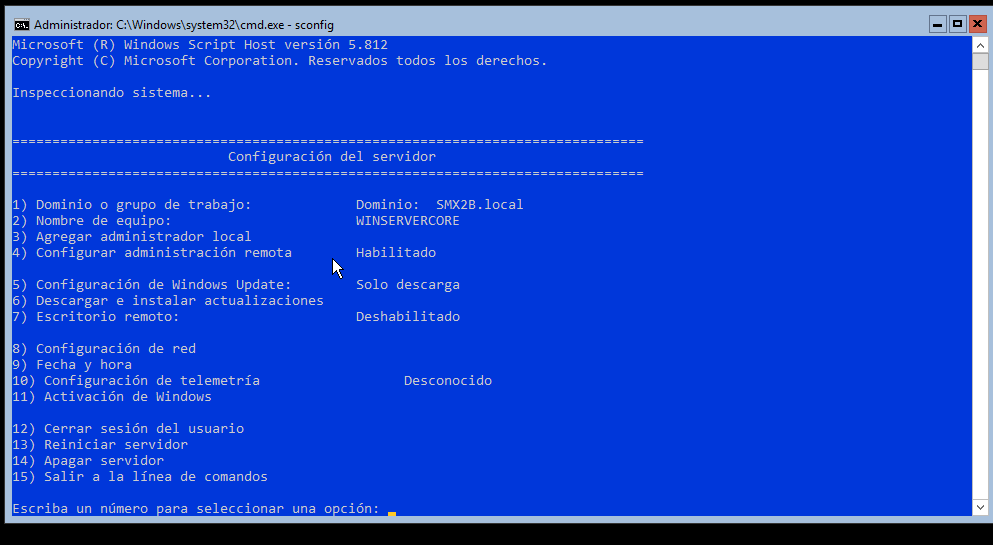

# PowerShell. Configuració del DHCP en un Windows Server Core

## 1 Requisits previs

## 1.1 Alternativa 1: Configurar IP estàtica i nom del servidor (sconfig)

Es poden realitzar des del **sconfig**




## 1.2 Alternativa 2: Configurar IP estàtica i nom del servidor (PowerShell)

IP: 192.168.100.99 /24
IP del DNS (DC): 192.168.100/24

(Per més informació, sobre configuració de la NIC i algunes gestions de xarxa tens un altre apartat en este curs. )

### Configuració de la IP.

* Averigua el nom de la NIC i la IP actual.

```powershell
Get-NetIPInterface
```
Suposem una resposta:

```
fIndex InterfaceAlias                  AddressFamily NlMtu(Bytes) InterfaceMetric Dhcp     ConnectionState PolicyStore
------- --------------                  ------------- ------------ --------------- ----     --------------- -----------
1       Loopback Pseudo-Interface 1     IPv6            4294967295              75 Disabled Connected       ActiveStore
7       Ethernet                        IPv4                  1500              25 Disabled Connected       ActiveStore
1       Loopback Pseudo-Interface 1     IPv4            4294967295              75 Disabled Connected       ActiveStore
```

Ja sabem el nom: "Ethernet". També que és fixa ( Dhcp: Disabled). Podem mirar si la IP

```powershell
Get-NetIPAddress -InterfaceAlias "ETHER*"
```

* Executa la següent ordre per assignar l'IP fixa:

```powershell
Set-NetIPAddress -InterfaceAlias "Ethernet" -IPAddress 192.168.100.99 -PrefixLength 24
```

* Assignem l'adreça de loopback com a adreça DNS.

Assumim que, en la nostre domini, el servidor DNS és el mateix que aquest que farà de servidor DHCP. En cas que fora un altre, indicaríem ací la seua IP.

```powershell
Set-DnsClientServerAddress -InterfaceAlias "Ethernet" -ServerAddresses 192.168.100.100
```
## 1.2 Canvi de nom 

```powershell
Rename-Computer -NewName "ServerCore"
```

# 1.3 Afegir el Servidor Core al Domini

```powershell
Add-Computer -DomainName "SMX2B.local" -Credential "SMX2B\Administrador"
```
# 1.4 Reiniciar

```powershell
Restart-Computer
```
O des del cmd:
```cmd
shutdown /r /t 0
```

# 2 Afegeix el rol de DHCP

```powershell
Install-WindowsFeature -Name DHCP -IncludeManagementTools
```

## 2.1 Importa el mòdul de DHCP per gestionar el servei DHCP:

```powershell
Import-Module DhcpServer
```
# 3 Autoritzar el servidor DHCP dins del domini.

```powershell

Add-DhcpServerInDC -DnsName "NomServidorCore" -IpAddress "AdreçaIPdelServidorCore"
```

# 4 Configuració del servei DHCP

## 4.1 Crear un rang d'IPs

Des de la 192.168.100.1 fins a 192.168.100.90:

```powershell
Add-DhcpServerv4Scope -Name "Xarxa Interna" -StartRange 192.168.100.1 -EndRange 192.168.100.99 -SubnetMask 255.255.255.0 -State Active
   ```
* Consultem i eliminem...
```
PS C:\Windows\system32> Get-DhcpServerv4Scope

ScopeId         SubnetMask      Name           State    StartRange      EndRange        LeaseDuration
-------         ----------      ----           -----    ----------      --------        -------------
192.168.100.0   255.255.255.0   Xarxa Interna  Active   192.168.100.1   192.168.100.99  8.00:00:00


PS C:\Windows\system32> Remove-DhcpServerv4Scope -ScopeId 192.168.100.0
PS C:\Windows\system32> Get-DhcpServerv4Scope
```

## 3.2 Configuració d'exclusions d'IP

Excloure des de la 192.168.100.80 fins a 192.168.100.99:

1. Executa aquesta comanda PowerShell:

```powershell
Add-DhcpServerv4ExclusionRange -ScopeId 192.168.100.0 -StartRange 192.168.100.5 -EndRange 192.168.100.10
```
Es poden fer més d'una exclusió.

* Per consultar, eliminar... 

```
PS C:\Windows\system32> Get-DhcpServerv4ExclusionRange -ScopeId 192.168.100.0

ScopeId              StartRange           EndRange
-------              ----------           --------
192.168.100.0        192.168.100.5       192.168.100.10

```

Si tenim més d'una exclusió...

```
PS C:\Windows\system32> Get-DhcpServerv4ExclusionRange

ScopeId              StartRange           EndRange
-------              ----------           --------
192.168.100.0        192.168.100.5       192.168.100.10
192.168.100.0        192.168.100.20       192.168.100.30


PS C:\Windows\system32> Remove-DhcpServerv4ExclusionRange -ScopeId 192.168.100.0 -StartRange 192.168.100.20 -EndRange 192.168.100.30
PS C:\Windows\system32> Get-DhcpServerv4ExclusionRange

ScopeId              StartRange           EndRange
-------              ----------           --------
192.168.100.0        192.168.100.5       192.168.100.10
```

## 3.3 Reserva d'IP

Per reservar l'adreça 192.168.100.20 per a un equip amb Windows 11 basant-se en la seua adreça MAC:

* Obtenir la MAC del PC Windows on fer la reserva.

Al Windows 11, obri PowerShell i executa la següent comanda per obtindre la MAC:

```powershell
   Get-NetAdapter | Select-Object Name, MacAddress
```
Pots mirar per l'entorn gràfic.
Si és un altre dispositiu ( no un PC Windows 1x), consulta la documentació tècnica.

* Al servidor executa la següent ordre

```powershell
Add-DhcpServerv4Reservation -ScopeId 192.168.100.0 -IPAddress 192.168.100.1 -ClientId "08-00-27-B5-DC-55" -Description "Reserva per a Windows 11"
```

* Per consultes, eliminacions...

```powershell
PS C:\Windows\system32> Get-DhcpServerv4Reservation  -ScopeId 192.168.100.0

IPAddress            ScopeId              ClientId             Name                 Type                 Description
---------            -------              --------             ----                 ----                 -----------
192.168.100.3        192.168.100.0        08-00-27-b5-dc-66                         Both                 PC 2 Windows 10
192.168.100.2        192.168.100.0        08-00-27-b5-dc-55                         Both                 PC 1 Windows 11


PS C:\Windows\system32> Remove-DhcpServerv4Reservation -ScopeId 192.168.100.0 -ClientId "08-00-27-b5-dc-55"
PS C:\Windows\system32> Get-DhcpServerv4Reservation  -ScopeId 192.168.100.0

IPAddress            ScopeId              ClientId             Name                 Type                 Description
---------            -------              --------             ----                 ----                 -----------
192.168.100.3        192.168.100.0        08-00-27-b5-dc-66                         Both                 PC 2 Windows 10
```

Si filtrem el *Remove-DhcpServerv4Reservation* per *-IPAddress 192.168.100.2* elimina totes les reserves del rang.

## Altres formes d'obtenir la MAC

* Des de l'entorn gràfic de Windows 11

1. En "Obri Configuració de xarxa i Internet" ( Win + I)
2. Propietats de la connexió "Adreça física (MAC)".

* Amb *ipconfig*

1. Obri el símbol del sistema (CMD) al Windows 11.
2. Executa la següent comanda:

```cmd
ipconfig /all
```

# 6 Més coses

Problemes que poden aparéixer i qüestions a revisar:

## Desactivar IPv6
```powershell
Disable-NetAdapterBinding -Name "Ethernet" -ComponentID ms_tcpip6
```

## IP DNS, IP Gateway

```powershell
Set-DnsClientServerAddress -interface "Ethernet" -serverAddress 192.168.100.100
```
```powershell
Set-NetIPAddress -InterfaceAlias "Ethernet" -DefaultGateway "192.168.100.98"
```
# Sincronització de l'hora

```cmd
w32tm /config /syncfromflags:DOMHIER /update
```
```cmd
w32tm /resync
```
# Ports i serveis essencials

* LDAP (port 389): Utilitzat per a les comunicacions de directori entre el servidor i el controlador de domini.
* Kerberos (port 88): Protocol d'autenticació utilitzat per Active Directory.
* DNS (port 53): Per a la resolució de noms dins del domini.

Pots verificar si hi ha regles que permeten aquest tràfic:
```powershell
Get-NetFirewallRule | Where-Object { $_.LocalPort -eq 389 -or $_.LocalPort -eq 88 -or $_.LocalPort -eq 53 }
```

Alternativa més còmoda, provisionalment, per fer proves és desactivar el Firewall en el Domini
```powershell
set-netfirewallprofiles -profile domain -enabled false
```

## Fitxer host

Si no funciona el DNS. Comprovant amb *nslookup* podem, provisionalment modificar aquest fitxer que sol usar-se en entorns menuts.

Per visualitzar pots usar el *more*

```cmd
notepad C:\Windows\System32\drivers\etc\host
```

Afegir:

192.168.1.100   WINSERVER.SMX2B.local

## Comprovació de la resolució de noms

```cmd
nslookup WinServer
```

## Revisar les zones i PTR del Servici DNS

## Netejar memòria cau DNS

```cmd
ipconfig /flushdns
```
o

```powershell
Clear-DnsClientCache
```


