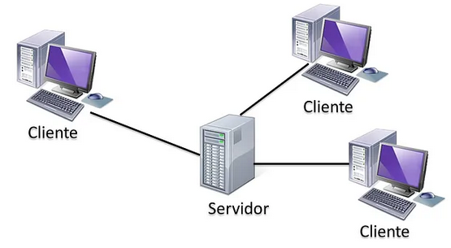
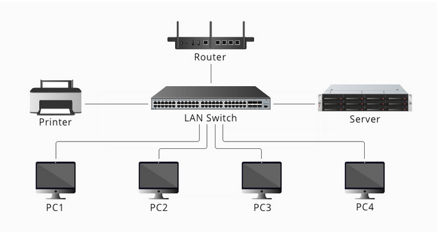
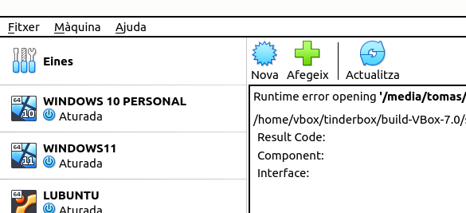
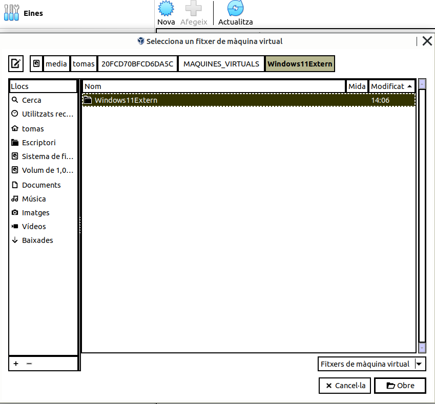

\newpage
\renewcommand\tablename{Tabla}

# 1. Introducció

El mòdul de **Sistemes Operatius en Xarxa** ofereix una visió completa sobre com funcionen i es gestionen les xarxes informàtiques en entorns corporatius, posant l'accent en l'arquitectura client-servidor. Aquest tipus d'arquitectura és una de les més utilitzades en l'actualitat, ja que facilita la distribució de recursos, la centralització de dades i l'escalabilitat dels serveis.

L'objectiu d'aquest mòdul és que l'alumne comprengui els fonaments dels sistemes operatius en xarxa, així com els elements i les eines necessàries per instal·lar, configurar i gestionar servidors en un entorn client-servidor.

# 2. Arquitectura Client-Servidor

L'arquitectura client-servidor és un model d'organització que divideix les tasques entre servidors, que proporcionen serveis, i clients, que en fan ús. Aquest model és essencial per al funcionament de moltes aplicacions empresarials i sistemes de xarxa moderns.

## 2.1 Característiques 

### 2.1.1 Centralització dels serveis

**Control centralitzat:** Els servidors centralitzen la gestió dels recursos, com bases de dades, fitxers, aplicacions i serveis web. Això permet una gestió més eficient, un manteniment més senzill i un control sobre la seguretat i els permisos.

**Seguretat centralitzada:** La centralització dels recursos permet implementar polítiques de seguretat uniformes. Això facilita l'aplicació de mesures com la protecció de dades, autenticació d'usuaris, i gestió d'accés als recursos compartits.

### 2.1.2 Comunicació a través de la xarxa

**Distribució de tasques:** Els clients es comuniquen amb els servidors a través de la xarxa, enviant sol·licituds per obtenir dades o accedir a serveis. Els servidors responen a aquestes sol·licituds proporcionant la informació o els recursos demanats.

**Protocol de comunicació:** La comunicació entre clients i servidors es realitza mitjançant protocols de xarxa com HTTP, FTP, SSH, SMB, entre d’altres. Aquests protocols defineixen les regles per a la transmissió de dades i garanteixen que les comunicacions es realitzin de manera ordenada i segura.

### 2.1.3 Independència entre client i servidor

**Plataformes diverses:** El client i el servidor no necessiten funcionar amb el mateix sistema operatiu o programari. Un client pot executar-se en Windows mentre que el servidor pot ser Linux, i la comunicació entre ambdós continuarà funcionant gràcies als estàndards de xarxa.

**Escalabilitat:** Aquesta separació permet que l'arquitectura creixi de manera escalable, afegint més clients sense la necessitat de canviar el servidor, o afegint més servidors per gestionar un major volum de sol·licituds de clients.

### 2.1.4 Rendiment i eficiència

**Distribució de la càrrega:** El servidor gestiona els processos més crítics o pesats, com l'emmagatzematge de dades o el càlcul intensiu, mentre que el client es limita a realitzar tasques de visualització o enviament de sol·licituds. Això fa que l’arquitectura sigui molt eficient en termes de rendiment.

**Control de la capacitat:** Els servidors es poden dissenyar per gestionar grans volums de clients simultàniament, oferint així una millor gestió del trànsit i els recursos. Això fa que els sistemes siguin més robustos davant de càrregues de treball elevades.

### 2.1.5. Modularitat

**Serveis especialitzats:** En una arquitectura client-servidor, diferents servidors poden especialitzar-se en oferir diferents tipus de serveis (servidors de fitxers, de bases de dades, web, etc.). Aquesta modularitat permet l’optimització de cada component en funció del servei que ofereix.

**Actualització independent:** Els servidors poden actualitzar-se o millorar-se sense afectar els clients. A més, els clients poden ser actualitzats o reemplaçats sense necessitat de modificar el servidor, sempre que mantinguin la compatibilitat amb els protocols utilitzats
    
## 2.2. Elements principals

### 2.2.1 El Servidor

És el component (màquina) que ofereix els serveis als clients. Gestiona recursos com bases de dades, aplicacions i fitxers, garantint seguretat, disponibilitat i rendiment.

**Servidor tipus rack** 
Dissenyats per instal·lar.se en els marcs rack cosa que permetn un ús més eficient de l'espai físic i una millor escalabilitat.
Els bastidors solen tindre diverses ranures conegudes com "U". És característic en el CPD (Centre d eProcessament de Dades).

**Servidor en maxi torre**
Son ordinadors de major capacitat de processament, comunicació per la xarxa local i sistema de redundancia de dades en els discos durs. 
Són més usats en organitzacions menys grans. Tot i que les caixes o torres estan preparades per a ampliacions amb bahies sobrants i pel seu tamany no ofereixen les facilitats en quan a escalabilitat dels racks. 

{width=50%}

### 2.2.2 El client

El client és el dispositiu o programa que envia peticions al servidor. Sol ser un ordinador o dispositiu mòbil que permet l'accés als recursos i serveis proporcionats pel servidor.

### 2.2.3 El Middleware

És el programari intermediari que facilita la comunicació i la coordinació entre el client i el servidor.El middleware permet independitzar els clients i els servidors, sobretot, gràcies als sistemes oberts,
que eliminen la necessitat de supeditar-se a tecnologies propietàries.
Per tant, el middleware facilita el desenvolupament d' aplicacions, perquè resol la part del transport
de missatges i facilita la interconnexió de sistemes heterogenis sense utilitzar tecnologies propietàries.

## 2.3 Funcionament bàsic

El funcionament bàsic es pot resumir en els següents passos:

1. El Servidor espera les sol·lituds.
2. El client envia una petició al servidor.
3. El servidor processa la petició, fent les comprovacions necessàries i, si pertoca... 
4. El servidor respon al client amb la informació o els serveis sol·licitats.
5. El client fa la comprovació i, si entén que la resposat és correcta la mostra al usuari.

A partir d'ací i per l'experiència com a usuaris finals d'un xarxa com la del IES Maria Enríquez, podem deduir que:

1- El servidor deu estar en marxa abans abans que els clients comencen a fer sol·licituds.
2- Les sol·licituds son transparents a l'usuari final. 
    * Accedim a una carpeta del servidor pel GUI o pel CLI com ho fem a una carpeta local. 
    * Enviem un PDF a una impressora de xarxa com ho fem a una impressora connectada al nostre USB.
3- Les primeres sol·licituds que farà tot client estarna relacionades amb:
    * Autenticar-se en "la xarxa"
    * Demanar una IP
4- El client podrà tindre o no permís per a accedir a permisos en funció de qui siga l'usuari, el PC...?

## 2.4 Esquema senzill que estudiarem

El model que emularem amb el VirtualBox per treballar a l'aula i a casa i també puntualment al taller (si hi ha diponible hores i recursos) serà un model senzill propis d'una organització simple. Els habituals en empreses mitjanes o menudes, ajuntaments etc. on tenim un o dos servidors i unes desenes de PC connectats mitjançant els stwitch.

{width=70%}

{width=70%}

# 3. Sistema operatiu de xarxa (SOX)

## 3.1 Concepte de SOX

Un **sistema operatiu de xarxa** és aquell que permet la comunicació entre diferents ordinadors connectats a una xarxa, facilitant la gestió centralitzada de recursos com fitxers, aplicacions o dispositius perifèrics. Alguns exemples són Windows Server, Linux (com Ubuntu Server) o macOS Server.

## 3.2 Sistemes Operatius de Xarxa més habituals

Els sistemes operatius més comuns inclouen:

-   **Windows Server**: Popular en entorns empresarials.
-   **Linux (Ubuntu Server, CentOS, etc.)**: Reconegut per la seva flexibilitat i codi obert.
-   **macOS Server**: Orientat a entorns creatius.

# 4 Tipus d'arquitectures Client/Servidor

## 4.1 Classificació segons la mida dels costats (Client/Servidor)

Aquesta classificació es fa en funció de la càrrega que suporta cada costat de l'arquitectura:

-   **Arquitectura lleugera**: La major part del treball es fa al servidor, mentre que el client només presenta els resultats.
-   **Arquitectura pesada**: El client realitza una part important del processament, i el servidor actua com a gestor de dades.

## 4.2 Segons el tipus de serveis que ofereix

En una arquitectura client-servidor, els serveis proporcionats poden variar considerablement segons les necessitats de l'empresa o organització. A continuació, es descriuen alguns dels tipus de serveis més comuns:

### 4.2.1 Servidor de fitxers

Funció: Proporciona emmagatzematge centralitzat per a arxius, que poden ser accedits, modificats i compartits pels clients de la xarxa.

Ús habitual: Es troba en entorns empresarials on cal compartir documents, fulls de càlcul, bases de dades o qualsevol altre tipus de fitxer entre diversos usuaris. Això permet el treball col·laboratiu.

Protocols associats habituals:SMB (Server Message Block) per a entorns Windows i NFS (Network File System) per a entorns Unix/Linux.

### 4.2.2 Servidor de bases de dades

**Funció:** Gestiona les bases de dades, processant sol·licituds de consulta i actualització de dades des dels clients. 
**Ús habitual:** Sistemes de gestió empresarial (ERP), sistemes de comerç electrònic, o qualsevol aplicació que depenga de dades estructurades.

**Exemples de software:** MySQL, PostgreSQL, Microsoft SQL Server i Oracle.

### 4.2.3 Ressolució de noms. 

Sí, la **resolució de noms** és un **servei bàsic i fonamental en les xarxes** que converteix noms de domini  i de recursos en la xarxa en les seus adreces IP, permetent així que els dispositius es localitzen i es comuniquen entre ells. És essencial per a la navegació web.

#### DNS (Domain Name System)

El DNS és el servei més conegut per a la resolució de noms. Converteix noms de domini com `www.exemple.com` en adreces IP com `192.0.2.1`, que els ordinadors utilitzen per comunicar-se entre ells.
Servidors que emmagatzemen i gestionen les dades de noms i adreces. Inclouen servidors DNS autoritaris, que tenen la informació definitiva sobre dominis, i servidors DNS recursius, que realitzen cerques en nom dels clients.

> Nota: El DNS el vorem prompte en la instal·lació del Windows Server i l'accès des d'un client Windows 11.

#### Hosts File

Un fitxer de configuració local en els sistemes operatius que mapeja noms de domini a adreces IP. Els fitxers `hosts` es poden utilitzar com a solució temporal per a la resolució de noms en xarxes petites o per a proves.

- **Ubicació**:
    - **Windows**: `C:\Windows\System32\drivers\etc\hosts`
    - **Linux/Mac**: `/etc/hosts`

>Nota: El vorem en configurar el Servidor LDAP de Linux.

#### NetBIOS (Network Basic Input/Output System)
Proporciona un sistema de resolució de noms per a xarxes locals de Windows. NetBIOS permet que els ordinadors es reconeguin mitjançant noms en lloc d’adreces IP.
- **Protocols associats**:
- **NBNS (NetBIOS Name Service)**: Permet la resolució de noms NetBIOS en adreces IP dins d'una xarxa local.

> Nota: és el protocol de les xarxes Workgrup menudes sense DNS que vam vore al curs passat i ara.

**Importància del servei de resolució de noms**
- **Facilitat d'ús**: Permet als usuaris utilitzar noms de domini amigables en lloc d’adreces IP numèriques, facilitant l'ús i la memòria.
- **Eficiència**: Redueix la necessitat de memoritzar adreces IP complexes i facilita l'administració de xarxes mitjançant noms de domini.
- **Flexibilitat**: Permet actualitzacions i canvis d'adreces IP sense necessitat que els usuaris final hagin de modificar les adreces en les seves aplicacions.

En resum, la resolució de noms és un servei fonamental en la infraestructura de xarxes que facilita la comunicació entre dispositius i aplicacions mitjançant la traducció de noms humans llegibles en adreces IP que els sistemes informàtics poden interpretar.

### 4.2.5 Servidor web

Funció: Un servidor web s'encarrega d’allotjar i servir pàgines web als clients (normalment navegadors web). Aquest servidor interpreta sol·licituds HTTP enviades pels clients i respon amb els fitxers HTML o altres recursos necessaris per a renderitzar la pàgina.

Ús habitual: S’utilitza per a llocs web, portals de comerç electrònic i aplicacions basades en web. Els servidors web són crucials per a l'accés remot a informació i serveis empresarials.

Protocols associats: HTTP i HTTPS són els protocols principals utilitzats per als servidors web. Els exemples més comuns de programari de servidors web són Apache, Nginx i Microsoft IIS.

### 4.2.6 Servidor d'autenticació i gestió centralitzada d'usuaris

**Funció:** La gestió centralitzada d'usuaris permet a les organitzacions administrar de manera centralitzada les credencials d'usuari, els permisos i l'accés als recursos compartits en la xarxa.
Un servidor d'autenticació, com Active Directory en entorns Windows o OpenLDAP en sistemes Linux, centralitza la gestió d'usuaris i controla qui pot accedir a determinats recursos.

Components clau de la gestió centralitzada d'usuaris

**Autenticació:** Els usuaris es validen a través d’un sistema centralitzat abans d'accedir a qualsevol servei. Per exemple, en sistemes com Active Directory, els usuaris introdueixen un nom d'usuari i una contrasenya que el servidor verifica.

**Autorizació:** Una vegada autenticat, el sistema determina els recursos als quals l'usuari pot accedir segons els seus rols i permisos. Això permet controlar qui pot visualitzar, modificar o administrar certs recursos, com ara fitxers o aplicacions.

**Gestió d'usuaris:** El servidor centralitzat permet afegir, eliminar o modificar usuaris des d'una ubicació central, la qual cosa facilita l'administració en grans xarxes amb molts usuaris.

**Polítiques de seguretat:** Es poden aplicar polítiques de seguretat uniformes, com ara l'obligatorietat de contrasenyes fortes, l'expiració periòdica de contrasenyes o l'autenticació multifactor.

Exemples de programari de gestió centralitzada d'usuaris

**Active Directory (AD):**És la solució de Microsoft per gestionar usuaris i recursos de xarxa de manera centralitzada en un entorn Windows Server.

**LDAP (Lightweight Directory Access Protocol):** Utilitzat sovint en entorns Unix/Linux per gestionar l'autenticació i permisos a través d'un directori d'usuaris.

**Kerberos:** Un protocol d'autenticació de xarxa que utilitza xifratge de claus simètriques per autenticar els usuaris i serveis dins d'una xarxa.

La gestió centralitzada d'usuaris és essencial per a qualsevol organització amb una xarxa corporativa on els usuaris necessiten accedir a múltiples recursos, com fitxers, aplicacions o serveis. Això permet que els administradors gestionen permisos i configuracions des d'un únic punt, millorant l'eficiència i la seguretat.

### 4.2.7 Servidor d'impressió

El servidor d'impressió gestiona la impressió de documents en una xarxa, actuant com a intermediari entre els clients que envien treballs d'impressió i les impressores disponibles. Això permet als usuaris de la xarxa enviar els seus documents a una o diverses impressores de forma centralitzada i organitzada.

Gestió de cues. Els servidors d'impressió poden gestionar la cua d'impressió, prioritzar les tasques, emmagatzemar temporalment els documents per a una impressió eficient i controlar l'accés a les impressores basant-se en permisos d'usuari o grups d'usuaris.

Gestió dels permisos i prioritats. Els administradors poden definir qui té permís per utilitzar quines impressores, establint polítiques basades en rols d'usuaris, grups o departaments.

Monitorització i registre d'ús: El servidor pot monitoritzar l'ús de les impressores i generar informes, permetent als administradors saber qui està imprimint, la quantitat de pàgines, i controlar l'ús excessiu o no autoritzat.

Protocols associats: IPP (Internet Printing Protocol): És un dels protocols més utilitzats per a la comunicació entre clients i servidors d'impressió. Permet a les aplicacions d'usuari enviar treballs d'impressió a través d'Internet o d'una xarxa local.

LPD/LPR (Line Printer Daemon/Line Printer Remote): Aquests protocols es fan servir tradicionalment en entorns Unix/Linux per gestionar les tasques d'impressió.

SMB (Server Message Block): Utilitzat en entorns Windows, permet compartir impressores (i fitxers) a través de la xarxa local.

Exemples de programari de servidor d'impressió

Windows Print Server: El servidor d'impressió de Microsoft, integrat en el sistema operatiu Windows Server, permet gestionar impressores en xarxa i assignar-les als usuaris de forma centralitzada.

CUPS (Common Unix Printing System): Un programari de codi obert utilitzat en sistemes Unix/Linux i macOS per gestionar tasques d'impressió en xarxa.

### 4.2.8 Servidor de correu

Funció: Gestiona el correu electrònic dins de l'organització, tant per a l'enviament com per a la recepció de missatges. Proporciona serveis com la gestió de bústies de correu, filtres de correu brossa, i emmagatzematge d'arxius adjunts.

Ús habitual: Es troba en totes les organitzacions que necessiten comunicar-se a través del correu electrònic, ja sigui internament o externament.

Protocols associats: Els protocols més comuns són SMTP (Simple Mail Transfer Protocol) per a l'enviament de correu, i IMAP (Internet Message Access Protocol) o POP3 (Post Office Protocol) per a la recepció.
    
## 4.3 Servidors. Máquines o serveis?

Tal com hem exposat la classificació dels servidors segons el servei, sembla que un Servidor només puga oferir un servei: no es tracta d'això. De fet, tal i como vorem el mateix Servidor físic fa de servidor de diversos serveis. Així, direm que el Servidor WIN-SERVER1 "és el servidor DNS" o el "servidor DHCP" o el "servidor d'autenticació a la xarxa local".
És "servidor" aquella màquina que respon a la petició d'un servei oferint-lo i pot tindre més d'un servei instal·lat i configurat.

# 5. Avantatges i inconvenients de l'arquitectura C/S

## 5.1. Avantantges

-   **Escalabilitat**: Es pot ampliar afegint més clients o servidors.
-   **Seguretat**: Centralització dels recursos amb polítiques de seguretat robustes.
-   **Facilitat de manteniment**: El servidor es gestiona de manera centralitzada.

## 5.2. Inconvenients

-   **Cost**: Pot ser costós configurar i mantenir els servidors.
-   **Dependència**: Si el servidor falla, els clients poden quedar desconnectats.

# 6. L'alternativa a l'arquitectura C/S: els Grups de Treball (Workgroups)

Els grups de treball (workgroups) són una alternativa al model client-servidor. En aquests, els recursos es comparteixen directament entre ordinadors, sense la necessitat d'un servidor centralitzat. Aquest model és adequat per a xarxes petites, però no s'escalfa bé per a entorns grans.

Com ja vam vore en el tram final del curs anterior. Un mínim control assignant permisos senzill d'escriptura o lectura a una carpeta ens obligava a "duplicar" els usuaris en les diferents máquines. 
El mateix passava si volíem canviar de màquina, havíem de tindr el nostre usuari creat en la nova màquina. 

EL Workgrup sols és una solució vàlida per a xarxes molt senzilles on es comparteix pocs recursos o de forma puntual. Qualsevol gestió mínima en un entorn de treball col·laboratiu i recursos software (Base e dades, pe exemple) o hardware (impressores, discos...) es complica excessivament.

# 7. Requisits dels SOX. 

## 7.1. Comprovació dels requisists tècnics

Abans d'instal·lar un sistema operatiu en xarxa, és crucial revisar els requisits tècnics per assegurar que el maquinari suporta correctament el sistema. Això inclou revisar la RAM, CPU, espai en disc i compatibilitat amb dispositius de xarxa.

En el cas d'usar VirtualBox, a banda de mirar si tenim RAM suficient i espai al disc dur (el prcessador sol ser mésn important) cal que revisem no tindre inhabilitada la virtualizació a la UEFI i l'hipervisor en si funcionant correctamet.

Ací teniu els requisits mínims actuals per als sistemes operatius més comuns en una infraestructura client-servidor.

## 7.1. Per a Windows Server 2019

Els requisits mínims per instal·lar **Windows Server 2019** són:

- **Processador**: 
  - 1.4 GHz de 64 bits
- **Memòria RAM**:
  - **Mínim**: 512 MB per a instal·lacions de Server Core.
  - **Recomanat**: 2 GB o més per a la instal·lació amb interfície gràfica (*Desktop Experience*).

- **Disc dur**:
  - **Espai mínim**: 32 GB.
  - **Espai recomanat**: Més de 40 GB (depèn del rol del servidor).

- **Altres requisits**:
  - Compatible amb *UEFI* 2.3.1c (per a instal·lació segura).
  - Accés a la xarxa per a la instal·lació i activació.

## 7.2 Per a Ubuntu Server 22.04 LTS

Els requisits per a **Ubuntu Server 22.04 LTS** són:

- **Processador**:
  - CPU de 1 GHz o superior, compatible amb arquitectura de 64 bits (*x86-64* o ARM).

- **Memòria RAM**:
  - **Mínim**: 512 MB (recomanable 1 GB o més per a millor rendiment).

- **Disc dur**:
  - **Espai mínim**: 2.5 GB per a instal·lació bàsica.
  - **Espai recomanat**: 10 GB o més, depenent de les aplicacions i serveis que es vulguin instal·lar.

- **Altres requisits**:
  - Accés a una connexió de xarxa per a la instal·lació i actualitzacions.
  

Aquestes especificacions es recomanen per assegurar un funcionament mínimament eficient en entorns de producció. Per millors resultats, **és recomanable utilitzar més recursos**, especialment quan el servidor haurà de suportar càrregues pesades o entorns virtualitzats.

També cal considerar la versió o ús. No és el mateix un Windows Server Database per a fer de servidor de BD que un Essentials que no tinga tanta càrrega de treball.

# 8. Elaboració de la documentació sobre instal·lació i incidències

Una bona pràctica en la gestió de sistemes operatius en xarxa és crear documentació detallada sobre la instal·lació, configuració i manteniment dels servidors. Això inclou instruccions pas a pas, captura de pantalles, diagrames de xarxa i llistats d'incidències amb les solucions aplicades.

# 9. La virtualització

Repasseu els conceptes sobre virtualització de SO vistos a i la instal·lació en VirtualBox d'una màquina virtual en [SOM. Ferramentes de Virtualització](https://tofermos.github.io/SOM/U2-FERRAMENTES_DE_VIRTUALITZACI%C3%93/UNITAT-2-Ferramentes-de-virtualitzaci%C3%B3.html). No anem a repetir-los ací.

## 9.1 Ús al mòdul. Aula i a casa

Per al mòdul usarem el VirtualBox instal·lant les MV en un disc extraïble sòlid (SSD). D'aquesta manera podrem dur a casa la feina i acabar-la **afegint la máquina** a la instal·lació de VirtualBox que tindrem del curs passat. 
Convé revisar que la versió del Hipervisor siga la mateixa.

> Nota:
>
> Sobre el disc extraïble SSD, pes recomanable que siga de 512GB o 1 TB
> Curs 2024-2025, IES Maria Enríquez. Aules 206 i 314:
> La velocitat de 1050MB/s és suficient per als PC de classe però en portàtils i PC més actuals, podríeu treure més profit si ne compreu un de major velocitat (als de l'aula no perquè fan de coll d'ampolla)
> Si opteu per muntar-lo vosaltres (comprant el M2.0 i la carcassa) i 512GB, s'estalviareu diners.

