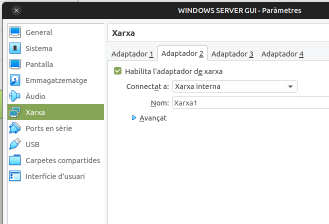
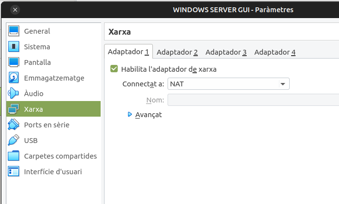
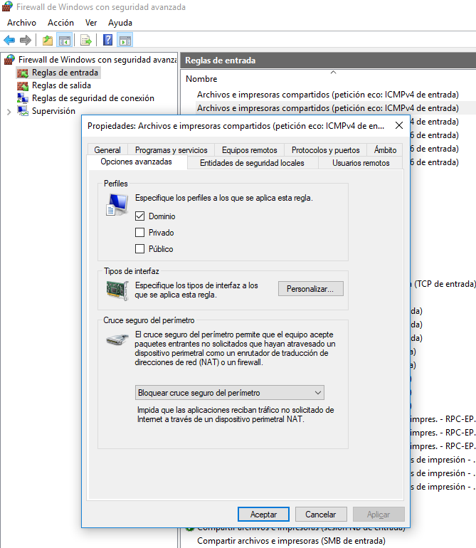
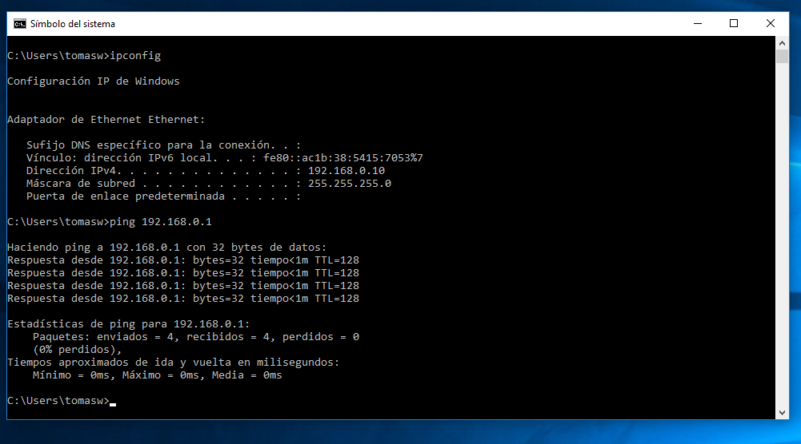
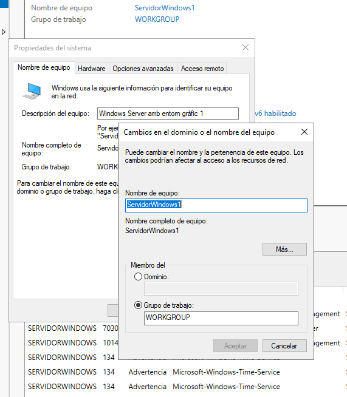
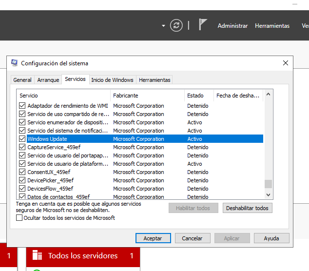

# INSTAL·LACIÓ DEL WINDOWS SERVER 2019 AMB ENTORN GRÀFIC
## Resum

Un primer pas per emular una Domini serà la instal·lació d'un Windows Server i dos màquines de Windows 1X.

1. Configurarem les MV com a Xarxa Interna. Emulem una xarxa local de computadores connectades a un switch.
2. Configuració mitjançant IP fixes. IPs privades en la mateixa xarxa. 
3. Assegurarem la connectivitat entre màquines. (Detecció de xarxes i compartició en Windows, Firewall...)

# 1 CONFIGURAR EL SERVIDOR

# 1.1 "Xarxa Interna" en VirtualBox.

Afegirem 2 targes, una per a emular la xarxa local ( Xarxa interna ) i l'altra per disposar de la connexió d'Internet de l'amfitrió.

</img>
</img>

En el WINDOWS 1x hem de tindre NOMÉS la tarja interna.

# 1.2 Configuració de la xarxa local en Windows

*Windows+R: Configuración, Red e internet, Centro de Redes y Recursos Compartidos*

</img>

Ho hem de revisar en **LES DOS MÀQUINES**

**Detecció de xarxa i ús compartit**

*Win+R: Configuración, Red e internet, Centro de Redes y Recursos Compaçartidos, Cambiar configuración del  Uso compartido avanzado:*
    
    * Activar la detección de redes
    * Activar el uso compartido de carpetas e impresoras.
    
</img>

Ho hem de revisar en **LES DOS MÀQUINES**

**IPs privades en la mateixa xarxa.**

    IP Windows 1X: 192.168.0.2/24    
    IP Windows Server: 192.168.0.1/24
    
*Windows+R: Configuración, Red e internet, Centro de Redes y Recursos Compartidos, Ethernet*

</img>

## 1.3 Provar la connectivitat amb el protocol ICMP (ping)

**Revisar les les restriccions del FireWall de Windows**

</img>

Ho hem de revisar en **LES DOS MÀQUINES**

**Provar el ICMP**

</img>

## 1.3 Canviar el nom del servidor

</img>

### 1.4 Revisar aspectes bàsics de la configuració
Un exemple podria ser desactivar/activar el Servei d'actualitzacions.

</img>

Altre exemple podria ser assegurar la Zona horària.

</img>

