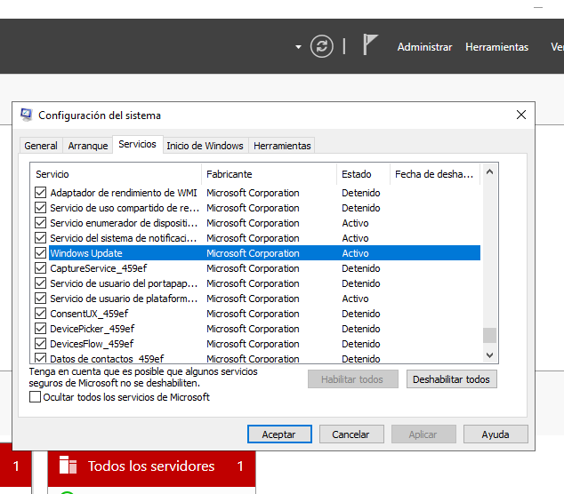

\newpage
\renewcommand\tablename{Tabla}

# 1 Resum

En aquesta unitat prèvia a la creació d'un domini:

1. Configurarem les MV com a Xarxa Interna. Emulem una xarxa local de computadores connectades a un switch.

2. Configurarem la xarxa Windows mitjançant IP fixes privades en la mateixa xarxa. 

3. Coneixerem sobre protocols i Firewall :

  * protocols i aplicacions (detecció de xarxes i compartició en Windows) 
  * altres prrotocols com el ICMP4 (ping) o SMB
  * les restriccions del Firewall
  
4. Estudiarem aspectes bàsics de la compartició de carpetes.

5. Treballarem la captura d'unitats (GUI/CLI)

6. Veurem algunes configuracions generals simples ( nom del PC i WG, Actualizacions automàtiques, Zona horària...)

7. Avançarem alguns canvis que hem de fer a nivell d'Aplicacions i Firewall quan passem de WorkGroup a Domini.

# 2 Canviar el nom del servidor i Workgroup


Configurar la xarxa Servidor

# 5 IPs privades en la mateixa xarxa

Com ja sabeu del mòdul de XAL de 1r de SMX haureu de configurar les IPs. Per exemple:

   IP Windows 1X: 192.168.0.2/24    
   IP Windows Server: 192.168.0.1/24
    
*Windows+R: Configuración, Red e internet, Centro de Redes y Recursos Compartidos, Ethernet*


# 4 Configuració de la xarxa en Virtualbox. "Xarxa Interna"

Estem "conectant cables al switch".

De moment només ens fa falta la tarja que es connectarà a un switch on es conecten la  resta de PC de la xarxa () "xarxa interna").

Podem instal·lar un segon adaptador per disposar de la connexió d'Internet de l'amfitrió (adaptador NAT). De moment és opcional.


> NOTA:
>
> En el WINDOWS 1x hem de tindre NOMÉS la tarja interna. No perdeu de vista la "realitat" que estem emulant!

## 4.1 Prova del connectivitat

Una vegada fet la instal·lació física, comprovem la conectivitat.

```cmd
ipconfig
```


Convé assegurar-nos que el protocol no està bloquejat pel Firewall: 


# 5 Firewall de Windows. Aplicaciones permitidas

Des del mateix Administrador de Servidor accedir al **Firewall: Aplicaciones permitidas** i assegurar que ens permeta Compartir i Detectar recursos a través de la xarxa. Dos capacitat que activarem en l'apartat següent:


Podem trobar-nos en dos situacions: **WorkGroup o Domini**.

>Nota:
> Quan canviem de Workgroup a Domini, hem de recordar fer el canvi.

| **Tipus de xarxa** | **Detecció de xarxes**               | **Ús compartit de fitxers i impressores** | **Perfil del Firewall** |
|---------------------|--------------------------------------|-------------------------------------------|--------------------------|
| **Workgroup**       | Habilitada per al perfil **Privada** | Habilitada per al perfil **Privada**       | **Privada**              |
| **Domini**          | Habilitada per al perfil **Domini**  | Habilitada per al perfil **Domini**        | **Domini**               |


**La configuració següent és la que aplicarem quan canviem de Workgroup a Domini:**


# 6 Detecció de xarxes i compartició d'arxius i impressores.

*Windows+R: Configuración, Red e internet, Centro de Redes y Recursos Compartidos*

Com ja vam estudiar a la Unitat anterior amb el Wordgroup fet amb PC Windows 1x, hem d'activar per a totes les màquines les característiques:

* Activar la detecció de xarxes

* Activar l'ús compartit de carpetes i impressores.
 
Configuración, Red e internet (o *Win + I*) Centro de Redes y Recursos Compartidos, Cambiar configuración del  Uso compartido avanzado:*

Però esta activació serà distinta si estem en un Workgroup o en un Domini

## 6.1 Cas de WorkGroup


### Problema en Windows Server i la Xarxa Privada

**Problema:**

En Xarxa Privada, marquem les opcions però quan entrem veiem que estan desactivades 
No es detecten les carpetes compartides, ni tant sols els PCs de la xarxa.

En canvi sí podem accedir a les carpetes mitjançant els comandament *net use*

**Raó**:

La detecció de serveis compartits depén d'altres serveis que no estan executant-se. 

**Solució:**

Abans que res assegureu-vos que teniu el Firewall configurat com hem indicat al punt anterior (**Aplicaciones permitidas...**). Si és correcte...

Fent spoiler al tema de **Serveis de Windows** que tractarem més avant, cal que activem una sèrie de serveis necessaris (dependències)

Alguns d'aquests servicis podrem inciar-los des l'Administrador del Servidor (*servermanager.exe*) que tenim obert normalment però altres no. 
Això es deu a que no estan habilitats, caldrà executar la consola de microsoft específica de servicis (*services.msc*) i habilitar-los prèviament.

Els serveis que cal que estiguen executant-se (dependències) són:

* Client DNS.
* Publicación de recurso de deteccción de función.
* Detección host de SSDP.
* Dispositivo host de UPnP.


Per a iniciar els servicis primer cal que estiguen habilitats. Per això anem a la **consola MC de servicis** amb *Win R: services.msc*).

1.- Assegurem que estiguen no estiguen deshabilitats. El tipus d'inici ha de ser **Automático** per a que s'engeguen en iniciar el servidor.


2.- Podem iniciar manualment per no reiniciar ara.


>Nota:
> 
>Encara que supose continuar fent spoiler sobre el tema de servicis, observa que amb un **Inici automàtic**, el servei està en marxa en engegar-se el servidor **sense necessitat d'iniciar sessió al Servidor**


## 6.2 Cas de Domini.
**La configuració que expliquem en este punt 6.1 és la que aplicarem quan canviem de Workgroup a Domini:**


Una prova molt clàssica és la del ping (protocol ICMP4). La fem des de totes les màquines.


## 6.3 Resum sobre les característiques de detecció de xarxes i compartició de recursos


Podem trobar-nos en dos escenaris. El Servidor foram part d'un Workgroup (provisional o poc habitual), o quan el servidor forma part d'un domini. Segon el cas activarem les dos característiques en una opció o altra:

| **Tipus de Xarxa**       | **Opció** | **Motiu**                                               |
|--------------------------|-------------------------------|-------------------------------------------------------|
| **Workgroup**            | Privada                      | Permet compartició de recursos dins d'una xarxa de confiança. |
| **Domini**               | Domini                       | Configura la xarxa per integrar-se amb Active Directory; no cal activar Privada.   |


**1 Privada**
        Indica que la xarxa és de confiança (com una xarxa local domèstica o d'oficina petita).
        Permet la compartició de recursos (carpetes, impressores) i serveis com el descobriment de dispositius.
        Menys restriccions en el tallafoc.

**2 Pública**
        Considera la xarxa com a no segura (xarxes públiques com Wi-Fi a cafeteries o aeroports).
        Detecció i compartició de recursos deshabilitades.
        Tallafoc més estricte per protegir el servidor.

**3 Domini**
        S’aplica automàticament quan el servidor és membre d’un Active Directory Domain.
        Es configura per confiar en la xarxa del domini i permet la gestió centralitzada per polítiques de grup (Group Policy).

**4 Totes les xarxes**
        Agregat per a configurar opcions avançades o genèriques que s'apliquen independentment del tipus de xarxa.


L'opció de *3 Domini* apareixerà sols si ja tenim la màquina integrada en un Domini AC.

# 7 Aspectes bàsics de la configuració des del *msconfig*


Un exemple podria ser desactivar/activar el **Servei d'actualitzacions**

> Nota sobre les actualitzacoins automàtiques
>
> És important que entengueu el que pot suposar tindre activada esta opció en un servidor real aplicacions i middleware instal·lat i molts clients depenent-ne.

*Win + R: msconfig.exe*

</img>


Altre exemple podria ser assegurar la **Zona horària**.

Cal connexió a Internet. Caldrà una segona tarja connectada a un router (NAT en l'emulació nostra de Virtualbox)

</img>

# 8 Recursos compartits en xarxa


## 8.1 Compartició de carpetes

La compartició de carpetes la farem per a tots els usuaris del Domini donat que encara no tenim usuaris del domini. No anem a "replicar-los" com es feia en el Workgroup. 


Pondem limitar el nombre d'usuaris que hi poden accedir


>Nota:
>
> La limitació d'usuaris és important per raons de seguretat (evitar accesos desconeguts) però també per a mateniment: controlar si es queden sessions sense tancar . Des de la consola del sistema de fitxers es podrien expulsar.
D'igual manera passaria amb els fitxers oberts.


## 8.2 Assignació o captura d'Unitat de Xarxa

Ja ho hem vist anteriorment amb el Net use, però una vegaga funciona correctament la els protocols que faciliten *la compartició de carpetes i impressores* i la *detecció de la xarxa*, podem assignar unitats a través del GUI buscant el recurs per la xarxa.
Simplement amb botó contrari *Asignar unidad de red*. En reiniciar el client vorem que continua (el mateix efecte que el /persistent:yes).

La forma en que es podrà automatitzar esta captura per a tots els clients d'una xarxa la vorem més avant.

## 8.3 Net use

Amb els comandaments *net* podem, entre d'altres coses, assignar també unitat de xarxa. 
Fins i tot quan no funcione la detecció de xarxes (el problema de dependències tractat al punt 2.5 podem accedir a les carpetes compartides a través de la xarxa fent ús dels comandaments *Net use*. 
Net use estableix una connexió directa basad en el protocol SMB (Samba) i no usa els altres protocls al·ludits al punt 2.5.

*Win + R:cmd*

```cmd
net use F: \\WinServ1\Dades2024 /persistent:yes
```

Per veure totes les Unitat de xarxa ("lletres") assignades

```cmd
net use
```

Per eliminar-ne alguna
```cmd
net use f: /delete
```

# 9 Consola del sistema de fitxers *fsmgmt.msc*

La consola *fsmgmt.msc* ens permet

* Tancar fitxers oberts en la xarxa
* Veure els usuaris de xarxa que estan accedint-hi (sesiones)
* Veure els recursos compartits amb el nom que es comparteixen. Si acaba amb $ són ocults.


# 10 Nota final sobre els prototocols en Windows Server

**Protocols**

La detecció de xarxes en Windows es basa en una combinació de protocols (LLMNR, NetBIOS, SSDP) i serveis com. Tenim, per tant, unes "dependències".
L'Explorador de equipos En canvi, el comandament **net use** usa el protocolo **SMB  Samba** per establir una **conexió directa** con el recurs compartit.
També hem vist que podem usar el **ICMP4** fent un ping. 

**Com a servicis**

Per una banda veiem que podem habilitar-los com a serveis i, una vegada habilitats, iniciar-los o apagar-los ( també inici automàtic).
*Wind +R : services.msc*

**Firewall**
El Firewall no sols pot bloquejar "aplicacions" com la *detecció de xarxa* o *compartició de fitxers i impressores* que hem vist (depenent de quin tipus de xarxa tenim). També ens permet establir regles d'entrada o eixida per a cadascun del protocols.

