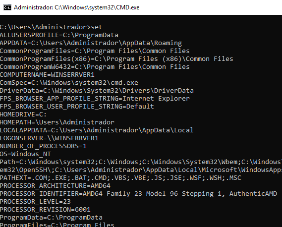
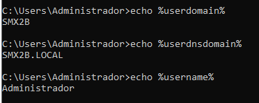
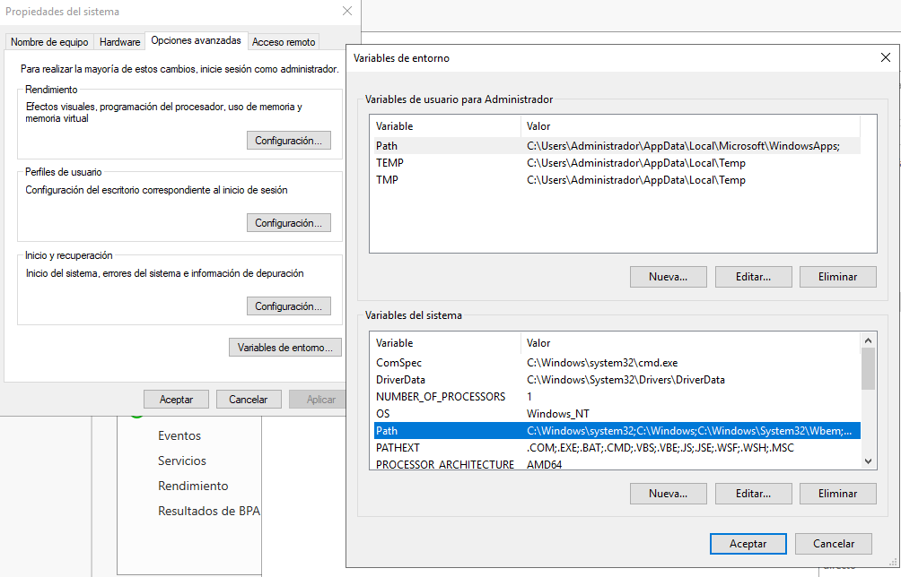

\newpage
\renewcommand\tablename{Tabla}

# 1 Funcions d’un servidor

Des del punt de vista del que series les funcions d'un Sistema Operatiu de Xarxa trobem, com ja hem vist a l'anterior unitat, que es corresponen a alguns dels Rols i Característiques. Podem dir que Windows Server les implementa així. 
No tots els Rols i Característiques, menys encara, són **funcions principals**

1. Servei de Directori ( a Linux serà en OpenLDAP) a WS és el **Active Directory Domain Services (AD DS)**: Permet crear i gestionar dominis de forma centralitzada i còmoda.

2. **DHCP Server**: Assigna automàticament adreces IP als dispositius de la xarxa.

3. **DNS Server**: Traduïx noms de domini a adreces IP, dins d'una xarxa o a internet. R
*Recordeu que quan configuràvem les IP en un WorkGroup NO indicàvem cap IP de servidor DNS. En un Domini, usem la ressolució de noms de DNS, molt més eficient*

4. **File and Storage Services**: Gestiona el sistema d'emmagatzematge de fitxers i carpetes compartides, quotes d'emmagatzematge, duplicació de dades...

5.  **Servici de backup de Seguretat de Windows Server**. 

6. La connexió remota pot considerar-se com una funció dels servidors. En WS tenim **Remote Desktop Services (RDS)** que permet als usuaris la onnexió remota a escriptoris virtuals o aplicacions.

6. **Print and Document Services**: Permet gestionar impressores i compartir-les en la xarxa.

7. **Web Server (Internet Information Services (IIS)**. Servidor de webs.


# 2 Administració i configuració bàsica

## 2.1 Consoles i altres utilitats comuns a tots el sistemes Windows


A banda de les vistes en l'apartat anterior, específicament de Windows Server tenim les consoles i utilitats següents:

**servermanager.exe** - Administrador de Servidors. Aquesta és la utilitat (no es consola estrictament parlant) central per a gestionar el servidor. Permet configurar rols i característiques, gestionar discos, supervisar el rendiment, entre altres funcions.

**dcpromo.msc** - Promoció de controlador de domini: Utilitzada per configurar un controlador de domini (AD-DS), una funció exclusiva de Windows Server.

**dsa.msc** - Consola per administrar tots els **objectes del Active Directory**. 

**gpmc.msc** - Consola per a gestionar el objectes polítiques de grup **directives**.

**fsmgmt.msc** - Carpetes compartides: Una consola específica per gestionar carpetes i recursos compartits al servidor, encara que també es pot trobar en versions professionals de Windows 10/11.

**dnsmgmt.msc** - Gestió de DNS: Disponible en Windows Server per gestionar zones i registres DNS.

**dhcpmgmt.msc** - Gestió de DHCP: Permet administrar el rol de servidor DHCP per assignar adreces IP automàticament a dispositius de la xarxa

**eventvwr.msc** - Visor d'events.

**services.msc** - Gestor de servicis. 

**tsadmin.msc** o Remote Desktop Services Manager: Utilitzada per gestionar sessions d'escriptori remot, més comuna en Windows Server per administrar entorns d’escriptori remot (RDS).

**cluadmin.msc** - Gestió de Clúster de Failover: Disponible en Windows Server per administrar clústers de tolerància a fallades i alta disponibilitat, especialment útil per entorns crítics empresarials.

* Des de l'Administrador del Servidor o Control de Panel podem accedir a moltes.

* Al curs de Windows 11 d'aquest repositori podreu trobar una guia més que suficient sobre les utitlitas gràfiques del sistema Windows per configurar i administrar una màquina.

[Consoles i altres utilitats](https://tofermos.github.io/Windows11/gestiodelequip/gestiodelequip.html)


## 2.1 PowerShell (El vorem més avant)

Més avant, si farem una ullada interessant al lleguatge d'scripts basat en cmdLets (comandaments de Windows). Totes les tasques d'instal·lació, configuració i administració es poden fer amb cmdLets.

Si voleu consultar, teniu un curs de PowerShell en aquest repositori:

[Curs PowerShell](https://github.com/tofermos/PowerShell)


## 2.2 Variables del Sistema

Podem accedir a elles:

* Des del cmd



* Per consultar alguna.

1 Windows usa la mateixa ordre que Unix. 
2 En Windows en compte d'anar precedides de $, van entre %var% ( En PowerShell usarem el $ tant en lectura com en escriptura)
3 No es case-sensitive. No diferència majúscules de minúscules



* Despres d'afegir un directori (potser calga reiniciar el servidor)

```cmd
set PATH=%PATH%;C:\PROGRAMES_MEUS
```

* Des del GUI




Llig les variables del sistema. Algunes les usarem més avant o son interessants:

* %userdomain%
* %userdnsdomain%
* %computername%
* %username%
* %path*
* etc.