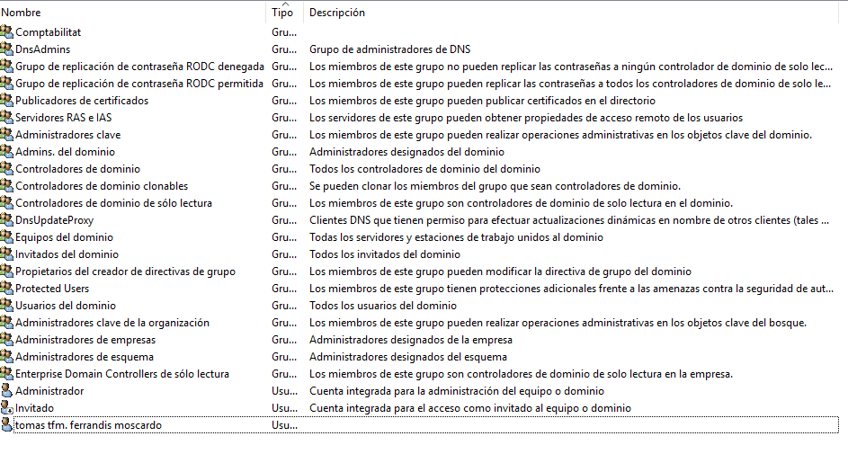

\newpage
\renewcommand\tablename{Tabla}

# 1 Servei de directori

## 1.1 Conceptes de Directori i Domini

Bàsicament podem entendre un directori com una llista detallada d'objectes. Per
exemple, l'agenda de tlf del mòbil és un tipus de directori que guarda informació de contactes de persones o entitats. Objectes per igual (contactes) que poden tindre nom, adreça, tlf, e-mail, malnom...

### Dos classes d'informació

L'Active Directory Domain Services (AD DS) és molt semblant però més flexible i dinàmic. Permet emmagatzemar la informació
de tota l'organització. Una informació sobre l'estructura de l'propi directori i també sobre com s'ha d'administrar.
AD DS pot emmagatzemar informació sobre l'organització, llocs, ordinadors, usuaris, objectes compartits i qualsevol altra cosa que pugui formar part de la infraestructura de xarxa. A diferència de la llista de contactes de whatsapp, ací els elements emmagatzemats son de diferent naturales (usuaris, grups, UO, polítiques d'accés, permisos, assignació de recursos,
etc.)
Cal recordar que tota aquesta informació s'emmagatzema en una base de dades jeràrquica.

### Replicable

El motor d'aquesta base de dades és el mateix que incorpora Microsoft Exchange Server i
permet la replicació de controladors de domini. És a dir, es pot enviar la informació continguda a la
base de dades a diferents controladors de domini a través de la xarxa. 

A més d'administrar polítiques que seran vàlides a tota l'organització, Active Directory permet
realitzar operacions com la instal·lació de programes, de manera simultània i centralitzada, en
multitud de clients o aplicar actualitzacions crítiques en tota l'organització.

Quan utilitzem Active Directory, tenim a la nostra disposició eines d'administració per establir
polítiques de grup, per incloure uns grups dins d'altres en diferents nivells, un accés senzill a l'arbre
d'usuaris, ordinadors, impressores i contactes, etc. Òbviament, podem utilitzar Windows Server
2019 sense usar Active Directory, però estarem prescindint d'un ampli conjunt de capacitats.

### Dos tipus de components

Pel que fa a l'estructura de l'servei de directori, el primer que hem de saber és que hi ha dos tipus de
components en Active Directory: els components físics i els components lògics.

*Taula 1: Components de l'AD-DS*

|Components físics|Components lògics|
|:---|:--|
|Controladors de dominis|Dominis|
|Llocs|Boscos|
|Xarxes|Arbres|
||Unitats organitzatives|

>Nota:
>
>Al mòdul de SOX ens centrem en desenvolupar un model senzill d'organització: un Domini amb Unitats Organitzatives.

# 2 Creació del domini

De moment el que tenim és una LAN del tipus WorkGroup (grup de treball). Usuaris locals de cada màquina i cap administració centralitzada. 
Per passar de WORKGROUP -> DOMAIN caldrà que:

1.  Instal·leu el Active Directory ( AD-DS )
2.  Promocioneu el servidor a Controlador del Domini (DC)

# 3 Canvis en la configuració de la xarxa

Tal i com s'ha explicat als punts 5 i 6 de la Unitat 2. Per al domini cal configurar les màquines de la següent manera:

## 2.1 Instal·lació de l'Active Directory

## 2.2 La Promoció de Windows Server a Domain Controller (DC)

## 2.3 Crear un nou bosc

La ressolució de noms, de moment, no la configurem.

**Nom NetBios del Domini**

**Carpetes importants**

**Resum de les accions fetes i Script**

>NOTA
>
>L'script que podem descarregar-nos ens serà útil en la implementació del AD-DS en un Windows Server Core.
>Per executar-lo cmdLet a cmdLet o com a script desant-lo amb l'extensión *.ps1

# 3 Objectes del AD

Tot seguit estudiareu els objectes: 

* Usuaris
* Grups d'usuaris
* Unitats organtizatives

## 3.1 Usuaris del Domini

A la present unitat i en avant, anem a centrar-nos en els usuaris del domini. Sobre usuaris locals (els que usem en monoestació o WorkGroup) teniu tota la informació al curs de Windows 1x d'aquest repositori.

Recordem que els grups són un tipus de contenidor que permeten definir conjunts d'usuaris i definir permisos basant-nos en aquesta pertinença al grup, en lloc de fer-ho de manera individual, usuari per usuari.
Com a pauta general, l'agrupació d’objectes sol facilitar les tasques d’administració reduint les possibilitats d’error.

### Creació d'usuaris

Tot i que després vorem com poden ser els usuaris, és a dir a quin o quins grups poden pertànyer, fem una mirada prèvia al manteniment dels usuaris per donar un enfoc pràctic i més dinàmic.

### Des de l'Adminsitrador de l'Active Directory

### Creem un usuari

### Configurem el compte d'usuari creat

## 3.2 Grups d'usuaris en l'AD

### Tipus i àmbits

Hi ha dos grans tipus de grups al Directori Actiu del Windows:

**Grups de seguretat:** aquest tipus de grups permet definir permisos per a recursos del domini. Són els utilitzats a les llistes de control d'accessos (ACLs) que s'estudiaran més endavant. Aquest tipus de grups són els que s'utilitzaran a la administració de la xarxa.

**Grups de distribució:** no tenen característiques de seguretat, únicament són un llistat d'usuaris per a missatgeria.

Dins dels grups de seguretat hi ha tres àmbits:

**Grup Universal:** és un grup els permisos del qual s'estenen a diversos dominis. A més, aquest tipus de grups pot estar format per usuaris o grups d’usuaris de diferents dominis.

**Grup Global:** és molt similar als grups universals, és a dir poden permetre l'accés a recursos de qualsevol dels dominis de l'arbre del Directori Actiu, però llevat que tots els membres del grup deuen pertànyer al mateix domini.

**Grup local del domini:** és un grup creat en un domini amb membres que poden provenir d'altres dominis i que només pot tenir accés a recursos dins del domini.

**En quins casos utilitzarem cada àmbit?** 

Els grups universals solen tenir la seva utilitat en grans empreses on s'ha definit un bosc de dominis
assignant dominis a cadascun dels seus departaments o divisions. En aquest tipus d'estructures, quan se'n realitza una modificació en el grup, aquesta ha de replicar-se en tots els controladors de domini que estiguin configurats com a catàleg global.
En xarxes de domini únic es poden aplicar grups globals que tindran més sentit quan es defineixi un segon domini, el que pot passar en el moment en què hi hagi una ampliació de l’organització.

Com a pautes generals per a l'administració de xarxes tindrem en compte les consideracions següents

1. No cal assignar un àmbit més ampli del necessari.

2. Els grups locals de domini no es poden processar a altres dominis.

3. Un grup global no es replica fora del domini, ja que no forma part del pla de replicació del catàleg global.

4. Els grups universals es repliquen per tota la xarxa generant trànsit que tenia certa incidència en el rendiment abans dels Windows Server 2008. hui en dia en té poca.

5. Si un grup universal està compost per grups globals i es produeixen canvis dins dels grups globals, no es produeix un canvi al catàleg global, i per tant aquesta modificació no comporta una replicació en tots els controladors de domini del bosc.

### Grups predefinits

En instal·lar el Directori Actiu podem comprovar que s'han generat automàticament una sèrie de grups predefinits amb uns permisos d'acord amb les funcions assignades:

Examinem les funcions d'alguns dels grups més utilitzats:

**Usuaris del domini:** grup global que conté tots els comptes d'usuaris del domini.

**Administradors del domini:** grup global que permet als membres realitzar tasques d'administració del domini.

**Administradors d'empresa:** grup universal que permet als membres realitzar tasques d'administració a tots els dominis de la xarxa.

**Administradors d'esquema:** grup universal que permet als membres modificar l'estructura dels objectes del Directori actiu.

**Administradors:** grup local que permet als seus membres realitzar tasques d'administració al controlador de domini.
Operadors de còpies de seguretat: grup local que permet als seus membres fer còpies de seguretat o restaurar fitxers dins del domini.

**Operadors de compte:** grup local que permet als membres crear, editar i eliminar comptes d'usuari i grups.

**Operadors d'impressió:** grup local que permet als membres configurar i administrar l'ús d'impressores de xarxa.

**Operadors de servidor:** grup local que permet als seus membres crear carpetes compartides al servidor i realitzar còpies de seguretat o restaurar fitxers al controlador de domini.

**Usuaris:** grup local que limita les possibilitats que un usuari faci un canvi accidental al sistema però sí permet executar la majoria de les aplicacions.

### Creació de grups.

### Com afegir usuaris al grup.

Opció 1: Propietats del grup...

Opció 2: Des de les Propietats de l’usuari...

## 3.3 Unitats organitzatives (GUI)

Les UO son agrupacions o subdivisions del domini per tal de facilitar l'administració. Contenen recursos i objectes.

Estes subdivisions poden fer-s'hi en base a 3 criteris:

1.  Geogràfic o territorial (Les típiques delegacions de les empreses).

2.  Organització interna (agrupant departaments de l'empreses que poden equivaldre a grups d'usuaris...)

3.  Dinàmiques, de projectes on van incorporant-se o abandonant usuaris per exemple.

>Note
>
>Per a la gestió de UO des del PowerShell podeu accedir al curs d'aquest repositori de PS:
>https://github.com/tofermos/PowerShell/blob/main/ADunitatsOrganitzatives.md

### Creació

Podem aniuar-les (unes dins d'altres) i fer que hereten les "propietats"

### Protecció contra eliminació i canvi accidental

Quan intentem moure o eliminar una UO tenim un missatge avisant que el canvi pot fer que deixen d'alicar-se directives o afectar als usuaris que la controlen (per exemple).

Si acceptem veiem que és habitual que no ens deixe.

Per defecte es creen protegides per evitar eliminacions o canvis d'ubicació accidentals. Ho hem de desprotegir prèviament.

### Delegació 

És interessant que assignem el control dels objectes i recursos de la delegació territorial/secció de l'empresa/projecte a un usuari.

![]](png/uo1.png)

>Note
>El més habitual serà que l'usuari siga Administrador i puga iniciar sessió de forma remota.
>Consulteu la fitxa de Escriptori Remot

# 4 Servei DNS

L'objecte del mòdul no és l'estudi dels serveis sinó dels Sistemes Operatius. En aquest cas la integració del servei DNS amb el Windows Server.

Aquests punt s'aboradarà des de 3 punts de vista:

* Un enfoc teòric en aquest apartat
* Vorem, més avant, alguns cmdLets per instal·lar/desinstal·lar, consultar i fer algun canvi.

## 4.1 La integració del DNS al servei AD DS

El servei de servidor DNS està integrat en el disseny i implementació dels serveis de domini d'Active Directory (AD DS), proporcionant una eina empresarial per organitzar, gestionar i localitzar recursos en una xarxa.

Quan implementeu servidors DNS amb AD DS, tingueu en compte que:

- El DNS és necessari per localitzar els controladors de domini.
- El servei d'inici de sessió a la xarxa utilitza el servidor DNS per registrar els controladors de domini al vostre espai de noms DNS.
- Els servidors DNS amb Windows Server poden utilitzar AD DS per emmagatzemar i replicar les zones DNS.
- La integració de zones DNS amb AD DS permet funcions com la rèplica d'AD DS, actualitzacions dinàmiques segures, i l'envelliment i eliminació de registres.

**Com s'integra DNS amb AD DS**

Quan instal·leu AD DS en un servidor i el promocioneu a controlador de domini, se us demana que especifiqueu un nom de domini DNS per al domini AD DS. A més, se us ofereix l'opció d'instal·lar el servidor DNS, ja que és necessari per localitzar controladors de domini dins del domini AD DS.

## 4.2 Beneficis de la integració d'AD DS

Per a xarxes que utilitzen DNS per a AD DS, es recomana utilitzar zones primàries integrades al directori, ja que aporten diversos beneficis:

- **Replicació multimaster**: Amb AD DS, qualsevol servidor DNS pot acceptar actualitzacions dinàmiques i replicar-les entre tots els servidors DNS.

- **Seguretat millorada**: Mitjançant ACLs, es poden restringir les actualitzacions dinàmiques per a equips o grups específics, cosa que no és possible amb zones primàries estàndard.

- **Automatització i sincronització**: Quan es crea un nou controlador de domini, les zones es repliquen automàticament.

- **Millor rendiment**: La sincronització de les zones integrades al directori és més eficient que les actualitzacions estàndard, evitant la transferència de tota la zona.

Si integreu les zones DNS amb AD DS, també simplifiqueu la gestió de la rèplica de bases de dades, evitant la necessitat de mantenir topologies de rèplica separades per a DNS i AD DS. Aquesta integració permet visualitzar la gestió com una única entitat administrativa.

Finalment, només les zones primàries es poden emmagatzemar al directori. Les zones secundàries han d'emmagatzemar-se en fitxers de text estàndard, però amb el model de replicació multimaster d'AD DS, no són necessàries si totes les zones estan en AD DS.

