\newpage
\renewcommand\tablename{Tabla}

# 1 Servei de DHCP

Es tracta de la funció bàsica de proporcionar IP provades en les LAN . Encara que aquest servei en altres tipus de xarxes el donen diferents dispositius com és el cas de les WIFIS públiques o el router domèstic.

## 1.1 Conceptes previs

**Recordatori:  Conceptes del mòdul de XAL de 1r SMX**

* Adreça IP: Una adreça única dins del rang establit pel servidor. En una LAN que és on implemetarem el nostre domini són ip privades.

* Màscara de subxarxa: Indica la porció de la xarxa a la qual pertany l'adreça IP.

Exemple:
IP1 192.168.1.3 amb mascara /24 (255.255.255.0)
IP2 192.168.1.45 amb mascara /24 (255.255.255.0)

* Adreça MAC: Adreça única de cada dispositiu (tarja ethernet, WIFI o boca d'un switch). Conté 6 bytes, els 3 més alts identifiquen el fabricant. Els altres 3 bytes, al dipositiu de forma única.

* Passarel·la predeterminada (Gateway o porta d'enllaç): Normalment, és l'adreça del router o un altre dispositiu de xarxa que connecta la xarxa local amb Internet.

* Servidor DNS: És el servidor que fa la funció de resoldre NOMS-IPs dins de l'espai de noms creat amb el nou domini.

* Servidor DNS alternatiu: Quan ens adrecem a un recurs que el nom no està dins del nostre espai de noms (xarxa local en el nostre cas), ens dirigirem a ell (mitjançant el gateway). Solem posar la IPv4 de Google com 8.8.8.8 o 8.8.4.4

El servei **DHCP (Dynamic Host Configuration Protocol)** en **Windows Server** és una **funció de servidor** que permet als administradors de xarxa automatitzar l'assignació d'adreces IP i altres paràmetres de configuració de xarxa als dispositius que es connecten a la xarxa.

## 1.2 Funcionament del servei DHCP

Aquesta funció s'implementa en Windows Server com un servici que respon a la filosofia del model client servidor. 
Quan un dispositiu (com un ordinador, càmera IP, mòbil, impressora...) es connecta a la xarxa, envia una sol·licitud per obtenir una adreça IP. 
El servidor DHCP respon a aquesta petició assignant-li una adreça IP de manera automàtica i dinàmica, així com altres paràmetres de configuració de xarxa com:

1. **Discover**: El client envia una petició en difusió per trobar un servidor DHCP a la xarxa.
2. **Offer**: El servidor DHCP respon oferint una adreça IP.
3. **Request**: El client accepta l'oferta enviant una sol·licitud per a l'adreça IP.
4. **Acknowledge**: El servidor DHCP confirma l'assignació de l'adreça IP al client.

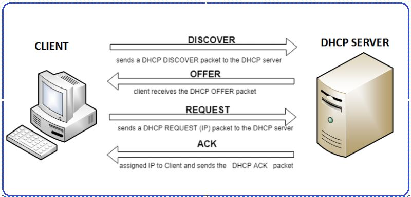{width=60%}

## 1.3 Elements principals del DHCP

- **Rangs o àmbits**: Conjunt o rang d'adreces IP que es poden assignar als dispositius clients.

- **Exclusions**: Quan volem que dins del rang alguna IP o grup d'IPs ("subrangs") no s'assignen. Pot ser útil per si volem assignar-les de forma manual a determinats dipositius.

- **Reserves**: IP que el DHCP assigna sempre al matei dispositiu. Es basa en la seua MAC.

- **Opcions DHCP**: Paràmetres addicionals, com ara passarel·les (router o gateway) predeterminades o DNS, que el servidor DHCP pot proporcionar als dispositius clients.

En resum, el servei DHCP en Windows Server facilita la gestió i assignació automàtica d'adreces IP en una xarxa, millorant l'eficiència i reduint la complexitat de la configuració manual de xarxes.

# 2 Implementació en Windows Server 2019

Veiem com s'implementa aquesta funció típica d'un model Client/Servidor el Windwos Server 2019.

## 2.1 Instal·lació

Un dels servicis més típics i usats d'un servidor senzill de xarxa és l'assignació dinàmica de IP privades de la xarxa local. Veiem com instal·lem i configurem el servei.

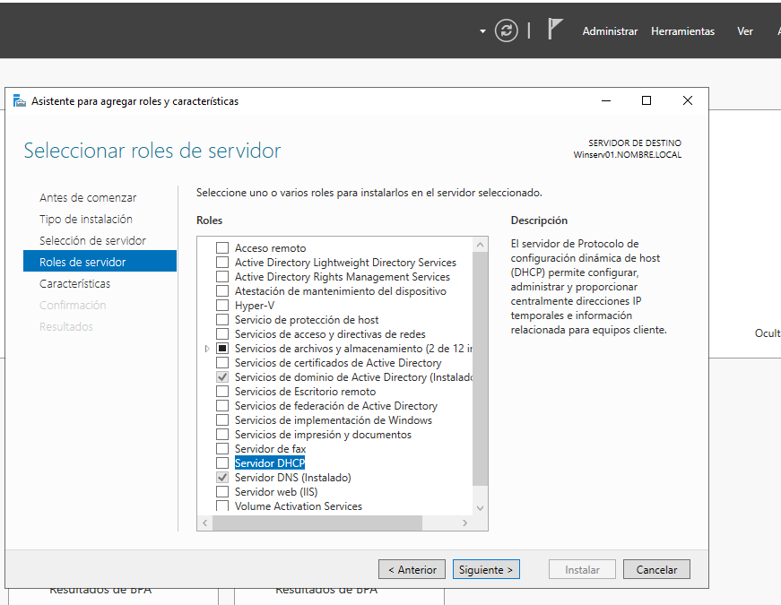{width=60%}

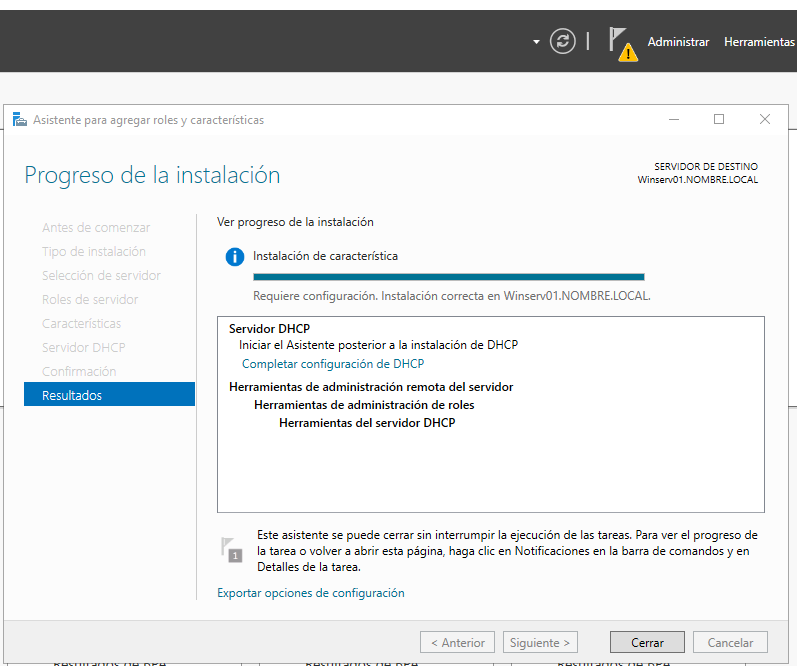{width=60%}

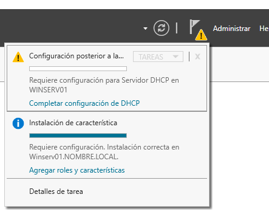{width=60%}

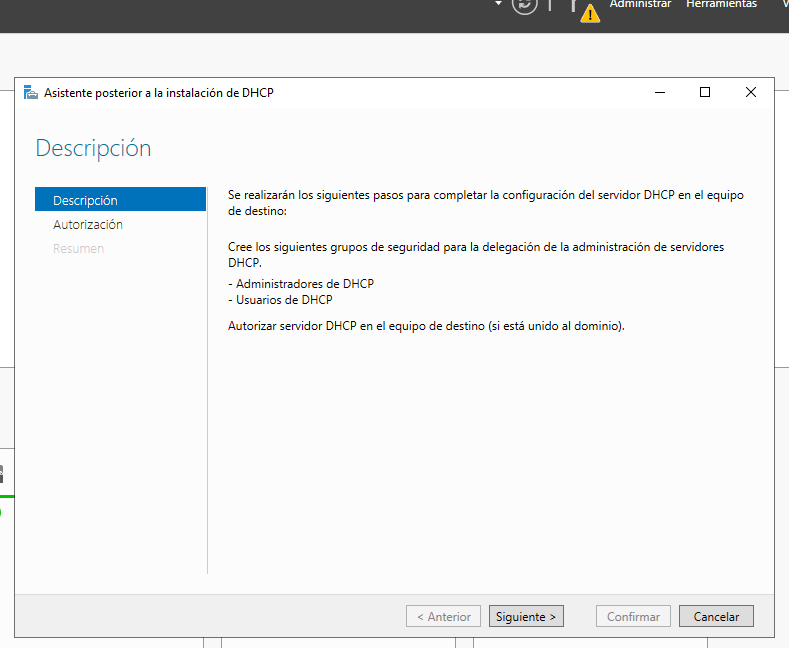{width=60%}

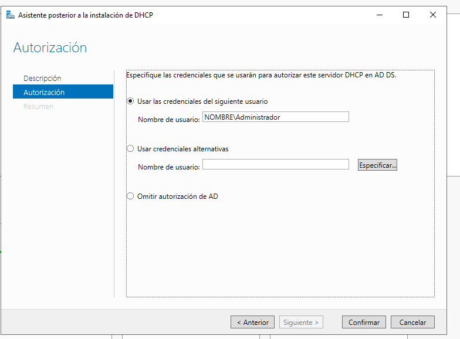{width=60%}

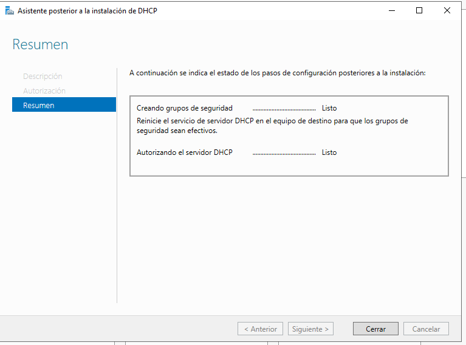{width=60%}

## 2.2 Configuració

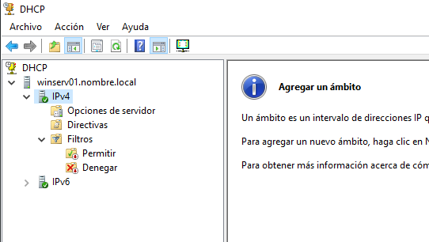{width=60%}

### Creem un rang de IP

**Pasos recomanables** 

* El/s rang/s ha d'abarcar TOTES les volem a la xarxa local. Després indicarem (dins de rang) quines queden excloses:

* Exclourem les que vulguem assignar manualment (estàtiques)... (servidors, altres routers...). Vorem que el servidor DNS i el Gateway (encaminador) ens el demana ara.

* Exclourem les que posem a disposició d'altri (instal·lador extern de fotocopiadores de xarxa o de càmeres IP, per exemple).

* Fer les reserves de IP per a determinades MAC: el DHCP les assigna (són dinàmiques) però sempre al mateix dispositiu.

>Nota:
>
>Les IPs excloses poden assignar-se manualment.
>Les IPs reservades les assigan el DHCP. No estan disponibles per a assignar-se manualment.

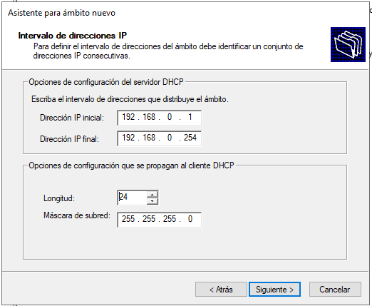{width=60%}

### Exclusions

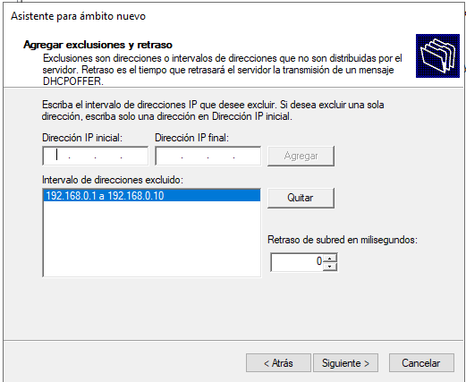{width=60%}

### Duració de l'assignació

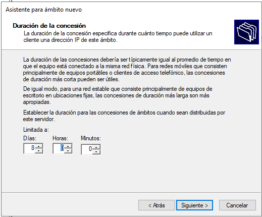{width=60%}

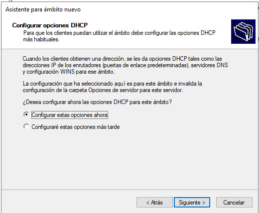{width=60%}

### Gateway (porta d'enllaç) o encaminador

Indiquem la IP que hem configurat al router.

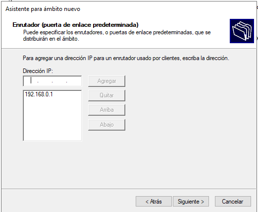{width=60%}

### Servidor DNS

Indiquem la IP que té el servidor amb el servei DNS.

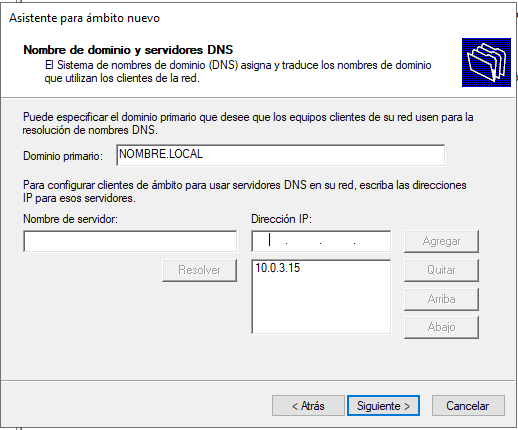{width=60%}

# 3 DHCP com a serveis en Windows Server i Windows 1x

## 3.1 El servei en el servidor

És qui està pendent de les peticions d'IP dels dispositius connectats a la xarxa (no únicament PCs amb Windows 1x). Disposem d'ell quan instal·lem el ROL corresponent.

Mirarem més avant els servicis però podem observar ja alguna característica típica d'este software de servidor. Entrem a la consola de Serveis (**services.msc**):

* Podem reiniciar-lo o aturar-lo
  
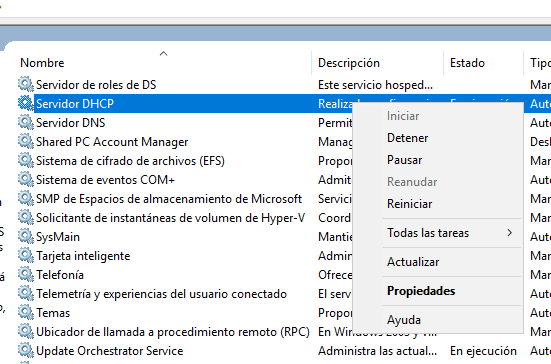{width=60%}

Evidetment és un servei que ha d'estar disponible des del primer moment per tant, el tipus d'inici serà **automòatic**.

* El tipus d'inici per defecte és, obviament, automàtic

 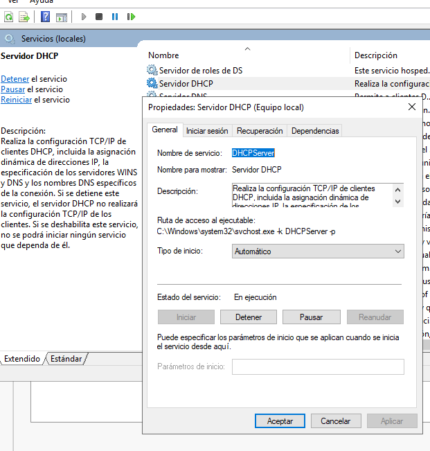{width=60%}

* No està associat a cap compte d'usuari en concret que haja d'iniciar sessió

  Només cal iniciar sessió en un servidor puntualment per a tasques de manteniment.
  
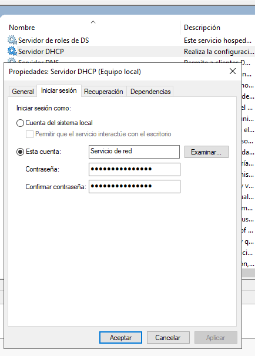{width=60%}

## 3.2 La part client del DHCP

En el PC client devem canviar la configuració de la NIC i especificar que, ara, la IP l'assignarà el DHCP: **assignació dinàmica**

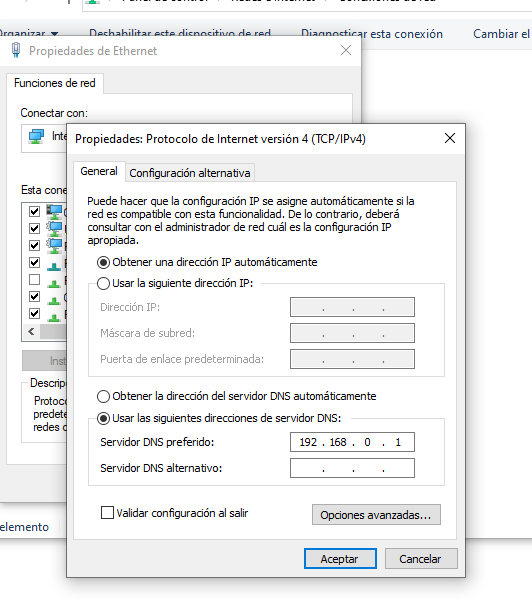{width=60%}

## 3.3 El servici DHCP en el client

És qui demana la IP al servidor i la serveix al software del PC Windows 1x.

* No hem d'oblidar que l'assignació dinàmica de IP o protocol DHCP respon al **model client servidor**.
* Altra qüestió és que **la implementació del software "client DHCP" en un Windows 1x es fa mitjançant un "servei local de Windows"**. No és un "servici" per a altres PC sinó per al mateix software del PC.

* Per comprovar si el client DHCP està funcionant correctament, entrem en la consola de serveis **services.msc** del PC Windows 1x com en el Servidor (encara que òbviament no és e mateix software).

>Nota:
>
>Una qüestió és que la funció típica d'un SOX del DHCP respon al model Client/Servidor. Un dispositiu demana i un servidor respon.
> Altra qüestión és la implemententació del software als dos costats (dispositiu/Servidor) que fa Windows mitjançant servicis propis en els Windows 1x i en el Windows Server.

|Model C/S| Nom del servici Windows|Acció|
|---|---|---|
|Servidor DHCP|"Servicio DHCP" en Windows Server|Reb peticions de IP de dispositius i les assigna|
|Client DHCP|"Cliente DHCP" en Windows 1x|Sol·licita IP i, en rebre-la, la configura a la tarja|

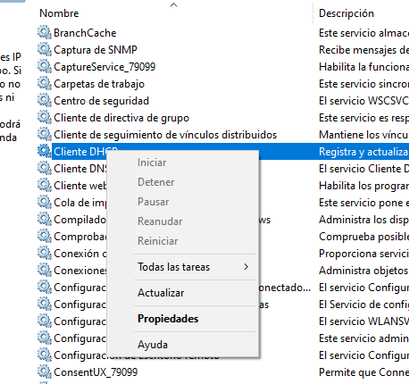{width=60%}
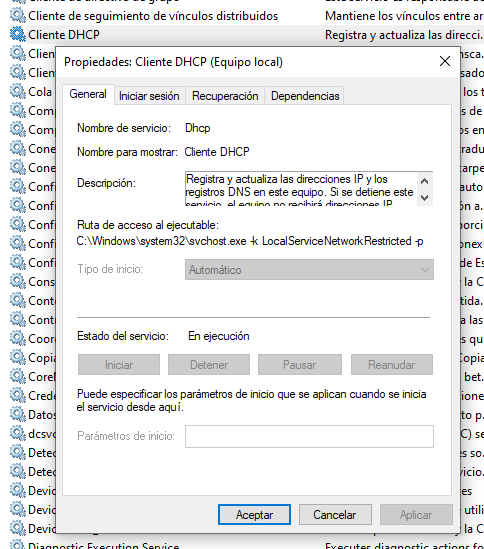{width=60%}
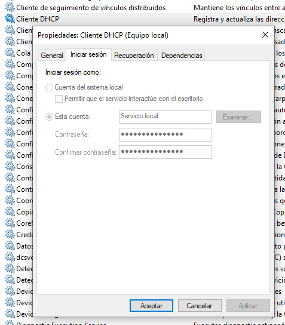{width=60%}

# 5 Avantatges del servei DHCP en Windows Server

- **Gestió centralitzada**: DHCP facilita la gestió de les adreces IP des d'un servidor central, evitant la configuració manual de cada dispositiu.
- **Eficàcia**: Assegura que no es produeixin conflictes d'adreces IP duplicades a la xarxa.
- **Escalabilitat**: És especialment útil en xarxes grans, on assignar IPs manualment seria lent i poc pràctic. 
- **Flexibilitat**: Si volem un canvi de totes les IP o gran part, només hem de configurar-lo al servici i reiniciar el dispositius. Imaginem, per exmeple, passar de IPv4 de classe C a B per a tota una xarxa.
- **Actualitzacions automàtiques**: El servidor DHCP pot canviar les adreces IP dels dispositius a mesura que es connecten i desconnecten de la xarxa.
- **Concessió temporal d'adreces IP**: Les IPs es poden assignar amb una duració específica, de manera que quan un dispositiu deixa de ser necessari a la xarxa, l'IP es pot reutilitzar.

