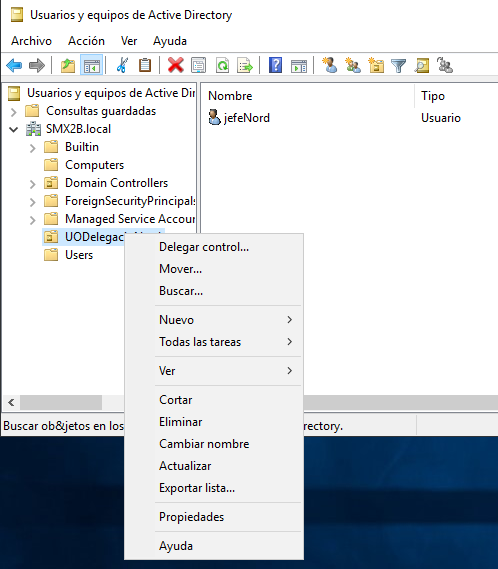
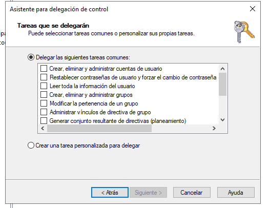

\newpage
\renewcommand\tablename{Tabla}

# 1 Les UO

Com ja hem explicat les UO són un objecte contenidor, d'ahi que es representa al GUI amb una icona similar a la de els carpetes. 
El contigut de les UO són altres objectes: usuaris, grups, carpetes compartides i també altres UO.

## Per a què es creen les UO?

Les UO són transparents a l'usuari. Un comptable pot detectar que forma part d'alguna "agrupació" de companys del mateix despatx o continus i intuir que són un "grup" d'usuaris. Però li costaria més intuir o deduir la existència de UOs.
De mode simplificat podríem dir que les UO es creen per administrar la xarxa per parts. Per a que els adminstradors, o usuaris avançats habilitats, puguen repartir-se la faena d'administrar la xarxa sencera.

Els criteris o raons per crear UO poden ser tres:

1- Dividir l'administració del domini atenent a un **criteri geogràfic**. Delegacions de països, zones... o centres d producció distints.
2- Dividir l'administració del domini atenent a un **criteri organitzatiu**. Agrupant departaments de l'empresa, per exemple.
3- Crear agrupacions d'objectes de forma **dinàmica** per a projectes temporals. Una UO amb tots els recursos (objetes) per crear una aplicació software nova, per desenvolupar un prjecte urbanístics...

## La divisió del treball duu l'especialització

El que està clar és que abandonem el paradigam de l'*administrador o administradors de tot el domini* i obrim les portes a que un usuari (no necessàriament administrador) puga fer tasques (encara que bàsiques) en el Servidor pròpies d'un administrador.

# 2 La delegació de control de la UO

Ja hem vist en aquesta unitat (U3.2) com es creen les UO i com es modifiquen. Ara vorem com es delega el control en un usuari. Delegar el control en un usuari Administrador del domini pot semblar un poc absurd; interessa delegar en un altre tipus d'usuari que no siga Administrador del tot per a convertir-lo en un "quasi-administrador" d'una part del domini (la UO).

### Seleccionem l'usuari (o usuaris)

Hem de buscar is seleccionar correctament l'usuari.

### Assignem drets 

Un exemple d'ús senzill és d'autoritzar a un usuari de la Delegació, Centre de Producció o Projecte que represente la UO per a que reinicie les contrassenyes dels usuaris. Així cada vegada que un operador d'ordinador se li oblida la contrasenya no cal que cride a l'administrador.

### Habilitem l'usuari per a inciar sessió

Com bé sabem, els grups d'usuaris que poden iniciar 
