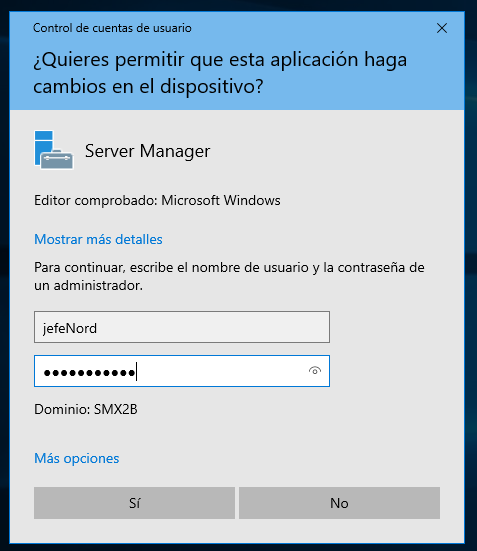
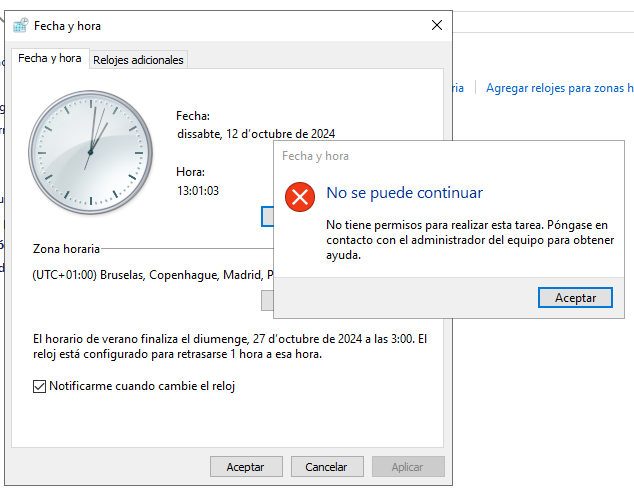
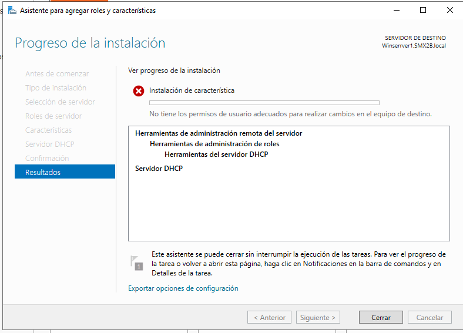
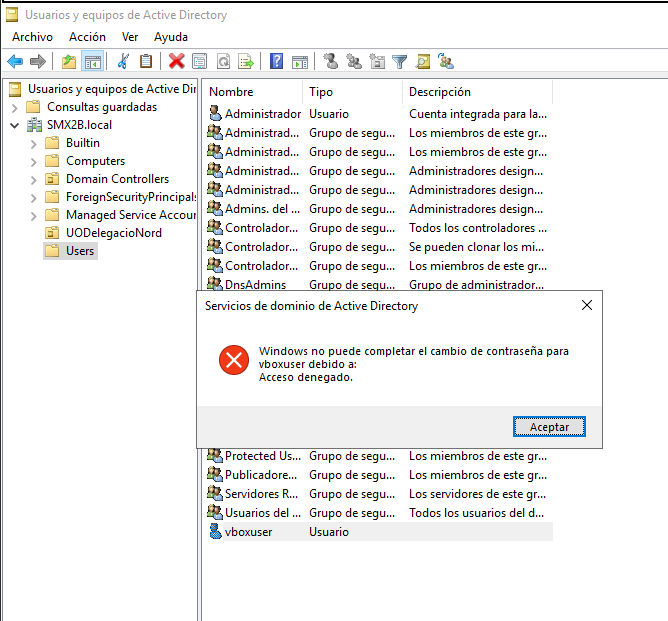
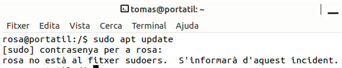
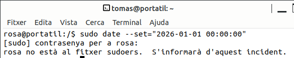

\newpage
\renewcommand\tablename{Tabla}

# 1 Les UO

Com ja hem explicat les UO són un objecte contenidor, d'ahi que es representa al GUI amb una icona similar a la de els carpetes. 
El contigut de les UO són altres objectes: usuaris, grups, carpetes compartides i també altres UO.

## Per a què es creen les UO?

Les UO són transparents a l'usuari. Un comptable pot detectar que forma part d'alguna "agrupació" de companys del mateix despatx o continus i intuir que són un "grup" d'usuaris. Però li costaria més intuir o deduir la existència de UOs.
De mode simplificat podríem dir que les UO es creen per administrar la xarxa per parts. Per a que els adminstradors, o usuaris avançats habilitats, puguen repartir-se la faena d'administrar la xarxa sencera.

Els criteris o raons per crear UO poden ser tres:

1- Dividir l'administració del domini atenent a un **criteri geogràfic**. Delegacions de països, zones... o centres d producció distints.
2- Dividir l'administració del domini atenent a un **criteri organitzatiu**. Agrupant departaments de l'empresa, per exemple.
3- Crear agrupacions d'objectes de forma **dinàmica** per a projectes temporals. Una UO amb tots els recursos (objetes) per crear una aplicació software nova, per desenvolupar un prjecte urbanístics...

## La divisió del treball duu l'especialització

El que està clar és que abandonem el paradigam de l'*administrador o administradors de tot el domini* i obrim les portes a que un usuari (no necessàriament administrador) puga fer tasques (encara que bàsiques) en el Servidor pròpies d'un administrador.

# 2 La delegació de control de la UO

Ja hem vist en aquesta unitat (U3.2) com es creen les UO i com es modifiquen. Ara vorem com es delega el control en un usuari. Delegar el control en un usuari Administrador del domini pot semblar un poc absurd; interessa delegar en un altre tipus d'usuari que no siga Administrador del tot per a convertir-lo en un "quasi-administrador" d'una part del domini (la UO).

## 2.1 Selecionem l'usuari, usuaris o grups

En el nostre exemple triarem un usuari *jefeNord* per a la *UO-DelegacióNord*.

Hem de buscar i seleccionar correctament l'usuari.

## 2.2 Assignem drets 

Un exemple d'ús senzill és d'autoritzar a un usuari de la Delegació, Centre de Producció o Projecte que represente la UO per a que reinicie les contrassenyes dels usuaris. Així cada vegada que un operador d'ordinador se li oblida la contrasenya no cal que cride a l'administrador

>Nota:
>
>Fixem-nos en el detall que parlem de "drets" i no de "permisos" que és un terme que circumscriurem a l'ambit del sistema de fitxers.

## 2.3 Habilitem l'usuari per a iniciar sessió

Com bé sabem, els grups d'usuaris que poden iniciar sessió al servidor per defecte, en acabar la instal·lació, són "administradors". Te la seua raó en la seguretat evidentment.

Com ja hem exposat, ara, anem a fer una excepció permentent l'accés al servidor a un usuari per a que faça **estrictament** les accions que hem especificat adés com a drets.

A la *Unitat 5. Windows Server. Monitorització i ús* tractarem l'inici de sessió remota, ara farem l'inici local.

**Spoiler: directiva de seguretat**

Tot i que les Directives de Seguretat es tracten a la *Unitat 4.Administració i configuració avançada* s'imposa la necessitat de fer un spoiler.

**Comprovem...** Provem tancar la sessió de l'administrador en ús i comprovar que l'usuari ja pot inciar sessió localment al servidor. 
Efectivament, pot. 

## 2.4 Comprovació de les accions que podem fer

Per defecte, no se'ns obri el panel d'Administració de Servidor. Cosa lògica si entenem que no som Administradors ni del servidor (local) ni del domini.

### Accés a eines d'administració

Si intentem accedir a alguna eina d'administració com les consoles de Microsoft (dsa.mmc, per exmple), l'administrador  del servidor (servermanger.exe), panel de control per fer un canvi... Ens demanarà que ens autentiquem...

Una vegada ens autentiquem com a l'usuari delegat veiem que podem entrar sense problemes (en principi).
És més, encara que l'acció no estava entre les autoritzades (apartat 2.2 i Figura 2), potser ens deixe "iniciar-la", fer com uns "primers pasos" dins de cada eina GUI però arriba un moment en que se'ns denega.

Una prova que heu de fer és la provar les accions permeses dins de la UO on tenim delegat el control i fora.

## 2.5 Conclusions

### Analogia i recordatori de SOM

A partir dels coneixements teòrics i pràctics del curs passat a SOM, podem entendre què ha passat i on. 
El que passa és exactament el que ens passava a l'aula de SOM, l'any anterior si, amb l'usuari d'alumne intentàvem executar un "sudo..." 

**Exemple 1** No podem instal·lar un ROL com quan en Linux no podíem instal·lar un paquet...

**Exemple 2** No podem canviar l'hora des del Panel de Control del Windows Server, ve a dir-nos que no "som sudoer"

### Les capes del SO

1- **Interfície usuari** 

GUI: L'eina de configuració (consola msa.msc, per exemple) és un aplicació de sistema. Hi està a la capa externa que es comunica amb nosaltres (usuaris) i ¡, així, li donem les indicacions sobre què volem que faça la màquina.

CLI: El terminal de Linux (o Powershell com vorem) també fan la mateixa funció.

Relament quan ens deixa executar incialment, és com qual al terminal ens deixa escriure "sudo apt...". És quan li donem a Enter ( o Aplicar/Acceptar) quen **enviem l'ordre al kernel** quan...

2- **Seguretat i protecció** El Kernel (nucli del SO) de Windows i de Linux comprovem que l'usuari no està autoritzat.

### Comproveu l'abast de la delegació

És important que comproveu que l'usuari té el control dins de la UO estrictament. En un altra UO o a l'arrel del Domini (exemple de la imatge següent), no.

