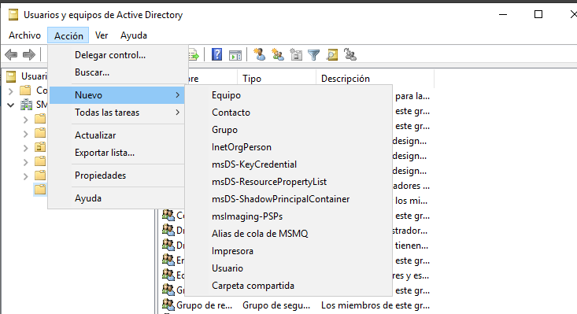
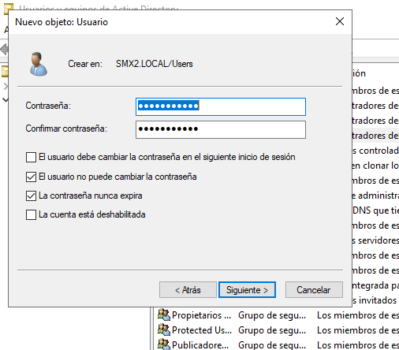
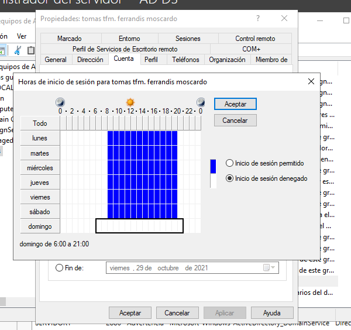
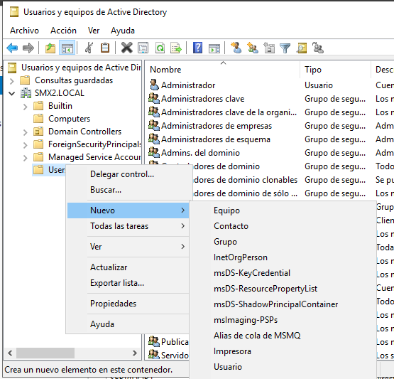
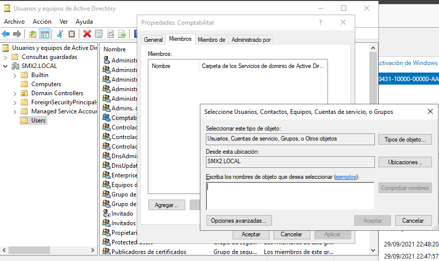
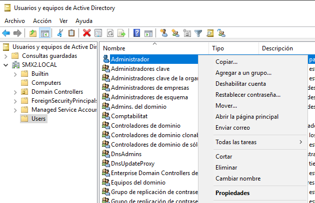
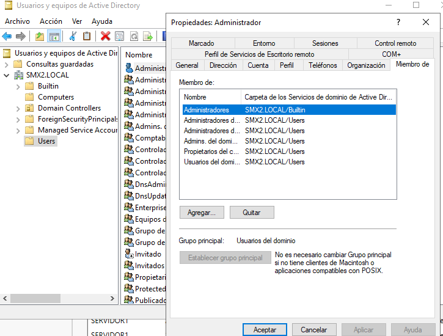

\newpage
\renewcommand\tablename{Tabla}

# 1 Funcions d’un servidor

Des del punt de vista del que series les funcions d'un Sisteam Operatiu de Xarxa trobem, com ja hem vist a l'anterior unitat, que es corresponen a alguns dels Rols i Característiques. Podem dir que Windows Server les implementa així. 
No tots els Rols i Característiques, menys encara, són funcions principals.

1. La funció de Servei de Directori que a Linux serà en OpenLDAP i vorem més avant, ací els el **Active Directory Domain Services (AD DS)**: Permet crear i gestionar dominis de forma centralitzada i còmoda.

2. La funció  o servei de **DHCP Server**: Assigna automàticament adreces IP als dispositius de la xarxa.

3. **DNS Server**: Traduïx noms de domini a adreces IP, facilitant l'accés als serveis dins d'una xarxa o a internet. Convé   que recordeu que quan cofiguràvem les IP en un WorkGroup NO indicàvem cap IP de servidor DNS. En canvi si buscàvem per la xarxa el nom del PC que compartia una carpeta, el trobàvem. En un Domini, usem la ressolució de noms, molt més eficient.

4. **File and Storage Services**: Gestiona el sistema d'emmagatzematge de fitxers i carpetes compartides, i permet utilitzar el servidor de fitxers, les quotes d'emmagatzematge i la deduplicació de dades.

5. La connexió remota pot considerar-se com una funció dels servidors. **Remote Desktop Services (RDS)** Proporciona eines per permetre que els usuaris es connecten de forma remota a escriptoris virtuals o aplicacions publicades.

6. **Print and Document Services**: Permet gestionar impressores i compartir-les en la xarxa.

7. **Web Server (IIS)**: Hosteja aplicacions web i llocs web utilitzant **Internet Information Services (IIS)**.

8.  **Servici de backup de Seguretat de Windows Server**. El vorem.

# 2 Administració i configuració bàsica

## Consoles i altres utilitats comuns a tots el sistemes Windows

Al curs de Windows 11 d'aquest repositori podreu trobar una guia més que suficient sobre les utitlitas gràfiques del sistema Windows per configurar i administrar una màquina.

[Consoles i altres utilitats](https://tofermos.github.io/Windows11/gestiodelequip/gestiodelequip.html)

## Consoles i altres utilitats específiques de Windows

A banda de les vistes en l'apartat anterior i que són comunes, la pràctica totalitat, a tots els Windows tenim que,específicament de Windows Server les consoles i utilitats següents:

**servermanager.exe** - Administrador de Servidors. Aquesta és la utilitat (no es consola estrictament parlant) central per a gestionar el servidor. Permet configurar rols i característiques, gestionar discos, supervisar el rendiment, entre altres funcions.

**dcpromo.msc** - Promoció de controlador de domini: Utilitzada per configurar un controlador de domini (AD DS), una funció exclusiva de Windows Server.

**dnsmgmt.msc** - Gestió de DNS: Disponible en Windows Server per gestionar zones i registres DNS.

**dhcpmgmt.msc** - Gestió de DHCP: Permet administrar el rol de servidor DHCP per assignar adreces IP automàticament a dispositius de la xarxa.

**fsmgmt.msc** - Carpetes compartides: Una consola específica per gestionar carpetes i recursos compartits al servidor, encara que també es pot trobar en versions professionals de Windows 10/11.

**tsadmin.msc** o Remote Desktop Services Manager: Utilitzada per gestionar sessions d'escriptori remot, més comuna en Windows Server per administrar entorns d’escriptori remot (RDS).

**cluadmin.msc** - Gestió de Clúster de Failover: Disponible en Windows Server per administrar clústers de tolerància a fallades i alta disponibilitat, especialment útil per entorns crítics empresarials.

## PowerShell (El vorem més avant)

Més avant, si farem una ullada interessant al lleguatge d'scripts basat en cmdLets (comandaments de Windows) molt avaçat i potent. 

Si voleu consultar, teniu un curs en aquest repositori:

[Curs PowerShell](https://github.com/tofermos/PowerShell)

# 3 Servei de directori

## Conceptes de Directori i Domini

Bàsicament podem entendre un directori com una llista detallada d'objectes. Per
exemple, l'agenda de tlf del mòbil és un tipus de directori que guarda informació de contactes de persones o entitats. Objectes per igual (contactes) que poden tindre nom, adreça, tlf, e-mail, malnom...

### Dos classes d'informació

L'Active Directory Domain Services (AD DS) és molt semblant però més flexible i dinàmic. Permet emmagatzemar la informació
de tota l'organització. Una informació sobre l'estructura de l'propi directori i també sobre com s'ha d'administrar.
AD DS pot emmagatzemar informació sobre l'organització, llocs, ordinadors, usuaris, objectes compartits i qualsevol altra cosa que pugui formar part de la infraestructura de xarxa. A diferència de la llista de contactes de whatsapp, ací els elements emmagatzemats son de diferent naturales (usuaris, grups, UO, polítiques d'accés, permisos, assignació de recursos,
etc.)
Cal recordar que tota aquesta informació s'emmagatzema en una base de dades jeràrquica.

### Replicable

El motor d'aquesta base de dades és el mateix que incorpora Microsoft Exchange Server i
permet la replicació de controladors de domini. És a dir, es pot enviar la informació continguda a la
base de dades a diferents controladors de domini a través de la xarxa. 

A més d'administrar polítiques que seran vàlides a tota l'organització, Active Directory permet
realitzar operacions com la instal·lació de programes, de manera simultània i centralitzada, en
multitud de clients o aplicar actualitzacions crítiques en tota l'organització.

Quan utilitzem Active Directory, tenim a la nostra disposició eines d'administració per establir
polítiques de grup, per incloure uns grups dins d'altres en diferents nivells, un accés senzill a l'arbre
d'usuaris, ordinadors, impressores i contactes, etc. Òbviament, podem utilitzar Windows Server
2019 sense usar Active Directory, però estarem prescindint d'un ampli conjunt de capacitats.

### Dos tipus de components

Pel que fa a l'estructura de l'servei de directori, el primer que hem de saber és que hi ha dos tipus de
components en Active Directory: els components físics i els components lògics.

*Taula 1: Components de l'AD-DS*

|Components físics|Components lògics|
|:---|:--|
|Controladors de dominis|Dominis|
|Llocs|Boscos|
|Xarxes|Arbres|
||Unitats organitzatives|

>Nota:
>
>Al mòdul de SOX ens centrem en desenvolupar un model senzill d'organització: un Domini amb Unitats Organitzatives.

# 3 Instal·lació del Active Directory 

Teniu una guia molt resumida en el curs de Windows Server d'aquest repositori. Entreu al següent enllaç...

[Instal·lació del AD](https://github.com/tofermos/Windows-Server/blob/main/md/ADDSenWindowsServerGUI.md)

# 4 Usuaris i grups del Domini

A la present unitat i en avant, anem a centrar-nos en els usuaris del domini. Sobre usuaris locals (els que usem en monoestació o WorkGroup) teniu tota la informació al curs de Windows 1x d'aquest repositori.

Recordem que els grups són un tipus de contenidor que permeten definir conjunts d'usuaris i definir permisos basant-nos en aquesta pertinença al grup, en lloc de fer-ho de manera individual, usuari per usuari.
Com a pauta general, l'agrupació d’objectes sol facilitar les tasques d’administració reduint les possibilitats d’error.

## 4.1 Creació d'usuaris

Tot i que després vorem com poden ser els usuaris, és a dir a quin o quins grups poden pertànyer, fem una mirada prèvia al manteniment dels usuaris per donar un enfoc pràctic i més dinàmic.

### Des de l'Adminsitrador de l'Active Directory

### Creem un usuari

### Configurem el compte d'usuari creat

## 4.2 Grups d'usuaris en l'AD

### Tipus i àmbits

Hi ha dos grans tipus de grups al Directori Actiu del Windows:

**Grups de seguretat:** aquest tipus de grups permet definir permisos per a recursos del domini. Són els utilitzats a les llistes de control d'accessos (ACLs) que s'estudiaran més endavant. Aquest tipus de grups són els que s'utilitzaran a la administració de la xarxa.

**Grups de distribució:** no tenen característiques de seguretat, únicament són un llistat d'usuaris per a missatgeria.

Dins dels grups de seguretat hi ha tres àmbits:

**Grup Universal:** és un grup els permisos del qual s'estenen a diversos dominis. A més, aquest tipus de grups pot estar format per usuaris o grups d’usuaris de diferents dominis.

**Grup Global:** és molt similar als grups universals, és a dir poden permetre l'accés a recursos de qualsevol dels dominis de l'arbre del Directori Actiu, però llevat que tots els membres del grup deuen pertànyer al mateix domini.

**Grup local del domini:** és un grup creat en un domini amb membres que poden provenir d'altres dominis i que només pot tenir accés a recursos dins del domini.

**En quins casos utilitzarem cada àmbit?** 

Els grups universals solen tenir la seva utilitat en grans empreses on s'ha definit un bosc de dominis
assignant dominis a cadascun dels seus departaments o divisions. En aquest tipus d'estructures, quan se'n realitza una modificació en el grup, aquesta ha de replicar-se en tots els controladors de domini que estiguin configurats com a catàleg global.
En xarxes de domini únic es poden aplicar grups globals que tindran més sentit quan es defineixi un segon domini, el que pot passar en el moment en què hi hagi una ampliació de l’organització.

Com a pautes generals per a l'administració de xarxes tindrem en compte les consideracions següents

1. No cal assignar un àmbit més ampli del necessari.

2. Els grups locals de domini no es poden processar a altres dominis.

3. Un grup global no es replica fora del domini, ja que no forma part del pla de replicació del catàleg global.

4. Els grups universals es repliquen per tota la xarxa generant trànsit que tenia certa incidència en el rendiment abans dels Windows Server 2008. hui en dia en té poca.

5. Si un grup universal està compost per grups globals i es produeixen canvis dins dels grups globals, no es produeix un canvi al catàleg global, i per tant aquesta modificació no comporta una replicació en tots els controladors de domini del bosc.

### Grups predefinits

En instal·lar el Directori Actiu podem comprovar que s'han generat automàticament una sèrie de grups predefinits amb uns permisos d'acord amb les funcions assignades:

Examinem les funcions d'alguns dels grups més utilitzats:

**Usuaris del domini:** grup global que conté tots els comptes d'usuaris del domini.

**Administradors del domini:** grup global que permet als membres realitzar tasques d'administració del domini.

**Administradors d'empresa:** grup universal que permet als membres realitzar tasques d'administració a tots els dominis de la xarxa.

**Administradors d'esquema:** grup universal que permet als membres modificar l'estructura dels objectes del Directori actiu.

**Administradors:** grup local que permet als seus membres realitzar tasques d'administració al controlador de domini.
Operadors de còpies de seguretat: grup local que permet als seus membres fer còpies de seguretat o restaurar fitxers dins del domini.

**Operadors de compte:** grup local que permet als membres crear, editar i eliminar comptes d'usuari i grups.

**Operadors d'impressió:** grup local que permet als membres configurar i administrar l'ús d'impressores de xarxa.

**Operadors de servidor:** grup local que permet als seus membres crear carpetes compartides al servidor i realitzar còpies de seguretat o restaurar fitxers al controlador de domini.

**Usuaris:** grup local que limita les possibilitats que un usuari faci un canvi accidental al sistema però sí permet executar la majoria de les aplicacions.

## 4.3 Creació de grups.

## 4.4  Com afegir usuaris al grup.

Opció 1: Propietats del grup...

Opció 2: Des de les Propietats de l’usuari...

