\newpage
\renewcommand\tablename{Tabla}

# Perfils mòbils.

La configuració de Perfils Mòbils serveix per guardar al Servidor la configuració del perfil de l'usuari. 
Podem aplicar-ho a usuaris o grups concrets o a una Unitat Organitzativa o a tots els usuaris del Domini. De moment en esta unitat anem a fer-ho de forma individual a un usuari.

Avantatges:

* Possibilitat d'iniciar la sessió en qualsevol PC client i disposar del teu perfil (Configuració d'Escriptori, Unitats de xarxa...)

* Possibilitat de que l'Operador de còpies de seguretat programe un backup del nostre perfil.
  
Desavantages:

* La càrrega del perfil des del servidor fins el PC client genera un tràfic a la xarxa local que pot notar-se en iniciar tots el usuaris al mateix temps.

* Els usuaris poden despreocupar-se del tamany de les seues dades i acabar, entre tots, ocupant massa espai de disc dur al servidor.

## Crear i compartir carpeta

* Creem una carpeta en el servidor que compartim...

* ...donant permisos **control total** als usuaris als que volem configurar un perfil mòbil per a que en el primer inici de sessió puguen crear una subcarpeta i prendre possessió i guardar fitxers.

* La resta d'usuaris del domini no deuen accedir a una informació de perfil.

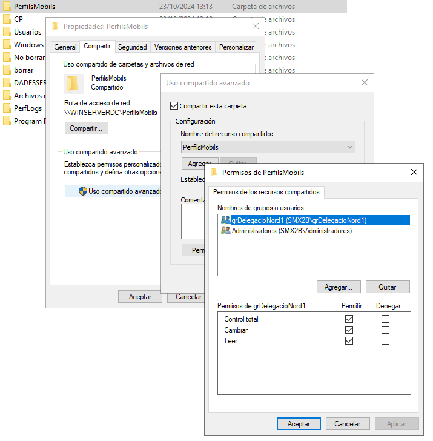

### Assignem la ruta del perfil

En el *dsa.msc* assignem el la ruta de la carpeta a un usuari (Figura 2)
Si seleccione, més d'un usuari (seleccionat amb Control) podem fer-ho de colp amb la variable **%username%** (Figura 3)

* Per a un usuari podem usar el *nom d'usuari* ( a la imatge usar la variable %username% )

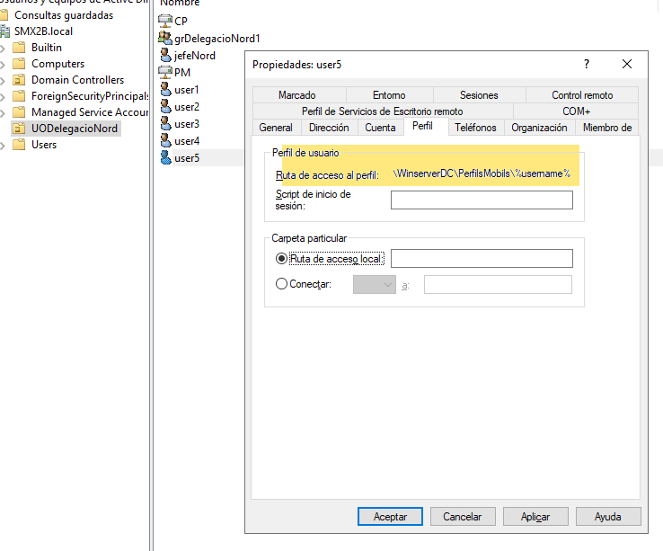

* Per a assignar a més d'un usuari al mateix temps ens valem de %username% 

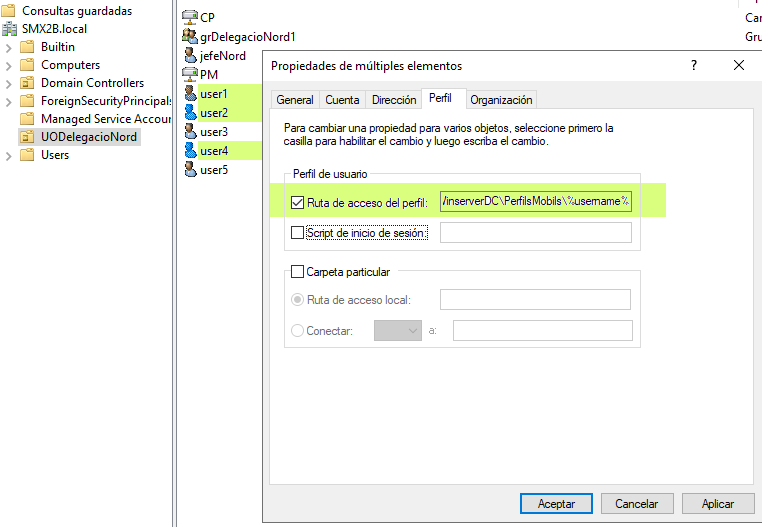

# Carpetes particulars

Son carpetes del Servidor que poden ser emprades per desar els treballs de cada usuari a efecte de centralitzar els backups. Ací es tracta més de dades del treball del dia a dia que de la confiuguració.

Ho fem de forma anàloga a l'anterior amb els usuaris que vullguem.

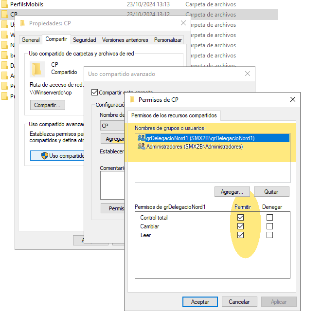

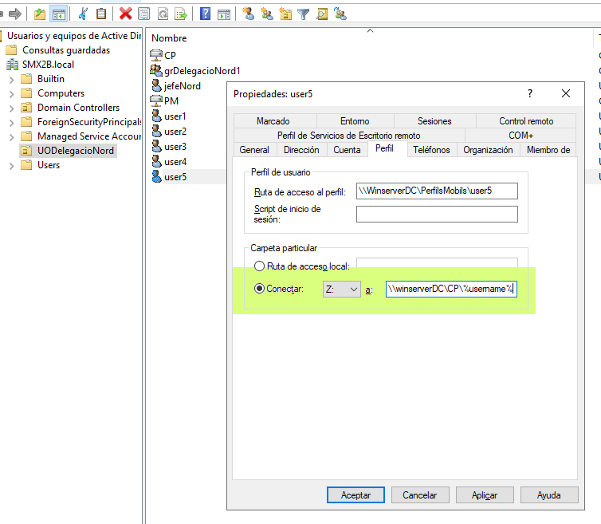

També es pot aplicar a més d'un de colp amb *%username%*

>Nota
>
>Moltes d'estes funcionalitats que estem aplicant de forma individualitzada, més avant vorem que es poden (i deuen) fer de forma més automatizada per atots els usuairs o PC de les UO o Domini.
>Ací és on entren en joc els scripts amb cmdLets de PowerShell i les Directives de grup.

# Readreçament de carpetes

També és interessant que les carpetes habituals de treball com són "Documentos", "Baixades" etc. les puguem tindre guardades al servidor i que també puga l'administrados del domini o l'operador de backups fer una còpia d'elles.

## Crear la Directiva

Podem seleccionar la **UO (o el Domini sencer)** on volem que s'aplique el nou adreçament. O crear la directiva i després vincular-la.

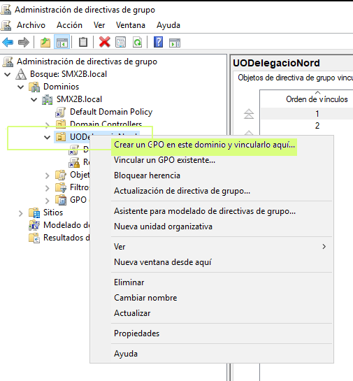

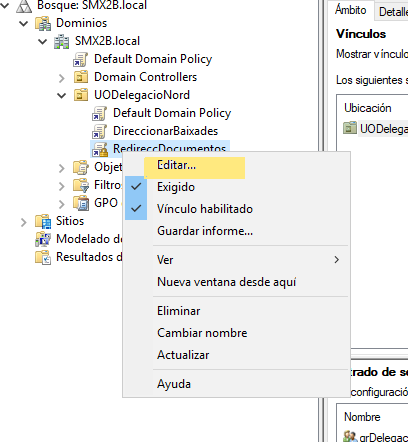

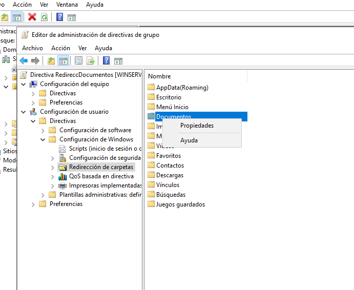

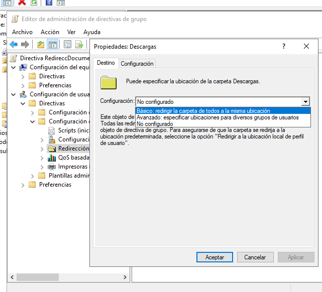

### Una carpeta per usuari

Independentment de la carpeta (Documents, Baixades...), podem optar per separar la informació de cada usuari.

Ací per crear una carpeta per cada usuari NO hem d'indicar el nom ni %username%

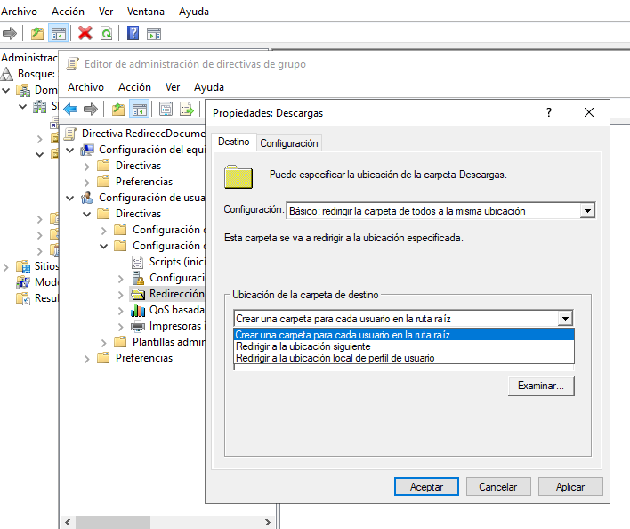

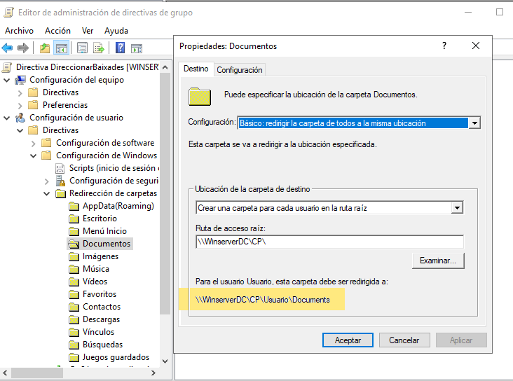

### Compartir tot en un sola carpeta

Independentment de la carpeta (Documents, Baixades...), podem optar per compartir en una sola carpeta.

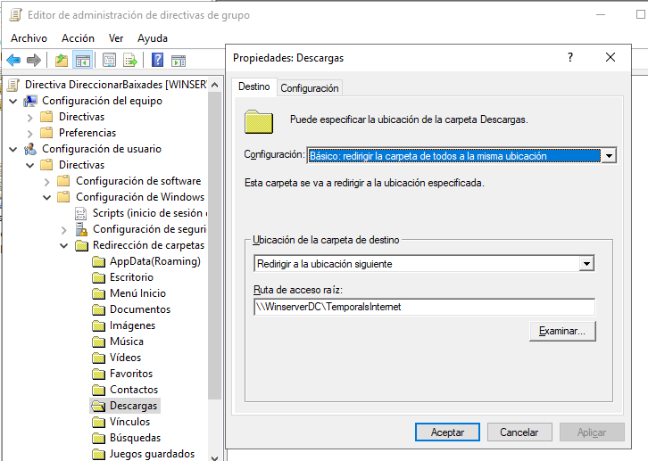

# Exemples d'ús

Optem per carpetes particulars amb accès a través d'una unitat de xarxa (P:) on cada usuari té una carpeta. Indiquem que no usen Documentos per a informació de l'empresa. També podem ocultar la carpeta Documentos en el client (com vàrem vore el curs passat en SOM).

Alternativament podem readrecem Documents a una carpeta compartida i no usar les Carpetes Particulars.

O bé manteir les dos opcions. Carpeta Particular per a un tipus d'informació i Documents per a altra.

Independentment, el Perfil pot ser o no mòbil.

# Consideració final

No existeix una forma "correcta"  de treballar. Els administradors de la xarxa han de tindre en compte les necessitats de l'organització, dels usuaris i els costums que tenen per decidir:

1.  **Quina informació** convé desar al Servidor i fer **backup periòdicament** i quiè pot quedar-se al PC Client per no tindre valor per a l'organització.
2. A partir d'ací, també haurà de marcar unes **normes d'ús** per als usuaris. Indicant-li on ha de guardar allò que és important per l'organització i on pot (si pot) deixar les "seues coses" o informació temporal sense valor.
3. Es pot configurar que es guarde al Servidor fins i tot les descàrregues o altres fitxers temporals a efectes com hem vist.

