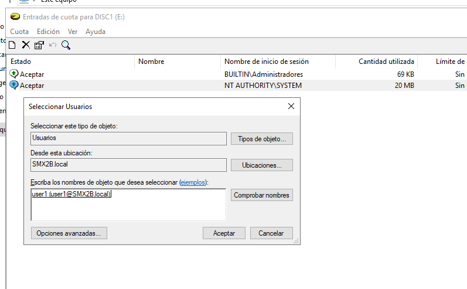
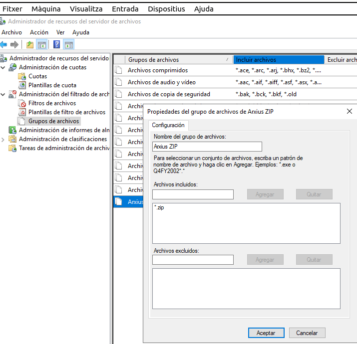

\renewcommand\tablename{Tabla}
\newpage

# 1 INTRODUCCIÓ

En xarxes amb dades compartides entre usuaris ens interessa establir límits d'emmagatzematge o controlar un mal ús o abús dels recursos evitant que algun usuari ocupe mes espai del que, com a administradors del domini, entenem que, en prinicipi necessita. Aquestes limitacions son el que en els SO entenem per *quotes*.

En aquesta unitat les estudiarem al Domini basat en Windows Server i més avant en Linux Server. 

# 2 QUOTES EN WINDOWS

Les quotes de disc realitzen un seguiment i controlen l'ús de l'espai de disc en els volums NTFS. Quan habilites quotes de disc, pots configurar dos valors:

* El límit de la quota de disc

* El nivell d'advertència de la quota de disc.

Per exemple, pots configurar un límit de quota de disc de 100 megabytes (MB) i un nivell d'advertència de
quota de disc de 80 MB. En aquest cas, l'usuari no pot emmagatzemar més de 100 MB d'arxius en el volum (volum).
Si l'usuari emmagatzema més de 100 MB d'arxius en el volum, es pot configurar el sistema de quotes de disc
per que registre un succés del sistema.

Evidentment l'administració de quotes en un volum requereix drets d'administrador en el Servidor (algun software de configuració tocarem) però també estem condicionant o limitant els drets del usuaris del domini, per tant, haurem de ser un usuari Administrador del domini (el grup Admins.del dominio, per exemple).

A partir del moment en el qual s’habiliten quotes de disc per a un volum, es realitzarà automàticament un
seguiment de l'ús quantitatiu del volum que facen tots els usuaris.
Pot ser útil habilitar quotes i no limitar l'ús de l'espai de disc sinó sols realitzar un seguiment de l'ús de l'espai de disc per part de cada usuari. També podeu especificar si ha de registrar o no un succés quan els usuaris superen el seu nivell d'advertència de quota o el seu límit de quota.


## Límit per carpetes

Windows Server ens permet mitjançant el ROL "Administrador de recursos del servidor de archivos" aplicar les quotes a carpetes individuals. Açò combinat amb les Carpetes Particular, readreçament de Documents o les carpetes compartides ens permet fer una gestió de l'espai secundari de la xarxa molt bona.

## Compressió de dades

Amb la compressió d'arxius no eludim el control si configurem aquest en local, ja que el seguiment es fa atenent a la seua grandària original, sense comprimir.

Per contra, en fer un seguiment de l'ús del volum en les carpetes compartides, Windows calcula el límit de quota mitjançant la grandària comprimida. 

### No interacció entre usuaris

La utilització de l'espai de disc que faça cada usuari, no afectarà a les quotes de disc d'altres usuaris del mateix
volum.

Per exemple, si un usuari guarda diversos arxius amb una mida de 100 megabytes (MB) al Volum E,
que té un límit de quota de 500 megabytes, no podrà escriure més dades en el volum si no elimina o mou
abans diversos dels arxius existents. Tanmateix, la resta dels usuaris encara poden guardar en aquest volum.
Les quotes de disc es basen en **el propietari** dels arxius indistintament dels directoris on s'ubiquen el fitxers.

## Quotes en volumns

Les quotes de disc només afecten als volums i són independents de les estructures de les carpetes dels
volums i de la seua distribució en discs físics.

Si un sol disc físic conté diversos volums i aplica quotes a tots els volums, cada quota de volum afecta
exclusivament a aquest volum. Per exemple, si comparteix dos volums distints, com Volum E i Volum G, es fa
un seguiment independent de les quotes per als dos volums, encara que es troben en el mateix disc físic.
Si un volum abasta múltiples discs físics, s'aplica la mateixa quota a tot l'àmbit del volum. Per exemple, si el
Volum F té un límit de quota de 500 megabytes (MB), els usuaris no podran guardar més de 500 MB en aquest
volum, independentment de si resideix en un disc físic o abasta tres.

# 3 OPERATIVA

Anem a aplicar les quotes sobre els Carpetes Particulars vistes en la  Unitat 3

Comprovem tindre suficient espai al disc.

## 3.1 Activar les quotes al disc

Cal activar les quotes al disc.

Ací podem configurar les quotes per grups o usuaris individuals.


### Quota per usuari

Una vegada tenim activada el sistema de quotes podem assignar quotes per a cada usuari.




No obstant aquesta opció no és la que més ens pot interessar en un entorn de xarxa sinó que ens instressarà mé poder assignar quatoes a carpetes concretes. Ho veiam al següent punt.

## 3.1 Instal·lar el Rol de Administrador de recursos del servidor d'arxius (File Server Resource Manager-FSRM)

Recordem de la Unitat 1 quan parlavem de les funcions d'un SOX. La de servir fitxer vorem que no és estrictament guardar inforamció compartida en disc.
  
El **Administrador de recursos del servidor d'arxius (FSRM)** és essencial per gestionar quotes de disc avançades. 

   1. Des del **Server Manager** al servidor. *servermanager.exe*
   2. Afegeix rols i característiques).
   3. Selecciona **File and Storage Services** > **File and iSCSI Services** > **File Server Resource Manager**.
   5. Completa l’assistent i, si es demana, reinicia el servidor.
   


Opcionalment podeu fer-ho des de PowerShell (executant-lo com a Administrador!)


```Powershell
Install-WindowsFeature -Name FS-Resource-Manager -IncludeManagementTools
```


Comprovar que el servici funciona

Podeu comprovar que el servici corresponent està Iniciat o revisar el tipus d'inici.


## 3.2 Configura les Quotes per a les Carpetes Particulars dels Usuaris de la Unitat Organitzativa

Podem configurar per al Directori que considerem. En aquest cas anem a usar el de les Carpetes Particulars.

Obrim l'eina i dins d’administració de quotes tenim dues opcions:

* **Quotes:** Mostra totes les quotes creades al "Administrador de recursos del servidor de archivos". Amb boto dret:  **crear nova quota**, podrem definir una al nostre gust, ja siga partint de zero o utilitzant les plantilles disponibles (opció recomanada).

* **Plantilles de quotes:** Mostra les plantilles existents i ens permet crear de noves. Podem configurar el tamany de la quota, i si volem que ens avise per correu electrònic o que registre un event. 


## Plantilles de filtre.

Al marge del tema de la limitació del tamany de disc que pot assolir una carpeta, també podem limitar els **tipus de fitxers**que poden guardar els usuaris. 




## L'aplicació, quan?

L'ordre següent:

```cmd
fsutil behavior set quotanotify 20
```
estableix les notificacions de quotes per avisar els usuaris cada 20 minuts sobre el seu ús de disc. Això és útil en entorns on és important que els usuaris estiguin al corrent del seu consum d'espai per evitar sobrepassar els límits assignats.

Per a fer proves també podem usar la mateix ordre:

```cmd
fsutil file createnew fitxer50MB 500000000
```
