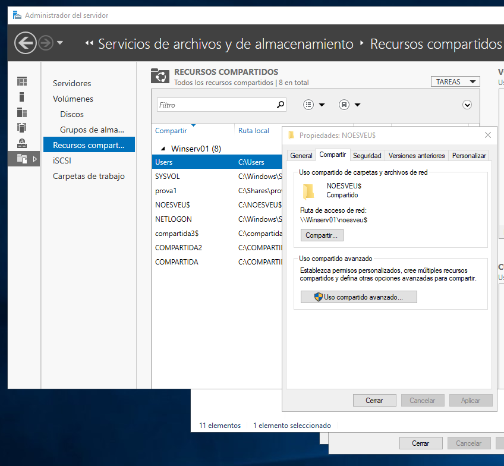
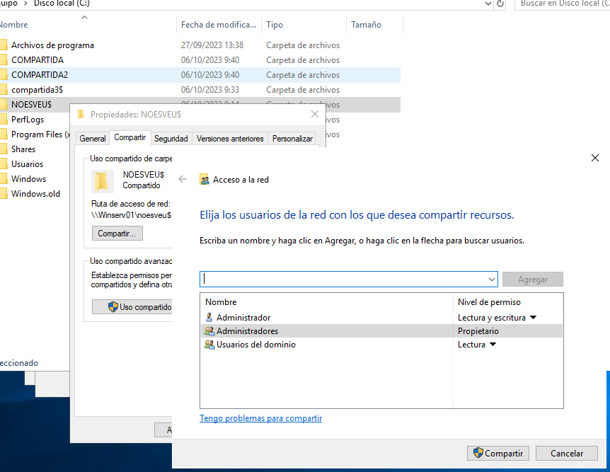
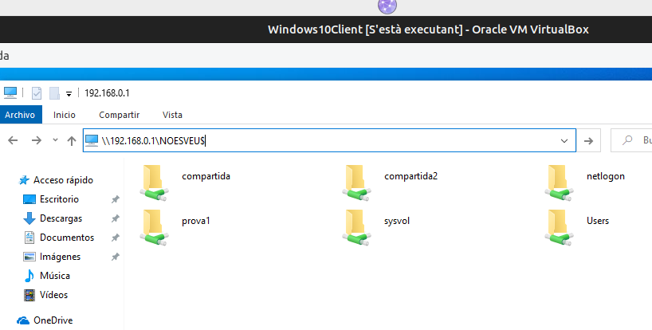

\renewcommand\tablename{Tabla}
\newpage

# RESUM

Aquest és un tema pont entre la Unitat 3 i la Unitat 4 de la Programació Didàctica recentement presentada del curs 2024/2025. Repassem conceptes sobre la compartició de carpetes en Windows i els contextualitzem en Unitat Organitzatives introduint el concpete de "permís  efectiou" que vorem quan tractem els permisos NTFS.
Esta unitat tratarem el Sistema de Fitxers des de dos vesants. La de l'accès (permisos) i ús (quotes) per part dels usuaris i la de la seguretat.
Grosso modo podem dir que tratarem la *disponibilitat* i la *confidencialitat*.

# 1 COMPARTICIÓ de CARPETA (SHARE)

Ja hem vist la compartició de les carpetes en xarxes Windows, tant en la part final del curs passat com en les activitats anteriors de Workgroup i Domini. 
Podem dir que, junt a la gestió centralitzada de comptes (usuaris i grups) és el més bàsic d'una xarxa local.

## 1.1 Prèvia

En Windows tenim dos sistemes de permisos:

* Sharing o compartició de carpetes. Admet només permisos de Lectura, Escriptura i Control Total. Poden aplicarse sobre particions NTFS o FAT32. S'apliquen només si accedim per la xarxa.

* Permisos NTFS, permet detallar més les accions a poder fer en el sistema de fitxers. En un domini, el normal és aplicar-los després de l'anterior per concretar el permisos. Només s'apliquen sobre particions NTFS i actuen també en local.

Anem a centrar-nos en els permisos SHARE

## 1.2 Permisos de Compartició (Sharing)

Els permisos de **compartició (sharing)** en Windows es configuren per controlar l'accés a carpetes **a través de la xarxa**, sense alterar els permisos NTFS locals.

Els permisos de compartició són més simples que els NTFS i es centren principalment en el nivell d'accés remot, mentre que la **propietat** fa referència a qui és el responsable de la carpeta o fitxer, la qual cosa afecta la capacitat de gestió de permisos.

Els permisos de compartició s'utilitzen tres tipus principals:

**Lectura (Read)**: Permet veure el contingut de la carpeta i obrir fitxers, però no es poden modificar ni crear nous elements.

**Canvi (Change)**: A banda de lectura, permet modificar (editar, afegir i eliminar fitxers o carpetes) dins de la carpeta compartida.

**Control total (Full Control)**: Dóna al usuari o grup el màxim nivell d'accés. A bada dels anteriors, canviar els permisos de compartició de la carpeta.

> **Nota:** Es tracta de decidir quins grups/usuaria accediran des de la xarxa i què podran fer.

## 1.3 La propietat

Només el **propietari** (o un administrador) té permisos per ajustar els permisos de compartició (i NTFS de la carpeta). La propietat també permet que el propietari puga recuperar l'accés o modificar permisos, fins i tot si altres usuaris han establert restriccions.

---

# 2. CONFIGURACIÓ

Els passos generals són:

1. **Seleccionar la carpeta**: Clic dret a la carpeta que vols compartir i seleccionar **Propietats**.

2. **Compartició**: Accedir a la pestanya **Compartició** i fer clic a **Compartir...** o **Compartició avançada** per opcions més detallades.

3. **Afegeix usuaris**: En aquesta finestra, pots especificar grups o usuaris concrets de la xarxa (locals del Servidor no té cap sentit) i assignar els permisos adequats (Lectura, Canvi o Control total). 

4. **Guardar canvis**: Recordeu que heu de provar accedint des de Xarxa. No a c:/\... d:/\...

## 2.1 Herència i Permisos Efectius en Compartició *( ho vorem de nou en donar NTFS)*

Els permisos de compartició no tenen herència (NTFS, sí). **S'apliquen només a la carpeta compartida i no a les subcarpetes**. No obstant vorem més avant que els  **permisos efectius** en una carpeta compartida són la combinació dels dos tipus de permisos amb regles en cas de contradicció.

## 2.2 Recomanacions

- **Assigna permisos mínims**: Com sempre, limita l'accés de cada grup als permisos mínims que necessite (Lectura/Canvi/Control total) per minimitzar riscos de seguretat. **Evita “Control total”**.

- **Revisa els permisos efectius** per garantir que els usuaris només tinguin l'accés necessari quan combinen permisos de compartició amb els permisos NTFS locals.

- **Crea grups** encara que siga d'un usuari, et facilitarà la gestió si després tens nous usuaris de perfils similar. 

---

# 3 OPERATIVA

## 3.1 Compartició

Des del Servidor compartim unes carpetes.

Podeu usar la consola **fsmgmt.msc** de CARPETES COMPARTIDES per crear, compartir i assignar permisos NTFS.

## 3.2 Compartició avançada

* CONTROL TOTAL Permís per a canviar el permisos i propietari.

* NOMBRE D'ACCESOS PERMESOS podem limitar la quantitat d'usuaris de la xarxa que poden accedir al mateix temps.

* NOM DEL RECURS COMPARTIT Si volem que la carpeta es veja a la xarxa amb un altre nom
  

---

# 4 ACCÉS PER LA XARXA A LES CARPETES COMPARTIDES
Des del client podem ja accedir als primers recursos compartits.

## 4.1 Formes d'accedir

Si observem, podem vore les carpetes des de Red del client ( Windows 1x ) de 4 formes.

* Gràficament des de l'explorador buscant el servidor
* Gràficament des de l'explorador amb la IP del servidor. Útil per a:
    * Descatar si falla la resolució de noms per provar però no la connexió a nivell de xarxa.
    * Visulitzar els directoris ocults escrivint el nom de recurs compartit amb el $
* Des de l'interface d'ordres amb NET SHARE. Només per visualitzar.
* Des de Powershell ( Ho estudiarem més avant )

  
# 5 Relació amb les Unitats Organitzatives

És molt probable que ens interesse que un departament  o una delegació de d l'empresa (una part del domini), els grups accedisquen a unes determindaes carpetes. I que tots accedisquen igual. 
Amb el que hem vist al tema de UO i en aquest, podem donar solució. Fent que les carpetes estiguen a la UO i, amb la directiva, tots esl usuaris de la UO accedisquen igual ( F:, per exemple )