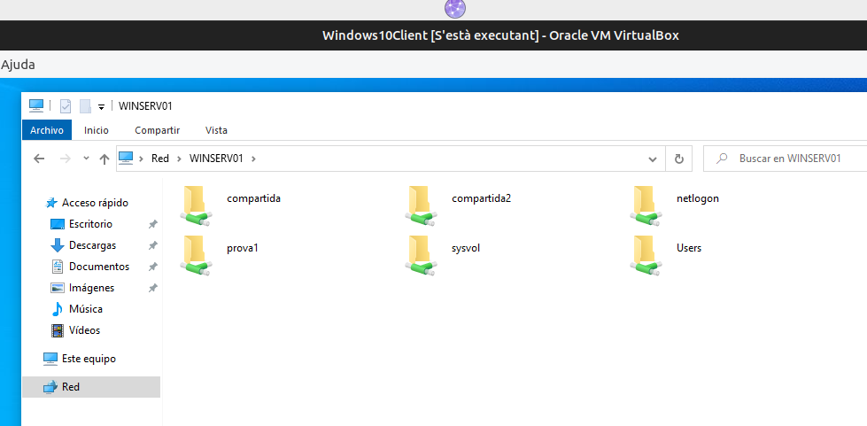
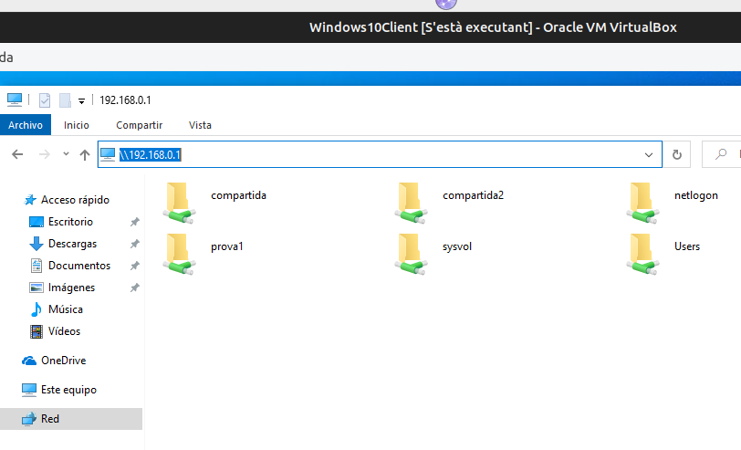

\renewcommand\tablename{Tabla}
\newpage


# RESUM

Aquest és un tema pont entre la Unitat 3 i la Unitat 4 de la Programació Didàctica recentement presentada del curs 2024/2025.

Repassem punts avançats sobre la compartició de carpetes en Windows i els contextualitzem en Unitat Organitzatives introduint el concepte de "permís  efectiu" que vorem quan tractem els permisos NTFS.

La Unitat 4 tracta el Sistema de Fitxers des de les tres vesssants de la tríada de la seguretat: 

* La **disponibilitat i confidencialitat**: Permisos efectius i quotes.

* La **integritat**: Directives de seguretat, Backups i RAIDs

# 1 COMPARTICIÓ de CARPETA (SHARE)

Ja hem vist la compartició de les carpetes en xarxes Windows, tant en la part final del curs passat com en les activitats anteriors de Workgroup i Domini. 
Podem dir que, junt a la gestió centralitzada de comptes (usuaris i grups) és el més bàsic d'una xarxa local.

## 1.1 Prèvia

En Windows tenim dos sistemes de permisos:

* Sharing o compartició de carpetes. Admet només permisos de Lectura, Escriptura i Control Total. Poden aplicarse sobre particions NTFS o FAT32. S'apliquen només si accedim per la xarxa.

* Permisos NTFS, permet detallar més les accions a poder fer en el sistema de fitxers. En un domini, el normal és aplicar-los després de l'anterior per concretar el permisos. Només s'apliquen sobre particions NTFS i actuen també en local.

Anem a centrar-nos en els permisos SHARE

## 1.2 Permisos de Compartició (Sharing)

Els permisos de **compartició (sharing)** en Windows es configuren per controlar l'accés a carpetes **a través de la xarxa**, sense alterar els permisos NTFS locals.

Els permisos de compartició són més simples que els NTFS i es centren principalment en el nivell d'accés remot, mentre que la **propietat** fa referència a qui és el responsable de la carpeta o fitxer, la qual cosa afecta la capacitat de gestió de permisos.

Els permisos de compartició s'utilitzen tres tipus principals:

**Lectura (Read)**: Permet veure el contingut de la carpeta i obrir fitxers, però no es poden modificar ni crear nous elements.

**Canvi (Change)**: A banda de lectura, permet modificar (editar, afegir i eliminar fitxers o carpetes) dins de la carpeta compartida.

**Control total (Full Control)**: Dóna al usuari o grup el màxim nivell d'accés. A bada dels anteriors, canviar els permisos de compartició de la carpeta.

> **Nota:** Es tracta de decidir quins grups/usuaria accediran des de la xarxa i què podran fer.


## 1.3 La propietat

Només el **propietari** (o un administrador) té permisos per ajustar els permisos de compartició (i NTFS de la carpeta). La propietat també permet que el propietari puga recuperar l'accés o modificar permisos, fins i tot si altres usuaris han establert restriccions.

---

# 2. CONFIGURACIÓ

Els passos generals són:

1. **Seleccionar la carpeta**: Clic dret a la carpeta que vols compartir i seleccionar **Propietats**.

2. **Compartició**: Accedir a la pestanya **Compartició** i fer clic a **Compartir...** o **Compartició avançada** per opcions més detallades.

3. **Afegeix usuaris**: En aquesta finestra, pots especificar grups o usuaris concrets de la xarxa (locals del Servidor no té cap sentit) i assignar els permisos adequats (Lectura, Canvi o Control total). 

4. **Guardar canvis**: Recordeu que heu de provar accedint des de Xarxa. No a c:/\... d:/\...

## 2.1 Herència i Permisos Efectius en Compartició *( ho vorem de nou en donar NTFS)*

Els permisos de compartició no tenen herència (NTFS, sí). **S'apliquen només a la carpeta compartida i no a les subcarpetes**. No obstant vorem més avant que els  **permisos efectius** en una carpeta compartida són la combinació dels dos tipus de permisos amb regles en cas de contradicció.

## 2.2 Recomanacions

- **Assigna permisos mínims**: Com sempre, limita l'accés de cada grup als permisos mínims que necessite (Lectura/Canvi/Control total) per minimitzar riscos de seguretat. **Evita “Control total”**.

- **Revisa els permisos efectius** per garantir que els usuaris només tinguin l'accés necessari quan combinen permisos de compartició amb els permisos NTFS locals.

- **Crea grups** encara que siga d'un usuari, et facilitarà la gestió si després tens nous usuaris de perfils similar. 

---

# 3 OPERATIVA

## 3.1 Compartició

Des del Servidor compartim unes carpetes.


Podeu usar la consola **fsmgmt.msc** de CARPETES COMPARTIDES per crear, compartir i assignar permisos NTFS.


## 3.2 Compartició avançada

* CONTROL TOTAL Permís per a canviar el permisos i propietari.

* NOMBRE D'ACCESOS PERMESOS podem limitar la quantitat d'usuaris de la xarxa que poden accedir al mateix temps.

* NOM DEL RECURS COMPARTIT Si volem que la carpeta es veja a la xarxa amb un altre nom.
  


Recordeu que en la consola **fsmgmt.msc** veieu les sessions de xarxa. Si s'ha superat el **nombre màxim d'accessos simultanis** a una carpeta, podeu consultar (i expulsar l'usuari des d'ací).

---

# 4 ACCESOS I MAPEIG

Des del client podem accedir als primers recursos compartits fins i tot si estan ocults

## 4.1 Formes d'accedir

Si observem, podem vore les carpetes des de Red del client ( Windows 1x ) de 4 formes.

* Gràficament des de l'explorador buscant el servidor

* Gràficament des de l'explorador amb la IP del servidor. Útil per a:

    * Descatar si falla la resolució de noms per provar però no la connexió a nivell de xarxa.

    * Visualitzar els directoris ocults escrivint el nom de recurs compartit amb el $

* Des de l'interface d'ordres amb NET SHARE.

* Des de Powershell.




  

L'assignació d'unitats es pot fer des del

* GUI.
* Des del cmd (*net use*, com ja vam avançar)*.
* PowerShell. Teniu informació al Repositori de PowerShell 
* Carpetes Particulars (ja estudiat).
* GPO (apartat següent)

Teniu informació sobre com s'accedeix amb els cdmLets de PowerShell al repositori de PowerShell:

[Repositori PowerShell](https://github.com/tofermos/PowerShell/blob/main/md/PSCompartirRecursos.md)

>TERMES QUIVALENTS:
> Assignar unitat de xarxa, mapeig, capturar unitat... és el mateix.


# 5 RELACIÓ AMB LES UNITATS ORGANITZATIVES i DIRECTIVA

És molt probable que ens interesse que un departament  o una delegació de d l'empresa (una part del domini), els grups accedisquen a unes determindaes carpetes. I que tots accedisquen igual. 
Amb el que hem vist al tema de UO i en aquest, podem donar solució. Fent que les carpetes estiguen a la UO i, amb la directiva, tots esl usuaris de la UO accedisquen igual (F:, per exemple)

## 5.1 Mapeig per GPO

L'assignació d'una unitat de xarxa mitjançant una **Directiva de Grup (Group Policy Object, GPO)**, és centralitzat per al Domoini o UO amb tots els  avantatges importants de seguretat i administració que comporta.

Avantatges:

1. **Control Centralitzat d'Accés**

2. **Assignació Automàtica amb Seguretat**: En lloc de confiar que cada usuari faci el mapeig manualment amb errors possibles.

3. **Opcions de Filtrat per Seguretat**: A les GPOs pots fer ús del filtrat de seguretat i la **delimitació per grups**.

4. **Opcions de Reconnectivitat i Persistència**: Les GPOs permeten definir si la unitat s’ha de tornar a connectar en iniciar sessió o no.

5. **Auditoria i Compliment**: Mitjançant registres d'auditoria a l'Active Directory, pots seguir qui ha accedit als recursos compartits.

## 5.2 Operativa

1. **Obre la Consola de Gestió de Directives de Grup (gpmc.msc)
2. Crea o selecciona una GPO existent en el domini o unitat organitzativa (OU) a la qual vols el mapeig.
3. Ves a: **Configuració d'Usuari** > **Preferències** > **Configuració de Windows** > **Unitats**.
4. Fes clic amb el botó dret i selecciona **Nuevo** > **Unitat de Mapeig**.
5. Indica lletra disponible i del recurs compartit (per exemple, `\\WindowsServerDC\NotesTakeHome`).
6. Selecciona les opcions d’actualització, connexió i desconnexió segons els requisits de seguretat i persistència.
7. Utilitza el **Filtrat de Seguretat** per aplicar la GPO només a grups específics si cal.


Recorda: 

```cmd
gpupdate /force
```


