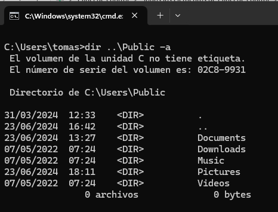
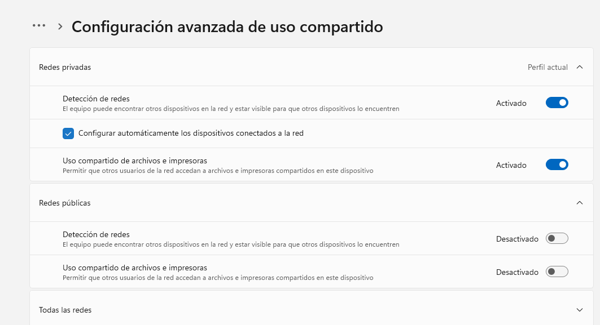
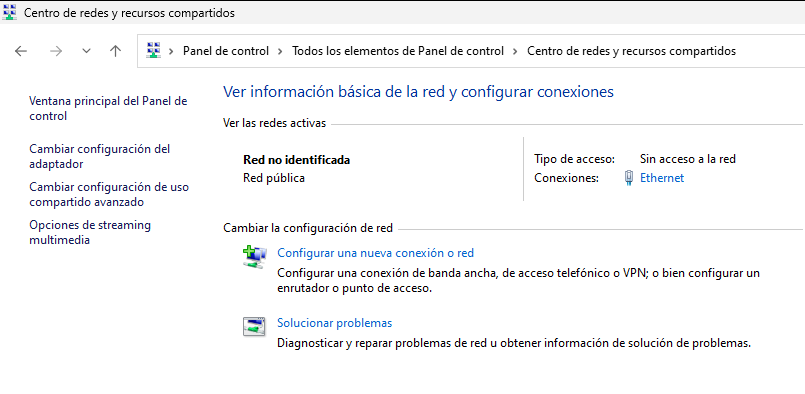
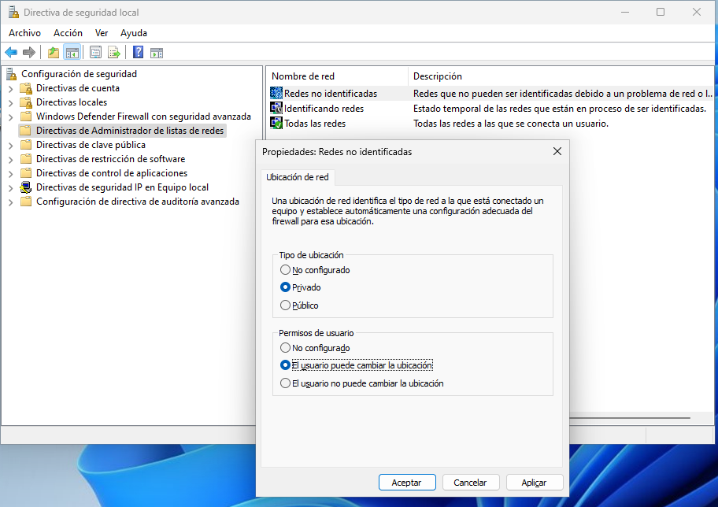
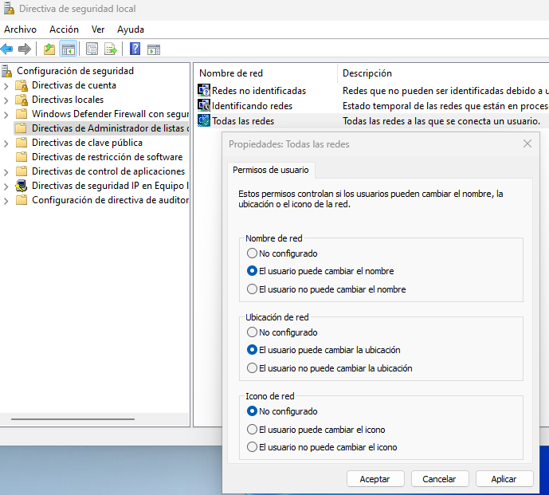
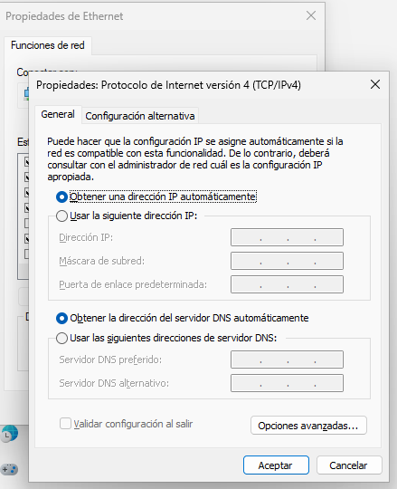
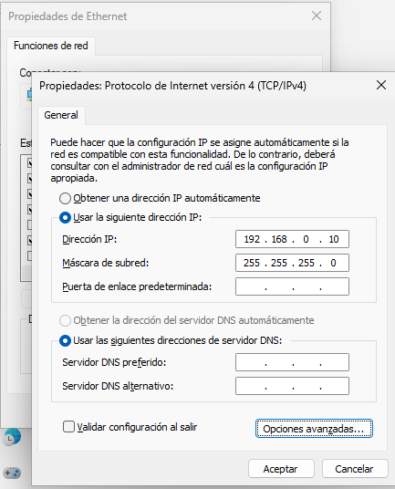
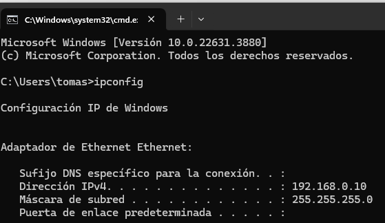

\newpage

\renewcommand\tablename{Tabla}

# 1 La connexió de la xarxa a nivell físic (VirtualBox).

Una vegada instal·lem les MV Windows 11 hem d'assegurar-nos que tinguen una tarja de xarxa per poder comunicar-se entre elles.

De totes les opcions que ens apareixen anem a centrar-nos en les que més ens poden interessar.

* **Adaptador pont** fa que la MV aparega com un PC més de la xarxa local real de l'aula o de ta casa. Tindrà una IP del mateix rang que la de l'amfitrió si ha sigut porporcionada pel servei del router.

* **NAT** Assigan una IP de rang (inclús de classe) ditinta a la del teu PC amfitrió.

* **XARXA INTERNA** A l'igual que l'anterior però ens permet assignar un **nom a la xarxa**.

Aquesta última opció és la que usarem quasi sempre al curs present. Els PCs ( clients i servidors) que han d'estar en la mateix xarxa han de tenir en aquest camp el mateix nom.

*Taula 1. Resum característiques xarxa VirtualBox*

|Té accés a internet|Pot comunicar-se amb altres MV|Es pot comunicar amb la màquina real|Hem de configurar alguna cosa a Linux/Windows|
|:--|:--|:--|:--|:--|
|NAT|Sí|No|No|No|
|XARXA INTERNA|No|Sí|No|Sí|
|PONT (BRIDGE)|Sí|Sí|Sí|No|

>NOTA: A efectes didàctics posar el mateix nom de xarxa en VirtualBox equival a connectar un cablejat al mateix switch.

# 2 Configuració avançada. Perfil de xarxes

Una vegada resolta a nivell físic i l'enllaç de dades la connexió de la xarxa en Windows 11, cal mirar resoldre asssegurar-nos que el SO estiga configurat per treballar en xarxa local.

Anem a observar (sense modifcar res encara) l'opció de **Configuración avanzada de uso compartido**

  * Panel de **Control\Centro de redes y usos compartido\ Cambiar configuración de uso compartido**
  
  * Altres formes d'accedir:
    * Win + I     Red e internet
    * Win + R i executar *ms-settings :network*  Red e internet
        
  
{width=75%}

Abans de fer canvis, hem de conéixer els conceptes que ens mostra aquesta aplicació integrada al Windows.

## 2.1 Xarxes públiques o privades.

La configuració de **"Compartició avançada"** en Windows permet personalitzar com es comporten les connexions de xarxa per a **Xarxes Públiques**, **Xarxes Privades**. En les dos estableix les tres tindrem la possibilitat d'habilitar/inhabilitar:

   - La **Detecció de xarxes**: Si vols que el teu dispositiu siga detectable (visible) per als altres dispositius de la xarxa en qüestió.
   - **Compartir fitxers i impressores**: Si vols que altres dispositius de la xarxa puguen accedoir accedir als teus recursos compartits en la xarxa (fitxers o impressore).

### **Xarxes Públiques**
   - Són xarxes **insegures**. La de l'IES, un bar, aeroport, hotel, (no sols WIFI), etc.
   - Lògicament les opcions per defecte de **Detecció de xarxes** i **Compartir fitxers i impressores** venen deshabilitades.

### **Xarxes Privades**
   - Són xarxes de confiança. La que corresponga a la LAN d'una organització com anem a emular en aquest mòdul o si en crees una a casa.
   - El normal és que la **Detecció de xarxes** i **Compartir fitxers i impressores** estiguen **habilitades**.
   

## 2.2 Carpetes públiques (Totes les xarxes)

Com veiem a l'entron gràfic, ens apareix una "tercera opció": **Todas las redes** que:

* Afecta a les **Carpetes públiques** de Windows. C:\\Users\\Public.
* Afecta tant si la xarxa és **pública** com **si és privada**.Podem habilitar o deshabilitar:
  * **Ús compartit de carpetes públiques**
  * **Ús del xifrat de 128 bits per a compartir fitxers**: Afegeix seguretat en xifrar els fitxers.
  * **Desactivar la compartició amb protecció per contrasenya**: Qualsevol dispositiu de la xarxa pot accedir als fitxers compartits sense necessitat d'autenticar-se amb un compte d'usuari o contrasenya.
      
{width=75%}

>Nota: Les carpetes públiques de Windows son accessibles per als usuaris locals (que s'autentiquen en inicair sessió, evidentment). De fet, el seu ús principal és compartir informació entre ells.

**Conclusions**

* Ens protegirem d'accesos maliciosos o accidental en xarxes públiques.
* Coneguem la utilitat de les carpetes públiques. Podríem usar-ho en un WorkGroup senzill però el normal és que necessitem compartir les dades en altres unitats i més carpetes.
* Per treballar en una xarxa local (Workgroup o Domini) com anem a fer en aquest mòdul, cal que el PC puga descobrir els altres dispositius i ser descobert per altri en la XARXA PRIVADA.

{width=75%}

## 2.3 Canvi de Pública a Privada i "Red No indentificada"

Inicialment trobarem la xarxa com a **No indentificada** i no podrem canviar-la a PRIVADA/PÚBLICA 

{width=75%}

Fent un poc d'spoiler al tema  de Directives (és inevitable en SO), la solució passa per...

* Win + R
* secpol.msc

{width=75%}

Ho podem solucionat des de les directives locals de seguretat.

{width=75%}

# 3 Configuració a nivell de xarxa (Adreçament IP)

Ja tenim resolta la connexió a nivell físic¹ i assegurat que el software de sistema està configurat adientment (SO  i Firewall), ara sols cal aplicar els coneixemente d'adreçament d'IPs vistos el curs anterior en el mòdul de XAL i assignar dos IP estàtiques privades del mateix rang.

* No tenim cap servidor DHCP per tant hem d'establir les IP manualment (estàtiques).
* És un xarxa privada, evidentement.
* Han de comunicar-se les màquines: el mateix rang.
* En una emulació VirtualBox i "Xarxa interna", convé que no coincidisca amb el rang de la IP de l'amfitrió (DHCP del centre o del router de casa). 

Normalment per defecte ve configurat...

{width=75%}

Fem els canvis commentats:

{width=75%}

{width=75%}

¹Atenent a l'estructura ISO/OSI diríem Nivell Físic i també d'Accés al Medi però en el nostre mòdul no cal entrar en aquests detalls. 
