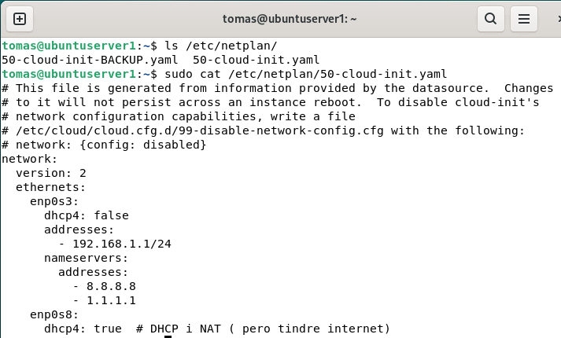

# 1.  SERVICI DE DIRECTORI

Recrodem que un servici de directori és una base de dades jeràrquica i centralitzada que s’utilitza per emmagatzemar i gestionar informació clau d’una organització. Aquesta informació pot incloure:

- Gestió d'usuaris i grups.
- Autenticació d'usuaris.
- Drets d'ús en la xarxa i les màquines.
- Configuracions relacionades amb sistemes i aplicacions.
- Autorització i assignació de permisos sobre el sistema de fitxers.
- Gestió centralitzada de recursos de la xarxa com impressores o equips.


# 2. LDAP

LDAP (Lightweight Directory Access Protocol) és un protocol estàndard i multiplataforma per accedir i gestionar serveis de directori. Entre les característiques principals de LDAP, destaquen:

- La seua independència del sistema operatiu.
- La capacitat de gestionar informació jeràrquica.
- La possibilitat d'autenticació centralitzada en grans xarxes.

Usos principals:
- Autenticació d’usuaris.
- Cerca i recuperació d’informació en bases de dades jeràrquiques.

**LDAP no està lligat a cap sistema operatiu** específic i és compatible amb diferents implementacions de serveis de directori com OpenLDAP, Active Directory, Novell eDirectory o Oracle Directory Server.

# 3. OpenLDAP

OpenLDAP és una implementació de codi obert del protocol LDAP. Es tracta d’una solució molt utilitzada en **entorns Linux** per implementar serveis de directori lleugers i altament configurables.

En un sistema Linux, OpenLDAP és sovint utilitzat com a nucli per proporcionar autenticació centralitzada i gestionar l’accés a recursos de la xarxa. Tot i això, no inclou funcions integrades com DNS o Kerberos, per la qual cosa sol integrar-se amb altres components per ampliar la funcionalitat.

Característiques destacades d'OpenLDAP:

- És una solució lleugera i modular.
- Suporta personalització avançada dels esquemes de dades.
- És altament compatible amb altres aplicacions i serveis que implementen LDAP.

A més, com hem dit, OpenLDAP pot integrar-se amb altres serveis com Kerberos o Samba per a ampliar les seues funcionalitats.


# 4. OpenLDAP vs ACTIVE DIRECTORY

## Similituds

1. **Basats en el protocol LDAP:** Tant OpenLDAP com Active Directory utilitzen el protocol LDAP com a base per gestionar i accedir a la informació.
2. **Directori jeràrquic:** Tots dos estructuren la informació en forma d’arbre, amb nodes com dominis, unitats organitzatives (OUs), usuaris i grups.
3. **Autenticació centralitzada:** Ambdues solucions permeten autenticar usuaris i gestionar recursos de manera centralitzada en una xarxa.
4. **Multiplataforma:** Encara que Active Directory està més orientat a Windows, amb configuracions addicionals també pot treballar amb clients Linux, mentre que OpenLDAP és compatible amb diverses plataformes.

## Diferències

1. **Funcionalitats integrades:**
   - Active Directory és un servei complet que inclou LDAP, Kerberos i DNS integrats, a més de funcions avançades com Group Policies (GPOs).
   - OpenLDAP és una implementació lleugera del protocol LDAP que requereix integracions externes per proporcionar funcionalitats similars.

2. **Entorn:**
   - Active Directory està optimitzat per a xarxes Windows.
   - OpenLDAP és més flexible i està dissenyat principalment per entorns Linux/Unix.

3. **Gestió:**
   - Active Directory ofereix eines gràfiques com l’Active Directory Users and Computers (ADUC) que simplifiquen la gestió però també cmdLets (POwerShell)
   - OpenLDAP és configurat principalment a través de fitxers de configuració i eines de línia d’ordres però també té entorns gràfics com JXplorer.


## Punts de connexió

1. **Integració en entorns híbrids:** OpenLDAP es pot utilitzar com a complement o com a directori secundari en xarxes on Active Directory és el directori principal.
2. **Autenticació conjunta:** Mitjançant connectors com **Samba** (que estudiarem al curs) o **SSSD**, els sistemes Linux que utilitzen OpenLDAP poden autenticar-se en dominis d’Active Directory.
3. **Sincronització:** Es poden configurar sincronitzacions bidireccionals entre OpenLDAP i Active Directory per mantenir la coherència de dades entre els dos sistemes.

## Conclusions

OpenLDAP i Active Directory tenen objectius similars en la gestió centralitzada d’usuaris i recursos, però cada solució està optimitzada per a entorns diferents:

- **OpenLDAP:** És ideal per a entorns Linux que necessiten flexibilitat i personalització, especialment quan es prefereix una arquitectura modular amb components externs com Kerberos i DNS.
- **Active Directory:** És la solució preferida per a xarxes Windows gràcies a les seues funcionalitats integrades i eines d’administració simplificades.

La integració entre ambdues eines permet aprofitar el millor de cada una en xarxes híbrides, oferint una gestió centralitzada i eficient en entorns complexos.

# 2  ESTRUCTURA DE LA BD/DIRECTORI LDAP
 
## 2.1  Entrades,  objectes i atributs

La base de dades LDAP té una estructura jeràrquica. Bàsicament totes les dades s'emmagatzemen en alguna part del directori LDAP, i a similitud dels directoris de fitxers, aquest directori s’organitza en arbre.

El model d'informació de LDAP està basat en entrades. Cada **entrada és un objecte del directori** i conté una col·lecció d'atributs, alguns dels quals son definitoris o identificadors. El DN o Distinguished Name, per exemple és únic i global (identifica a tot el domini de forma única l'ojecte). 

Fent un símil amb la taula d'una base de dades relacional, **una entrada seria com un registre (fila de la taula) i un atribut seria com un camp (la columna de la taula).**

A partir d'un exemple ho vorem més clar.

## 2.2 Exemple.

L'alumnat de 2 SMXB, després de la visita al Programa Lanzadera ha decidit muntar una empresa. Al domini li han posa de nom *smx2b* amb l'extensió *.com*.

Aquí tens una taula amb els atributs i exemples corresponents:

| **Atribut**       | **Definició**                                                                                     | **Exemple**                                                                 |
|--------------------|--------------------------------------------------------------------------------------------------|-----------------------------------------------------------------------------|
| **RDN**           | Nom relatiu dins d'una entrada del directori LDAP.                                               | `cn=comercials` <br> `uid=Arantxa`                                         |
| **DN**            | Camí complet i únic que identifica una entrada al directori.                                     | `cn=comercials,ou=DelegacioValencia,dc=smx2b,dc=com` <br> `uid=Arantxa,ou=DelegacioValencia,dc=smx2b,dc=com` |
| **`cn`**          | Nom comú que identifica un grup o una persona.                                                   | `cn=comercials` <br> `cn=Arantxa`                                          |
| **`uid`**         | Identificador únic d’un usuari.                                                                  | `uid=Arantxa`                                                              |
| **`gidNumber`**   | Identificador numèric d’un grup al qual pertany una entrada (especialment en sistemes UNIX).      | `gidNumber: 10001`                                                         |
| **`objectClass`** | Classes que defineixen el tipus d’entrada i els atributs que pot tenir.                          | `objectClass: posixGroup`, `objectClass: inetOrgPerson`, `objectClass: top`|
| **`homeDirectory`**| Ruta del directori personal d’un usuari (en sistemes UNIX).                                      | `/home/smx2b/arantxa`                                                      |


## 2.3 Atributs (RDN, DN, CN...)

Totes les entrades emmagatzemades en un directori LDAP tenen un únic **"Distinguished Name," o DN**. 

El DN per a cada entrada està compost de dos parts: 

* el Nom Relatiu Distingit (**RDN** per les seves sigles en anglès, Relative Distinguished Name) 
* la localització dins del directori LDAP on el registre resideix.

El RDN és la porció de la teva DN que no està relacionada amb l'estructura de l'arbre de directori. 

La majoria dels objectes que emmagatzemes en un directori LDAP tindrà un nom, i el nom és emmagatzemat freqüentment en l'atribut cn (Common Name). Ja que pràcticament tot té un nom, la majoria dels objectes que emmagatzemarà LDAP utilitzen el seu valor cn com a base per a la seva RDN. 

Exemple:
```bash
dn: cn=comercials,ou=DelegacioValencia,dc=smx2b,dc=com
cn: comercials
gidNumber: 10001
objectClass: posixGroup
objectClass: top
memberUid: 1001
```

• El DN base del meu directori ou = DelegacioNord, dc = smx2b, dc = com
• El RDN d’un registre d’un grup cn=comercials

Per als comptes d'usuari, típicament veuràs un DN basat en el cn o al uid (ID de l'usuari). Per exemple, el DN del comercial de login: arantxa pot semblar-se a:

```bash
dn: uid=Arantxa,ou=DelegacioValencia,dc=smx2b,dc=com
cn: Arantxa
gidNumber: 10001
homeDirectory: /home/smx2b/arantxa
objectClass: inetOrgPerson
objectClass: organizationalPerson
objectClass: posixAccount
objectClass: person
objectClass: top
```
LDAP utilitzen uid per a indicar "ID de l'usuari", no s'ha de confondre amb el número uid de UNIX. La majoria de les empreses intenten donar a cadascun un nom de login, així aquesta aproximació fa que tinga sentit emmagatzemar informació sobre els empleats. 

Pero podem usar el cn també.

Aquí veiem l'entrada Nom Comú o CN (per les seves sigles en anglès, common name) utilitzada. En el cas d'un registre LDAP per a una persona, pensa en el nom comú com els seu nom complet. Un pot veure fàcilment l'efecte col·lateral d'aquesta forma: si el nom canvia, el registre LDAP ha de "moure" d'un DN a un altre. 

# 3 INSTAL·LACIÓ en el SERVIDOR

## 3.1  Preparar el servidor Ubuntu

Nom de la màquina virtual i de l'equip: ubuntuserver1
	Usuari principal: admin
	Contrasenya usuari principal: Gandia2425

Dos targetes de xarxa (en Virtualització)
	NAT --> DHCP
	Xarxa Interna, interfície inet -> Manual
	
(al món real la NAT correspondria a una NIC connectada al router amb eixida a internet i la xarxa interna al switch de la LAN)

### 3.1.1  Configurar la targeta de xarxa
Editem la configuració de la segona targeta de xarxa, la de xarxa interna, i li fiquem una IP fixa i la màscara. 
En el meu cas utilitzaré l'IP 192.168.1.1. 
Busque el fitxer i l'edite amb nano

```bash
sudo nano /etc/netplan/50-cloud-init.yaml
sudo netplan apply
ip a
```




### 3.1.2 Nom de màquina

* Consultem el nom del servidor

```bash
sudo cat /etc/hostname
```
(o echo $HOSTNAME)

* Modifiquem el fitxer de noms 

```bash
sudo nano /etc/hosts
```


Afegim la tercera línia: 


Cal reiniciar el servidor
```bash
reboot
```
## 3.2 Instal·lar el OpenLDAP

* Actualitzem repositori i software prèviament

```bash
sudo apt update && sudo apt upgrade
```

* Instal·lem

```bash
sudo apt install slapd ldap-utils -y
```

Si no s'inicia l'assistent, executa...

```bash
sudo dpkg-reconfigure slapd
```

• Ens pregunta si volem ometre l’assistent: Seleccionem: no

• Ens pregunta la base del nostre **domini DNS:** En el meu cas: **smx2b.com**

• Ens pregunta el nom complet de l'**organització:** En el meu cas: **smx2b**

• Ens pregunta la paraula de pas. És la que usarem amb *admin* més avant per connectar-nos.

• A les següents preguntes podeu deixar l’opció per defecte.


### Comprovar el resultat

```bash
sudo slapcat
```


### Reiniciar el servici

```bash
sudo systemctl restart slapd
```

Amb *status* podem comprovar si está "running".

# 4. INSTAL·LACIÓ en el CLIENT UBUNTU

## 4.1 Configuració de la NIC

Xarxa interna --> Manual

Podem optar per modificar el netplan com hem fet en el servidor o gràficament. Alguns Entorns d'Escriptori com el LXQt de Lubuntu ho failiten prou:


Comprovem la connectivitat entre Servidor i Client


## 4.2 Configurar la resolució de noms.

Associació del nom del servidor a la seua IP en el **/etc/hosts**

```bash
sudo nano /etc/hosts
```


Comprovem que funciona la resolució de noms


# 5 JXPLORER

Existeixen varies aplicacions gràfiques per a facilitar la gestió d'LDAP: Jxplorer, phpLDAPadmin i Apache Directory Studio. 

Anem a provar el JXPLORER instal·lada en el client. Pot instal·lar-se en el servidor però la majoria de servidors Linux no tindran entorn gràfic.


## 5.1 Instal·lació del JXplorer en el client

Instal·lem requisists previs

```bash
sudo apt install openjdk-11-jdk
```
Ara ja si podem instal·lar el programa Jxplorer

```bash
	sudo apt install jxplorer
```

Un vegada l'engeguem des de l'icona, hem de **connectar amb el servidor**.

Important: El client executarà jxplorer, però haurà de connectar amb el servidor ldap. 

* Si estiguérem al servidor indicaríem *127.0.0.1 o localhost*. Al nostre cas (instal·lació en el client) caldrà indicar la IP del servidor.

* Hem de triar l'opció de **Usuari + Password** que és la que hem configurat en instal·lar el sevici i...

* indicar el password que també hem introduït en la configuració 


# 6 ELS OBJECTES PRINCIPALS

Anem a crear i modificar Unitats Organitzatives, grups d'usuaris i usuaris del domini. I amb la creació des del *jXplorer* podrem introduir uns conceptes bàsics de teoria sobre el LDAP perquè ens cladrà conéixer les **propietats mínimes** fan falta en cada objecte.

## 6.1 Propietats: classes i atributs

Les propietats que veiem quan donem d'alta una Unitat Organitzativa, un usuari o un grup poden ser:

- **Classes:** Esquemes que defineixen què pot o ha de tenir un objecte.  
- **Atributs:** Dades concretes d'un objecte definides per les classes.  

| **Característica**      | **Classes (objectClass)**                   | **Atributs**                                  |
|-------------------------|---------------------------------------------|-----------------------------------------------|
| **Funció**              | Defineixen el tipus d'objecte i els seus atributs | Contenen dades específiques de l'objecte      |
| **Tipus**               | Estructural, auxiliar o abstracte          | Obligatori (`must`) o opcional (`may`)        |
| **Exemple**             | `inetOrgPerson`, `posixAccount`, `top`     | `cn`, `uid`, `mail`, `gidNumber`, `sn`       |
| **Obligatorietat**      | Cada entrada LDAP ha de tenir almenys una classe | Només els atributs marcats com a `must` són obligatoris |
| **Herència**            | Pot heretar atributs d'altres classes      | No hereten, són definits per les classes      |


## 6.2 Principals objectes

### Unitat Organitzativa (OU)
Com ja sabeu, una **unitat organitzativa** serveix com a contenidor lògic per organitzar altres objectes com usuaris, grups o altres OU dins del directori LDAP.

- **Classes d'objecte necessàries:**
  - `top`
  - `organizationalUnit`

- **Atributs obligatoris:**
  - `ou` (Organizational Unit Name): El nom de la unitat organitzativa.


---

### Usuari del domini

Un **usuari** ha de tenir atributs mínims per ser compatible amb Linux, especialment per poder iniciar sessió i interactuar amb el sistema.

- **Classes d'objecte necessàries:**
  - `top`
  - `posixAccount` (indispensable per a compatibilitat amb Linux)
  - `inetOrgPerson` (opcional, però útil per informació addicional de l'usuari)

- **Atributs obligatoris per Linux (`posixAccount`):**
  - `cn` (Common Name): Nom complet de l'usuari.
  - `uid` (User ID): Identificador únic de l'usuari.
  - `uidNumber`: Número d'usuari (ha de ser únic).
  - `gidNumber`: Número de grup principal associat a l'usuari.
  - `homeDirectory`: Ruta del directori personal de l'usuari.
  - `loginShell`: Shell de connexió (exemple: `/bin/bash`).


---

### Grup d'usuaris del domini

Un **grup** ha de tenir atributs mínims per ser reconegut pel sistema Linux i associar-se amb usuaris.

- **Classes d'objecte necessàries:**
  - `top`
  - `posixGroup`

- **Atributs obligatoris per Linux (`posixGroup`):**
  - `cn` (Common Name): Nom del grup.
  - `gidNumber`: Número de grup (ha de ser únic).
  - `memberUid` (opcional, però recomanat): Identificadors dels usuaris que pertanyen al grup.

Veiem què passa si falten propietats requerides:


---

| **Tipus**                | **Classes d'Objecte**          | **Atributs Mínims Necessaris**                                  |
|--------------------------|--------------------------------|---------------------------------------------------------------|
| **Unitat Organitzativa** | `top`, `organizationalUnit`   | `ou`                                                         |
| **Usuari**               | `top`, `posixAccount`         | `cn`, `uid`, `uidNumber`, `gidNumber`, `homeDirectory`, `loginShell` |
| **Grup**                 | `top`, `posixGroup`           | `cn`, `gidNumber`, (`memberUid` opcional però recomanat)      |

---


## 6.3 Conceptes clau sobre objectes i classes a LDAP

1. Les classes d'objecte defineixen els atributs i el comportament dels objectes:actua com una plantilla que especifica:
     - Quins atributs són obligatoris.
     - Quins atributs són opcionals.

2. Herència entre classes d'objecte
    - Exemple:
     - La classe `inetOrgPerson` hereta d'altres classes com `organizationalPerson`, `person` i `top`.

3. **Exemple d'herència en classes:**
   Si tens un usuari definit amb la classe `inetOrgPerson`, automàticament aquest objecte també hereta els atributs de les classes de les quals depèn. Veieu-ho gràficament:

*Diagrama d'herència*:
   
```
top
  person
       organizationalPerson
                          inetOrgPerson
```


## 6.3 Fitxers ldif

Els vorem més avant però teniu ací un exemples amb les propietats mínimes requerides.

#### Exemple d'una entrada d'OU:

```ldif
dn: ou=usuaris,dc=exemple,dc=com
objectClass: top
objectClass: organizationalUnit
ou: usuaris
```

#### Exemple d'una entrada d'usuari:
```ldif
dn: uid=jordi,ou=usuaris,dc=exemple,dc=com
objectClass: top
objectClass: posixAccount
objectClass: inetOrgPerson
cn: Jordi Gómez
sn: Gómez
uid: jordi
uidNumber: 1001
gidNumber: 1001
homeDirectory: /home/jordi
loginShell: /bin/bash
```

### Exemple pràctic: Usuari amb múltiples classes
Un usuari que és compatible amb Linux i també conté informació personal pot definir-se així:

```ldif
dn: uid=jordi,ou=usuaris,dc=exemple,dc=com
objectClass: top
objectClass: person
objectClass: organizationalPerson
objectClass: inetOrgPerson
objectClass: posixAccount
cn: Jordi Gómez
sn: Gómez
uid: jordi
uidNumber: 1001
gidNumber: 1001
homeDirectory: /home/jordi
loginShell: /bin/bash
mail: jordi@example.com
telephoneNumber: +34 600 123 456
```