\newpage

# 1 Autenticació basada en LDAP

## 1.1 Introducció

Ara estudiarem autenticar en Linux els usuaris en en servidor LDAP enlloc utilitzar els clàssics fitxers /etc/passwd, /etc/group i /etc/shadow. 
Per fer-ho hem d’instal·lar i configurar els paquets **libpam-ldap** i **libnss-ldap**.

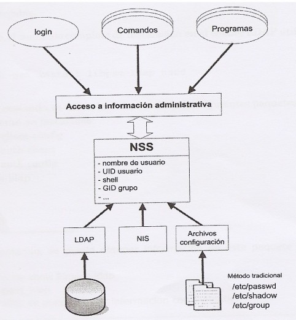

---

## 1.2 Llibreries d'autenticació pam-ldap i nss-ldap
La llibreria **pam-ldap** permet que les aplicacions que utilitzen PAM (Pluggable Authentication Modules) per
autenticar, puguen fer-ho mitjançant un servidor LDAP. Linux empra aquest mecanisme per a la validació
local, per tant ens cal instal·lar aquesta llibreria.

L'arxiu de configuració d'aquesta llibreria és **/etc/ldap.conf**. Hi ha altres aplicacions o serveis que utilitzen
PAM per l'autenticació i per tant podrien, gràcies a la llibreria pam-ldap, autenticar-se davant un servidor
LDAP.
Per especificar el mode d'autenticació de cada servei és necessari configurar els arxius que es troben a la
carpeta **/etc/pam.d/**. Al final d'aquest apartat s'indiquen els canvis necessaris en aquests arxius.
La llibreria **nss-ldap** permet que un servidor LDAP **suplanti als arxius /etc/passwd, /etc/group i /etc/shadow**
com a bases de dades del nostre sistema client. El seu arxiu de configuració es troba a **/etc/ldap.conf**
(comparteix arxiu de configuració amb la llibreria pam-ldap).

Posteriorment haurem de configurar el arxius que són **/etc/nsswitch.conf** per a que s'utilitze LDAP com a
base de dades del sistema en lloc dels arxius passwd, group i shadow.

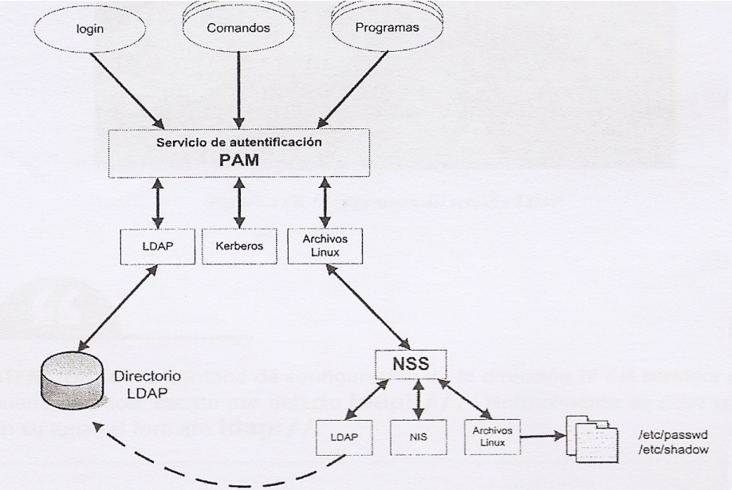

---

## 1.3 Instal·lació i configuració de libpam-ldap i libnss-ldap

**Client**

```bash
sudo apt update
sudo apt upgrade
```

Instal·lem els paquets del client LDAP

```bash
sudo apt install libnss-ldap libpam-ldap ldap-utils -y
```

Fixeu-vos que NO és ldapi:///, heu de llevar la “i” i la tercera “/”, ldap://192.168.10.1

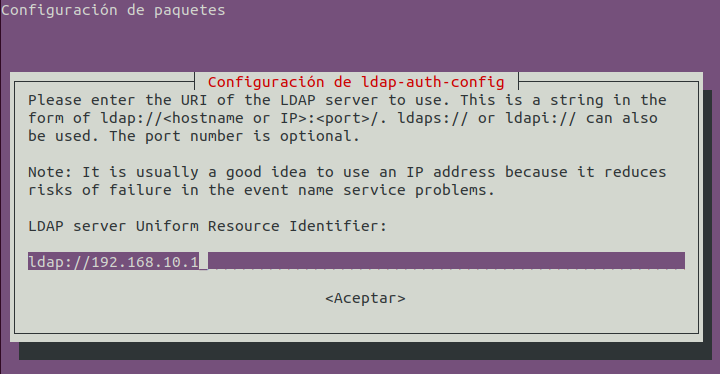

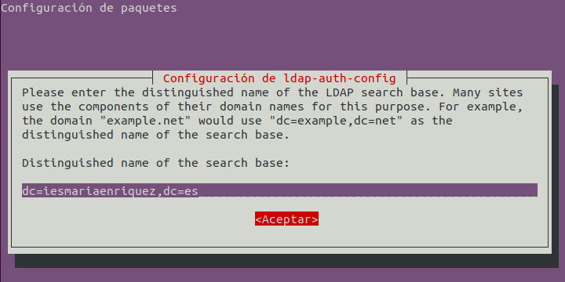

A les següent 3 pantalles deixarem les opcions per defecte:

* LDAP version: 3

* Make local root Database admin: Si

* Does the LDAP database require login? No

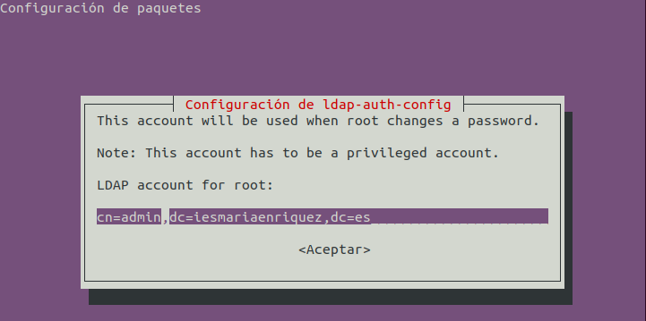

La configuració que acabem de fer s'emmagatzema en el fitxer **/etc/ldap.conf** el qual podem modificar
manualment. Aquest s'utilitza tant pel servei d'autenticació PAM com pel servei de noms NSS (Name
Service Switch). Si posteriorment tinguem que canviar aquesta configuració podem editar el fitxer o, més
fàcilment, el reconfigurarem amb l’ordre **dpkg-reconfigure ldap-auth-config**.

### 1.3.1 Configuració de NSS

**Client**

Per a que el servidor LDAP actue com si es tractara dels arxius passwd, group i shadow, a més d’instal·lar les
dos llibreries anteriors, hem d'indicar que s'utilitze LDAP com alternativa per a autenticar usuaris. Per a això
modifiquem l'arxiu /etc/nsswitch.conf:

```bash
sudo nano /etc/nsswitch.conf
```

Únicament cal afegir ldap (no cal canviar compat per file systemd). Segons la versió del client en les línies
de passwd, group i shadow posarà files, compat o files systemd. Els dos paràmetres signifiquen
pràcticament el mateix.

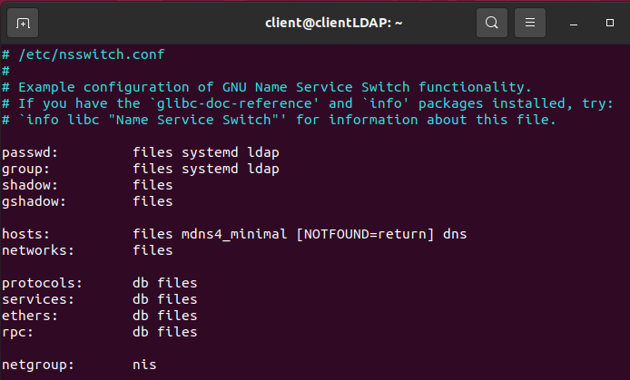

Ací estem configurant que en primer lloc busque usuaris, grups i contrasenyes en els fitxers locals i
si no els troba busque en LDAP. 

Respecte a les màquines (hosts) primer les busca en el fitxer local (/etc/hosts) i si no les troba pregunta al DNS.

>
>Si afegim “ldap” com últim element tant de passwd i group, a l’hora de montar les carpetes, tindrà prioritat els directoris locals dels usuari que les de LDAP.
>
>Això ens pot portar problemes en la posterior configuració dels perfils mòbils. Quan canviem la ruta del directori de cada usuari per a que el perfil es dese al servidor.

Actualitzem els canvis reiniciant la màquina o amb la següent ordre que caldria instal·lar prèviament:

```bash
sudo nss_updatedb ldap
```
**getent**

Amb ens mostra tant els usuaris locals com els creat en LDAP si NSS està funcionant. És la foram de comprovar-ho.
```bash
getent passwd
```


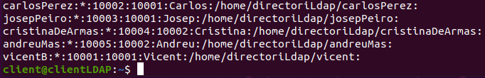

Podeu consultar /var/log/auth.log

### 1.3.2 Configuració de serveis PAM

**Client**

Ara el nostre Linux ja estaria preparat per a autenticar-se com a LDAP. Editant els fitxers que hi ha a la
carpeta **/etc/pam.d** podem configurar la forma en que s’autentica cadascun dels serveis que requereixen
autenticació.
Per a no haver de fer-ho individualment, existeixen uns arxius el nom dels quals comença per “common” i
que en molts d’aquests arxius hi fan referència mitjançant una línia `@include`

* /etc/pam.d/common-auth (per a autenticar-se)

* /etc/pam.d/common-account (per a disposar d’un compte)

* /etc/pam.d/common-session (per a poder iniciar sessió)

* /etc/pam.d/common-password (per a poder canviar la paraula de pas)

Aquest arxius contenen una línia que fa referència a la llibreria **pam_unix.so**, que correspon a l’autenticació
contra els arxius Linux (/etc/passwd, /etc/shadow,etc).

Observeu que el nostre sistema empra primer les llibreries **pam_ldap.so** per a autenticar els usuaris, i desprès
les de Linux. 

Així, si la autenticació falla provarà amb els usuaris locals de Linux. 

```bash
sudo nano /etc/pam.d/common-password
```

Aneu a la línia 26 i esborreu use_authtok:

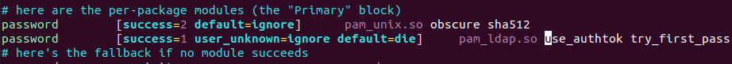

Quedará així:

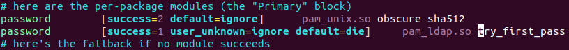


### 1.3.3 Creació automàtica directoris d’usuari (home)

**Client**

El mòdul **pam_mkhomedir.so** és el que permet crear el directori d’usuari. 

* *umask* indica els permisos aplicats.

Si umask=022, els permisos seran: 777 - 022 = 755 = rwx r-x r-x

* *skel* ens indica un directori, el contingut del qual, es copiarà al nou directori d’usuari; pots
posar-hi el que vullgues, tot es copiarà al nou directori HOME creat.

```bash
sudo nano /etc/pam.d/common-session
```

Baix de session optional pam_system.so posem:

```
session optional pam_mkhomedir.so skel=/etc/skel umask=077
```
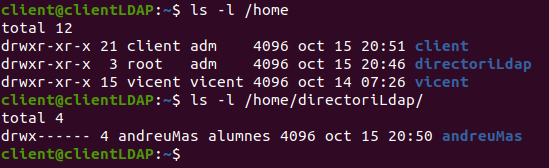

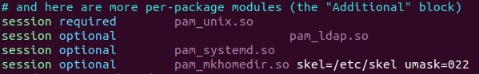


És una bona pràctica per introduir un fitxer de informació sobre els permisos, o que avise que estan
utilitzant el servei LDAP, o el que necessitem.
Com hem ficat umask=077 els permisos que tindran per defecte els directoris /home/usuari seran rwx --- ---

* client i vicent, son usuaris locals, la màscara per defecte és 022 (0022)

* andreuMas és un usuari LDAP, quan vam iniciar sessió per primera volta la màscara era 077

Si volem que els permisos per defecte dels nous directoris /home/usuari siga rwx r-x r-x (els permisos
habituals per als nous usuaris a Linux), al fitxer hauríem de ficar umask=022. Per tant, ho deixarem així:

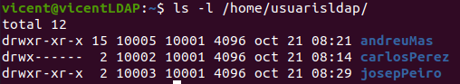

Perquè els permisos queden com cal, podem canviar-los manualment amb “chmod” o bé eliminar la
carpeta de l’usuari (cosa que causarà que s’esborren totes les seues dades).
Com podeu vore, els usuaris andreuMas i josepPeiro s’han creat després d’haver fet el canvi del umask, en
canvi, carlosPerez manté els permisos del umask antic, cal canviar-los per deixar-los com els d’un usuari

Per finalitzar la configuració i que s’apliquen els canvis del client, reiniciem la màquina:
```bash
reboot
```
Si volem mostrar tots els usuaris dels llocs indicats a nsswitch.conf: "compat/files" i "ldap" farem:
```bash
getent passwd
```

\newpage

# 2 Perfils mòbils

Ja coneixeu de Windows Server el concepte de Perfil Mòbil, no cal repetir-lo. Ara que tenim configurat el directori LDAP podem implementar-lo en el Ubuntu Server. 

## 2.1 Servidor

Cal fer que:
* les carpetes personals dels usuaris s'allotgen al servidor i 
* es munten automàticament en els clients en iniciar sessió. 

Els passos a fer són:

1. Creeu una subcarpeta en el servidor on emmagatzemar els homes. Exemple: /home/usuarisldap
(si useu directament /home les exportacions i canvis que feu afectaran també als usuaris locals del servidor)

2. Compartiu-la en xarxa amb **NFS (Network File System)** amb permisos de lectura i escriptura per a tots els clients.

Si no tenim instal·lat NFS: 

```bash
sudo apt install nfs-kernel-server
```

El punt 2 consisteix en modificar el fitxer /etc/exports i afegir la següent línia:

```
/home/usuarisldap *(rw,sync,no_root_squash,no_subtree_check) 
```

Explicarem més avant el NFS.

Ara cal reiniciar el servidor.

---

## 2.2 Client

Cal crear una carpeta que contindrà els continguts que es guarden de cada usuari al serverLDAP.

Per fer-ho fàcil, anem a crearla a la mateixa ubicació “/home/usuarisldap” i li donem permisos complets al
directori “chmod 777” el que ve a ser “drwxrwxrwx”.

Fet això, anem a montar mitjançant el fitxer “/etc/fstab”, que la carpeta ubicada al servidor es muntarà de
forma automàtica en el arranc del sistema al nostre directori local.

Cal **instal·lar el paquet “nfs-common”** perquè el fstab monte correctament el directori allotjat al servidor,
si no, voreu com no funciona, accedireu a /home/usuarisldap i dins sols tindreu els documents locals (no
cap).

Per tant, com que tenim el servidor amb la IP: 192.168.10.1 i la carpeta està ubicada a /home/usuarisldap,
anem a afegir la següent línia al fitxer /etc/fstab on bàsicament indiquem que la carpeta
“/home/usuarisldap” de l’equip remot amb IP 192.168.10.1, es muntarà a la carpeta local
“/home/usuarisldap”:
```
192.168.10.1:/home/usuarisldap /home/usuarisldap nfs auto,noatime,nolock,bg,nfsvers=3, intr,tcp,actimeo=1800 0 0
```

Quedaria així:

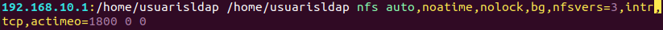

I per últim, cal que actualitzem a cadascun dels usuaris, la ruta del seu directori per a què coincidisca
amb la carpeta mòbil. 

Des del jXplorer per exemple:

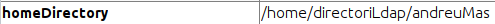


>Quan el sistema detecta 2 “homeDirectory” per a un mateix usuari, agafarà el directori més antic ( que és el local )

>Dos solucions:

>1. Modificar en el fitxer “nsswitch.conf” l’ordre en que “passwd” i “group” revisarà els comptes d’usuari. 
> Actualment l’ordre és “files” -> “systemd” -> “ldap”. Canviar per: “ldap” -> “files” -> “systemd”
> Reiniciar la màquina perquè agafe les últimes dades actualitzades del servidor LDAP.
>
>2. Eliminar el directori local (/home/directoriLdap) perquè LDAP funcione correctament.


Finalment, per verificar que tot està funcionant correctament, deuríem de revisar fent “login” mitjançant
un escriptori secundari de ubuntu (“tty3” per exemple) i revisant que quan iniciem sessió, crea
automàticament la carpeta que està al servidor. Exemple de andreuMas que no tenia cap directori antic:

Des d’este moment tot el que creem amb eixe usuari, realment està guardant-se al servidor, i es connecte
des del client que es connecte tindrà exactament el mateix.

> El servidor deu estar operatiu quan el client arranque el servidor, si no, fallarà el muntatge del directori NFS.
